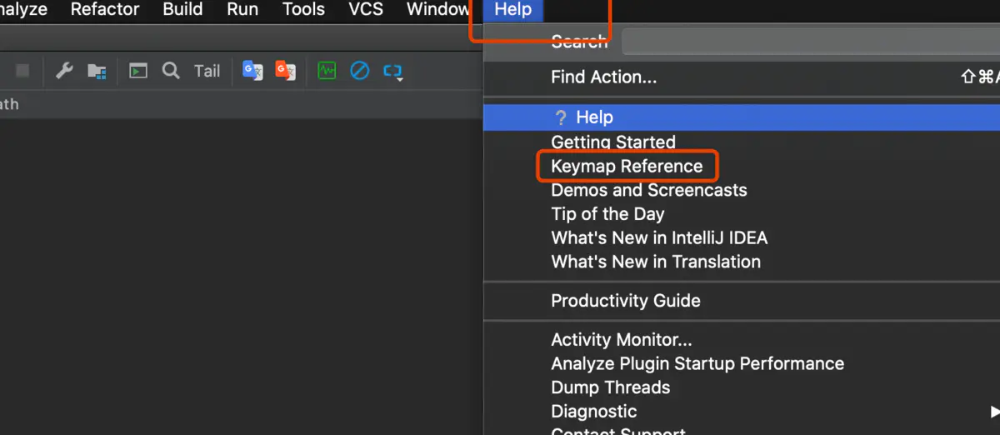

# IDEA快捷键 For Mac

[lsh的学习笔记](https://www.jianshu.com/u/9dafc3d23274)关注

12017.05.10 17:43:20字数 2,737阅读 15,892

## 说明

本文是翻译，我翻译的版本是2019.3.4。原始文件在IDEA中。

## 哪里找到这个快捷键文件？

依次点击顶部工具栏最后的`Help` --> `Keyap Reference`，即可找到这份文件

image.png

## Mac键盘符号和修饰键说明

下面有些功能，Mac小键盘空间不足，没有单键实现，转而使用组合键来实现。

- `⎋` Escape (Esc)
- `⌘` Command 命令 = Windows的Windows键
- `⇧` Shift 切换
- `⌥` Option 选项 = Windows 的Alt键
- `⌃` Control 控制
- `↩︎` Return/Enter 换行
- `⌫` Delete 向左删除
- `⌦` 向右删除 = Fn + Delete
- `⇞` Page Up = `Fn + ↑`
- `⇟` Page Down = `Fn + ↓`
- `Home` = `Fn + ←左方向键`
- `End` = `Fn + →右方向键`
- `⇥` 右制表符（Tab键）
- `⇤` 左制表符 = `Shift + Tab`

## 一、Editing（编辑）

#### 补全

| 快捷键    | 说明                                             | 使用频率 |
| :-------- | :----------------------------------------------- | :------- |
| ⌃ Space   | 基本的代码补全（补全任何类、方法、变量）         |          |
| ⌃ ⇧ Space | 智能代码`补全`（过滤器方法列表和变量的预期类型） |          |
| ⌘ ⇧ ↩︎     | 自动结束代码，行末自动添加`分号`                 |          |

#### 显示查看

| 快捷键             | 说明                                                         | 使用频率 |
| :----------------- | :----------------------------------------------------------- | :------- |
| ⌘ P                | 显示方法的参数信息（光标放在被调用方法的圆括号内，然后按此快捷键） | ★★★★     |
| ⌃ J                | 快速显示文档                                                 | ★★★★★    |
| ⇧ F1               | 显示外部文档（在某些代码上会触发打开浏览器显示相关文档）     | ☆        |
| ⌘ + 鼠标放在代码上 | 显示基本信息                                                 | ☆        |
| ⌘ F1               | 在`错误`或`警告`处显示描述信息                               | ☆        |
| ⌃ ⇧ Q              | 显示上下文信息                                               | ☆        |

#### 快速生成 / 提示

| 快捷键        | 说明                                                         | 使用频率 |
| :------------ | :----------------------------------------------------------- | :------- |
| ⌘ N, ⌃ ↩︎, ⌃ N | 生成代码（Getters, Setters, Constructors,hashCode/equals, toString） | ★★★★★    |
| ⌃ O           | 覆盖方法（重写父类方法）                                     | ★★       |
| ⌃ I           | 实现方法（实现接口中的方法）                                 | ★★★      |
| ⌘ ⌥ T         | 包围代码（使用if..else, try..catch, for, synchronized等包围选中的代码） | ★★★★★    |
| ⌘ /           | 注释/取消注释与`行注释`                                      | ★★★★★    |
| ⌘ ⌥ /         | 注释/取消注释与`块注释`                                      | ★★★★★    |
| ⌥ ↑           | 连续选中代码块                                               | ☆        |
| ⌥ ↓           | 减少当前选中的代码块                                         | ☆        |
| ⌥ ↩︎           | 显示意向动作和快速修复代码                                   | ☆        |

#### 优化（格式化，去除多余，优化import）

| 快捷键  | 说明                  | 使用频率 |
| :------ | :-------------------- | :------- |
| ⌘ ⌥ L   | 格式化代码            | ★★★★★    |
| ⌃ ⌥ O   | 优化import            | ★★★      |
| ⌃ ⌥ I   | 自动缩进行            | ☆        |
| ⇥ , ⇧ ⇥ | 缩进代码 / 反缩进代码 | ☆        |

#### 剪切、复制、粘贴、删除

| 快捷键 | 说明                             | 使用频率 |
| :----- | :------------------------------- | :------- |
| ⌘ X    | 剪切`当前行`或`选定的块`到剪贴板 | ★★★★★    |
| ⌘ C    | 复制`当前行`或`选定的块`到剪贴板 | ★★★★★    |
| ⌘ V    | 从剪贴板粘贴                     | ★★★★★    |
| ⌘ ⇧ V  | 从最近的缓冲区粘贴               | ☆        |
| ⌘ D    | 复制`当前行`或`选定的块`         | ★★★★★    |
| ⌘ ⌫    | 删除`当前行`或`选定的块的行`     | ★★★★★    |
| ⌥ ⌫    | 删除到单词的`开头`               | ☆        |
| ⌥ Fn ⌫ | 删除到单词的`末尾`               | ☆        |

#### 普通edit操作

| 快捷键      | 说明                      | 使用频率 |
| :---------- | :------------------------ | :------- |
| ⇧ ↩︎         | 开始新的一行              | ★★★      |
| ⌘ ⇧ U       | 大小写切换                | ★★★      |
| ⌘ ⇧ ([ / ]) | 选择直到`代码块`结束/开始 | ★        |
| ⌃ ⇧ J       | 智能的将代码拼接成一行    | ☆        |
| ⌘ ↩︎         | 智能的拆分拼接的行        | ☆        |
| ⌘ (+ / -)   | 展开 / 折叠代码块         | ★★★★★    |
| ⌘ ⇧ (+ / -) | 展开 / 折叠所有代码块     | ★★★★★    |
| ⌘ W         | 关闭活动的编辑器选项卡    | ★★★      |

## 二、Search/Replace（查询/替换）

| 快捷键   | 说明                                                    | 使用频率 |
| :------- | :------------------------------------------------------ | :------- |
| Double ⇧ | 查询任何东西(包括`文件夹`、`文件`以及`字符串`)          | ★★★★★    |
| ⌘ F      | 文件内查找                                              | ★★★★★    |
| ⌘ G      | 查找模式下，向下查找                                    | ★★★★★    |
| ⌘ ⇧ G    | 查找模式下，向上查找                                    | ★★★★★    |
| ⌘ R      | 文件内替换                                              | ☆        |
| ⌘ ⇧ F    | 全局查找（根据路径）                                    | ☆        |
| ⌘ ⇧ R    | 全局替换（根据路径）                                    | ☆        |
| ⌘ ⇧ S    | 查询结构（Ultimate Edition 版专用，需要在Keymap中设置） | ☆        |
| ⌘ ⇧ M    | 替换结构（Ultimate Edition 版专用，需要在Keymap中设置） | ☆        |

## 三、Usage Search（使用地点查询）

| 快捷键     | 说明                                          | 使用频率 |
| :--------- | :-------------------------------------------- | :------- |
| (⌥ / ⌘) F7 | 查找在哪个文件中被使用 / 查找在哪个类中被使用 | ★★★      |
| ⌘ ⇧ F7     | 高亮显示在本文件中使用地点                    | ★★★      |
| ⌘ ⌥ F7     | 显示使用地点                                  | ★★★      |

## 四、Compile and Run（编译和运行）

| 快捷键      | 说明                       | 使用频率 |
| :---------- | :------------------------- | :------- |
| ⌘ F9        | 编译Project                | ★        |
| ⌘ ⇧ F9      | 编译选择的文件、包或模块   | ★        |
| ⌃ ⌥ R       | 弹出 Run 的可选择菜单      | ★★★★★    |
| ⌃ ⌥ D       | 弹出 Debug 的可选择菜单    | ★★★★★    |
| ⌃ R         | 运行                       | ★★★★★    |
| ⌃ D         | 调试                       | ★★★★★    |
| ⌃ ⇧ (R / D) | 从编辑器运行上下文环境配置 | ★★★★★    |

## 五、Debugging（调试）

| 快捷键 | 说明                                                         | 使用频率 |
| :----- | :----------------------------------------------------------- | :------- |
| F8     | 进入下一步，如果当前行断点是一个方法，则不进入当前方法体内   | ★★★★★    |
| F7     | 进入下一步，如果当前行断点是一个方法，则进入当前方法体内，如果该方法体还有方法，则不会进入该内嵌的方法中 | ★★★★★    |
| ⇧ F7   | 智能步入，断点所在行上有多个方法调用，会弹出进入哪个方法     | ☆        |
| ⇧ F8   | 跳出                                                         | ★★★★★    |
| ⌥ F9   | 运行到光标处，如果光标前有其他断点会进入到该断点             | ★★★★★    |
| ⌥ F8   | 计算表达式（可以更改变量值使其生效）                         | ☆        |
| ⌘ ⌥ R  | 恢复程序运行，如果该断点下面代码还有断点则停在下一个断点     | ☆        |
| ⌘ F8   | 切换断点（若光标当前行有断点则取消断点，没有则加上断点）     | ★★★      |
| ⌘ ⇧ F8 | 查看断点信息                                                 | ★★★★★    |

## 六、Navigation（导航）

#### 跳转

| 快捷键           | 说明                                                         | 使用频率 |
| :--------------- | :----------------------------------------------------------- | :------- |
| ⌘ O              | 跳转到指定的类                                               | ★★★★★    |
| ⌘ ⇧ O            | 跳转到所有类型`文件/目录`，目录需要在输入的内容`前/后`加一个反斜杠/ | ★★★★★    |
| ⌘ ⌥ O            | 跳转到指定的目标（变量 / 方法）                              | ★★★★★    |
| ⌘ L              | 跳转到`指定行`                                               | ★★★★★    |
| ⌘ U              | 跳转到`父类/接口`的对应处                                    | ★★★★★    |
| ⌘ ⌥ B            | 跳转到`实现`处                                               | ★★★★★    |
| ⌘ (B / 鼠标点击) | 跳转到光标所在的`方法`/`变量`的`声明`处                      | ★★★★★    |
| ⌃ ⇧ B            | 跳转到类`声明`处                                             | ★★★      |
| ⌘ ⌥ (← / →)      | 跳转到`上一个`/ `下一个`操作处                               | ★★★★★    |
| ⌘ ⇧ ⌫            | 跳转到`最后一次`编辑处                                       | ★★       |
| ⌃ (↓ / ↑)        | 跳转到`上一个` / `下一个`方法名处                            | ★★★★★    |
| F2，⇧ F2         | 跳转到`下一个`/`上一个`高亮错误/警告处                       | ★★       |
| ⌘ ([ / ])        | 跳转到`当前所在代码块`的花括号`开始`/`结束`处                | ★★       |

#### 弹出

| 快捷键       | 说明                                       | 使用频率 |
| :----------- | :----------------------------------------- | :------- |
| ⌘ E          | 弹出`最近打开`的文件列表                   | ★★★★★    |
| ⌘ F12        | 弹出`当前文件`结构，类似eclipse的`outline` | ★★★★★    |
| ⌃ H          | 弹出当前`类`的层次（即父类、子类）         | ★★★★★    |
| ⌘ ⇧ H        | 弹出`方法`层次结构                         | ★★★★★    |
| ⌃ ⌥ H        | 弹出`调用`层次（哪些调用了此处）           | ★★★★★    |
| ⌥ Space, ⌘ Y | 弹出光标所在`方法`、`类`的定义             | ★★★★★    |

#### 窗口

| 快捷键    | 说明                                                      | 使用频率 |
| :-------- | :-------------------------------------------------------- | :------- |
| ⌥ F1      | 弹出窗口列表，跳转到选定的窗口                            | ★★★★★    |
| F12       | 返回到前一个工具窗口                                      | ☆        |
| Esc       | 跳转到代码编辑窗口（从工具窗口）                          | ★★       |
| ⇧ Esc     | 隐藏`当前`/`最后`一个活动的窗口（且光标进入代码文件窗口） | ★★★★★    |
| ⌃ (← / →) | 左右切换打开的编辑tab页                                   | ★★★★★    |
| ⌘ ⇧ F4    | 关闭活动run/messages/find/... tab                         | ☆        |
| F4，⌘ ↓   | `编辑`/`查看`源代码                                       | ☆        |
| ⌥ Fn ←    | 显示到当前文件的导航条                                    | ☆        |

#### 书签

| 快捷键  | 说明                                            | 使用频率 |
| :------ | :---------------------------------------------- | :------- |
| F3      | 选中文件/文件夹/代码行，添加/取消书签           | ☆        |
| ⌥ F3    | 选中文件/文件夹/代码行，使用助记符添加/取消书签 | ☆        |
| ⌃ 0...9 | 跳转到对应数值的书签处                          | ☆        |
| ⌘ F3    | 显示所有书签                                    | ☆        |

## 七、Refactoring（重构）

| 快捷键 | 说明                               | 使用频率 |
| :----- | :--------------------------------- | :------- |
| F5     | 复制文件到指定目录                 | ☆        |
| F6     | 移动文件到指定目录                 | ☆        |
| ⌘ ⌫    | 在文件上为安全删除文件，弹出确认框 | ☆        |
| ⇧ F6   | 重命名文件                         | ★★★★★    |
| ⌘ F6   | 更改签名                           | ☆        |
| ⌘ ⌥ N  | 一致性                             | ☆        |
| ⌘ ⌥ M  | 将选中的代码提取为方法             | ☆        |
| ⌘ ⌥ V  | 将选中的代码提取为变量             | ★★★★★    |
| ⌘ ⌥ F  | 将选中的代码提取为字段             | ☆        |
| ⌘ ⌥ C  | 将选中的代码提取为常量             | ☆        |
| ⌘ ⌥ P  | 将选中的代码提取为参数             | ☆        |

## 八、VCS/Local History（版本控制/本地历史记录）

| 快捷键 | 说明                       | 使用频率 |
| :----- | :------------------------- | :------- |
| ⌘ K    | 提交代码到版本控制器       | ★★★★★    |
| ⌘ T    | 从版本控制器更新代码       | ★★★★★    |
| ⌥ ⇧ C  | 查看最近的变更记录         | ★        |
| ⌃ C    | 快速弹出版本控制器操作面板 | ★★★★★    |

## 九、Live Templates（动态代码模板）

| 快捷键 | 说明                                           | 使用频率 |
| :----- | :--------------------------------------------- | :------- |
| ⌘ ⌥ J  | 弹出模板选择窗口，将选定的代码使用动态模板包住 | ☆        |
| ⌘ J    | 插入自定义动态代码模板                         | ☆        |

## 十、General（通用）

| 快捷键    | 说明                                                         | 使用频率 |
| :-------- | :----------------------------------------------------------- | :------- |
| ⌘ (1...9) | 打开相应编号的工具窗口                                       | ☆        |
| ⌘ S       | 保存所有                                                     | ★★★★★    |
| ⌘ ⌥ Y     | 同步、刷新                                                   | ☆        |
| ⌃ ⌘ F     | 切换全屏模式                                                 | ☆        |
| ⌘ ⇧ F12   | 切换最大化编辑器                                             | ★★★★★    |
| ⌥ ⇧ F     | 添加到收藏夹                                                 | ☆        |
| ⌥ ⇧ I     | 检查当前文件与当前的配置文件                                 | ☆        |
| ⌃ `       | 快速切换当前的scheme（切换主题、代码样式等）                 | ☆        |
| ⌘ ,       | 打开IDEA系统设置                                             | ☆        |
| ⌘ ;       | 打开项目结构对话框                                           | ☆        |
| ⌘ ⇧ A     | 查找动作（可设置相关选项）                                   | ☆        |
| ⌃ ⇧ Tab   | 编辑窗口标签和工具窗口之间切换（如切换过程中按delete，则关闭对应选中窗口） | ★★★★★    |

## 十一、Other（一些官方文档上没有体现的快捷键）

| 快捷键 | 说明       | 使用频率 |
| :----- | :--------- | :------- |
| ⌘ ⇧ 8  | 竖编辑模式 | ★★★★★    |

[IDEA快捷键 For Mac - 简书 (jianshu.com)](https://www.jianshu.com/p/e1f7deef3ec2)