# 同事用了这个IDEA技巧，开发效率提升了10倍

Lvshen的技术小屋 2020-08-21 08:42:48

## 开启Postfix Completion

在讲今天的技巧前，我们需要作几个准备：IntellJ IDEA和开启Postfix Completion。

打开IDEA的Settings -> Editor -> General ->Postfix Completion，把这个框选上即可。

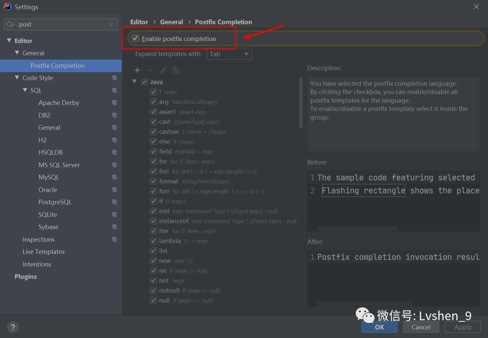


## **创建对象**

### .var

如果我们要创建一个Student对象，我们可以使用new Student().var。

```
 Student student = new Student();
```

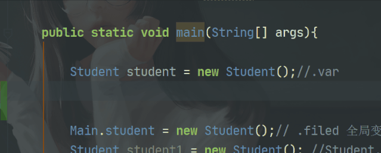


### **.new**

下图这个操作更加快捷，一步到位。

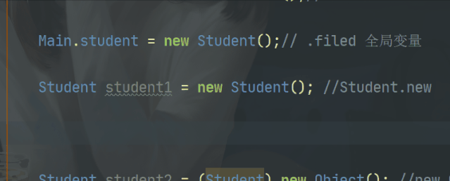


## **转型**

### **.castvar**

如果要将Object转成Student，可以new Object().castvar。

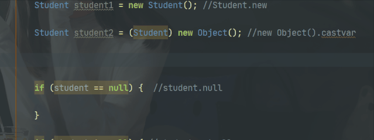


```
Student student2 = (Student) new Object();
```

## **if语句**

### **.null**

如果对象为null的编写。student.null。

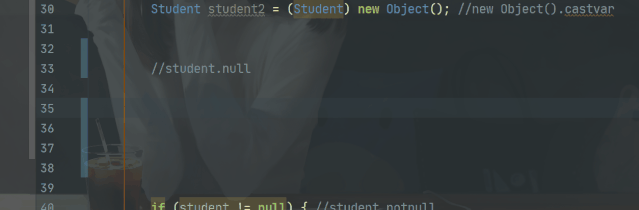


```
if (student == null) {

}
```

### **.notnull**

如果对象不为null的编写。student.nn。

```
if (student != null) {

}
```


### **.if**

对boolean变量的if语句写法，例如：flag.if

```
boolean flag = true;
if (flag) {

}
```

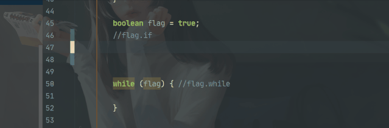


### **.while**

如果是while循环，可以这样flag.while。

```
while (flag) {

}
```

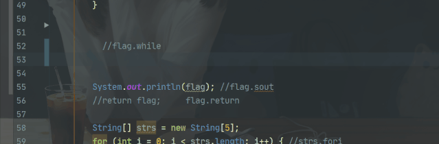


## **打印**

### **.sout**

想在控制台打印，可以这样：flag.sout。

```
System.out.println(flag); 
```

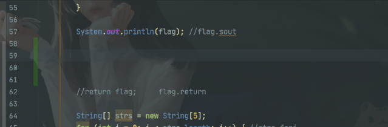


## **方法返回**

### **.return**

如果我们要返回某个值，可以：返回值.return。

```
public boolean test(){
    return true;
}
```


## **for循环**

### **.fori**

下面是几种for循环的编码方式。

```
for (int i = 0; i < strs.length; i++) {
    
}
```

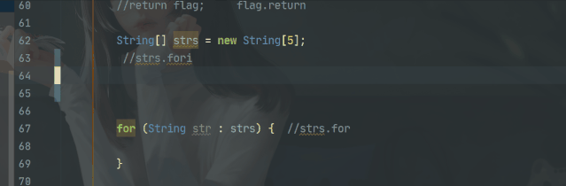


### **.for**

```
for (String str : strs) {

}
```

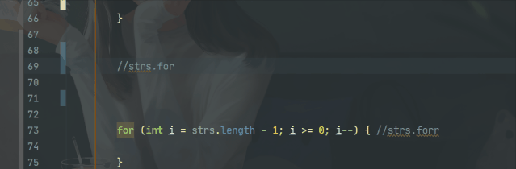


### **.forr**

```
for (int i = strs.length - 1; i >= 0; i--) {

}
```

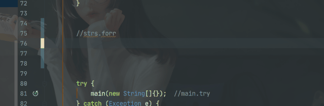


## **List列表**

### **.list**

如果需要编写一个包含了对象的List，例如：Student.list。

```
List<Student> students =new ArrayList<>();
```

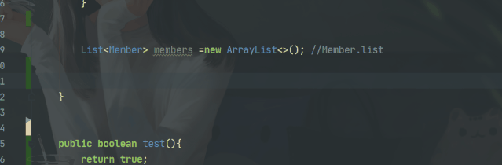


怎么样使用我上面的技巧，敲代码是不是一气呵成，行云流水，运指如飞。

编码速度起来了，效率得以提高，等着被老板夸吧。


https://www.toutiao.com/i6863231330927247880/?tt_from=android_share&utm_campaign=client_share&timestamp=1598054806&app=news_article&utm_medium=toutiao_android&use_new_style=1&req_id=202008220806460101941000184710C5C9&group_id=6863231330927247880