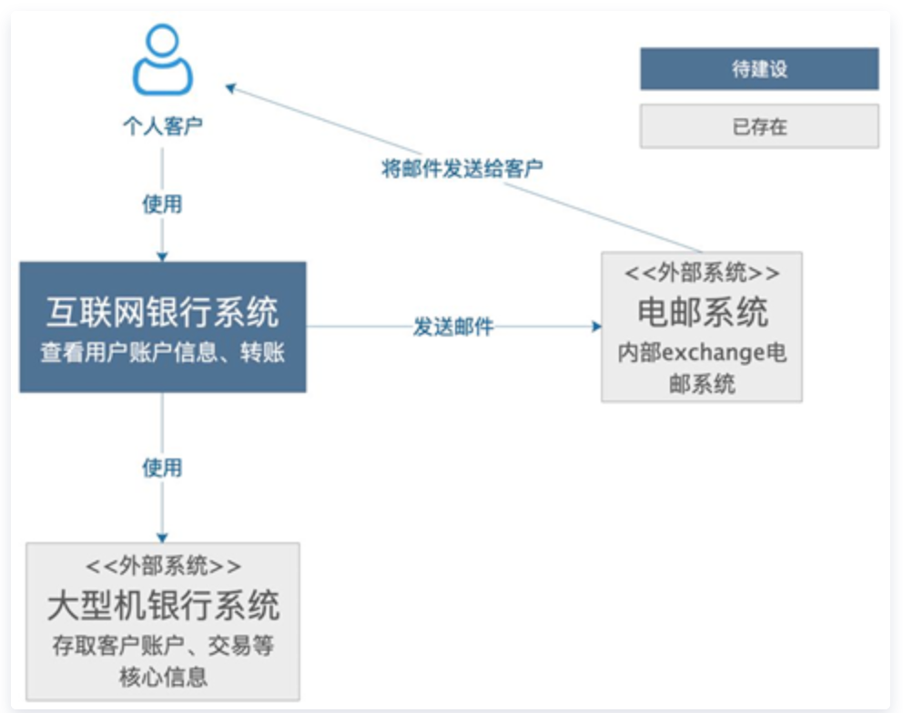
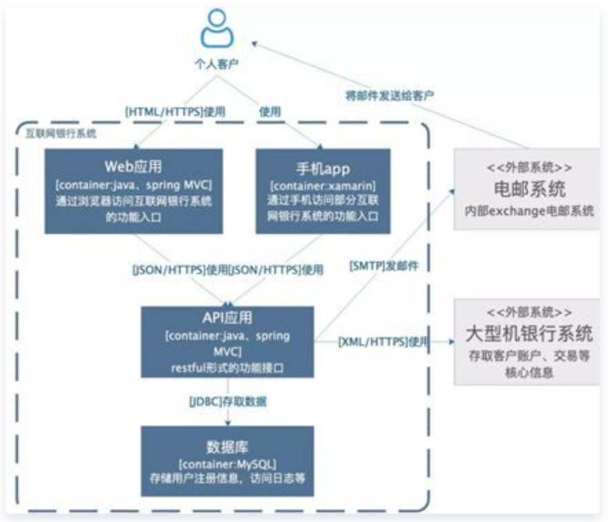
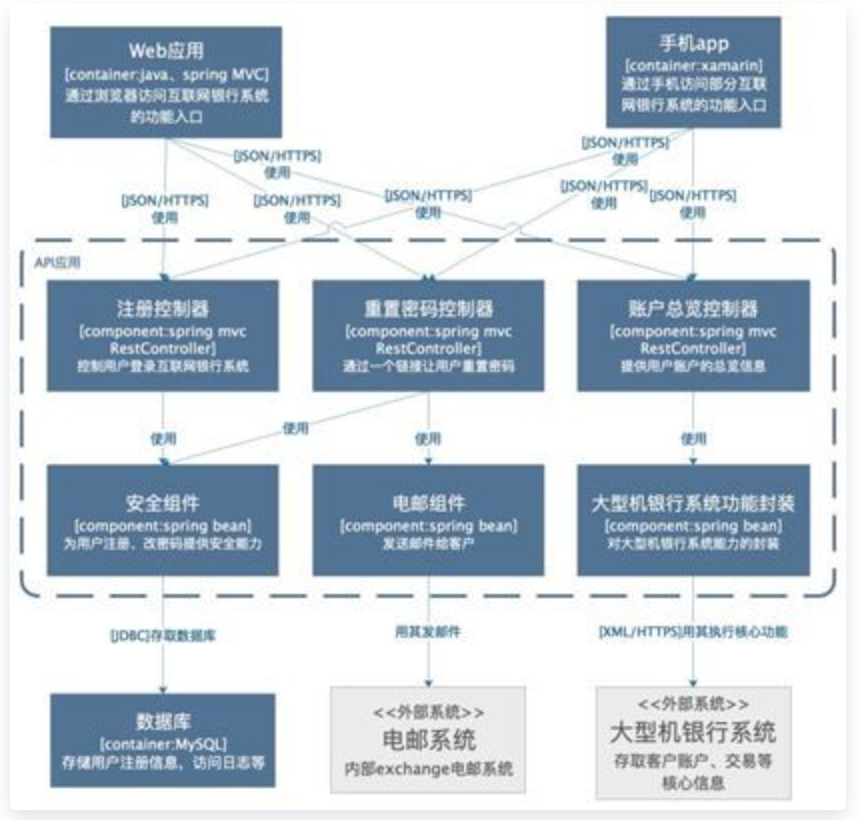
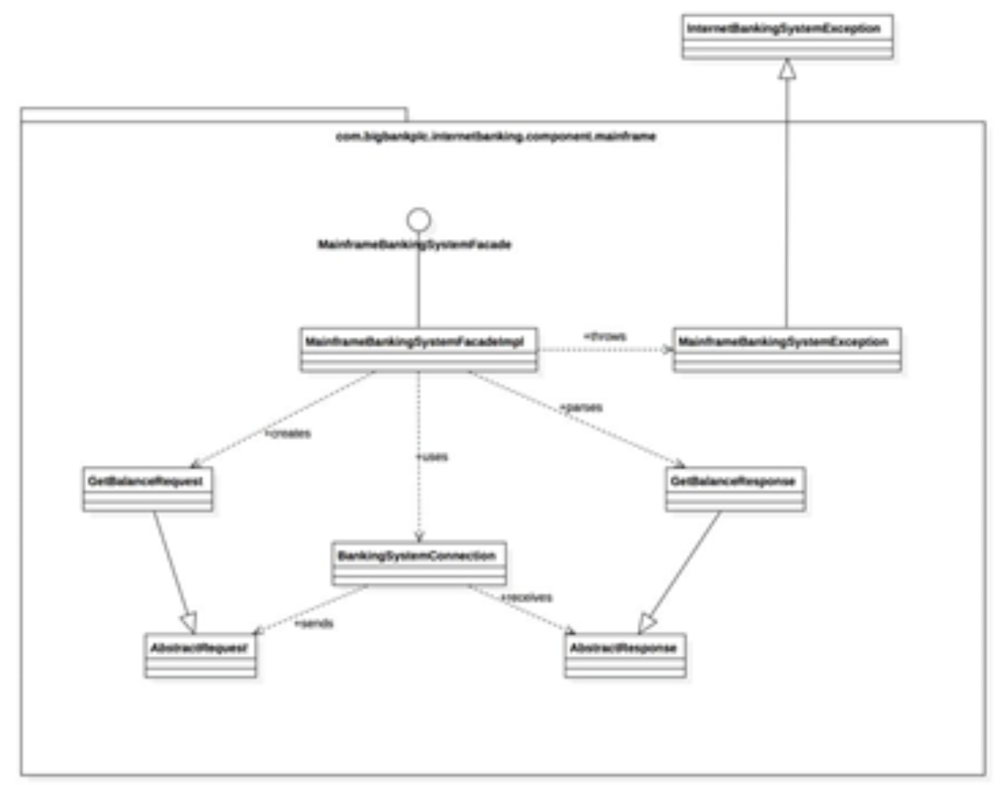

# 软件框架图——C4模型

2019-09-08阅读 2.8K0

**前言**

在进行系统或者功能讲解时，我们经常需要通过一张或者几张图来描述，但当我们拿到一张空白的纸时又总是感觉无从下手，或者画出来的东西完全没有什么清晰的结构，维度混乱造成自己都不知道如何去描述，又或者是画出来的东西极其复杂，根本不适合给别人去分享，如果你存在这样的问题，那接下来的文章或许会有一些帮助，本文将介绍一种画图的方法论，使得框架结构更加清晰。

**要点**

在进行方法介绍前，我们需要理清框架图的基本概念

**1. 框架：**框架就是对系统中的实体以及实体之间的关系所进行的抽象描述，是一系列的决策。框架是结构和愿景。系统框架是概念的体现，是对物/信息的功能与形式元素之间的对应情况所做的分配，是对元素之间的关系以及元素同周边环境之间的关系所做的定义。

**2. 框架图：**系统框架图是为了抽象的表示软件系统的整体轮廓和各个组件之间的相互关系和约束边界，以及软件系统的物理部署和软件系统的演进方向的整体视图。

**3. 框架图作用：**解决沟通障碍、达成共识、减少歧义。

**方法**

在这里给大家介绍的框架图就是利用C4模型进行绘制的，C4 代表上下文（Context）、容器（Container）、组件（Component）和代码（Code）——一系列分层的图表，可以用这些图表来描述不同缩放级别的软件架构，每种图表都适用于不同的受众。要为你的代码创建框架图，首先需要一组通用的抽象来创建一种无处不在的语言，用来描述软件系统的静态结构。C4 模型使用容器（应用程序、数据存储、微服务等）、组件和代码来描述一个软件系统的静态结构。同时它还考虑到使用软件系统的人。

下面案例来自互联网

**1. 系统上下文（System Context）**

这是一个想象的待建设的互联网银行系统，它使用外部的大型机银行系统存取客户账户、交易信息，通过外部电邮系统给客户发邮件。可以看到，非常简单、清晰，相信不需要解释，都看的明白，里面包含了需要建设的系统本身，系统的客户，和这个系统有交互的周边系统。

**用途**

这样一个简单的图，可以告诉我们，要构建的系统是什么；它的用户是谁，谁会用它，它要如何融入已有的IT环境。这个图的受众可以是开发团队的内部人员、外部的技术或非技术人员。即：

a.构建的系统是什么

b.谁会用它

c.如何融入已有的IT环境

**2. 系统容器（System Context）**

容器图是把语境图里待建设的系统做了一个展开。上图中，除了用户和外围系统，要建设的系统包括一个基于javaspring mvc的web应用提供系统的功能入口，基于xamarin架构的手机app提供手机端的功能入口，一个基于java的api应用提供服务，一个mysql数据库用于存储，各个应用之间的交互都在箭头线上写明了。

**用途**

这个图的受众可以是团队内部或外部的开发人员，也可以是运维人员。用途可以罗列为：

a.展现了软件系统的整体形态

b.体现了高层次的技术决策

c.系统中的职责是如何分布的，容器间的是如何交互的

d.告诉开发者在哪里写代码

**3. 组件（Component）**

组件图是把某个容器进行展开，描述其内部的模块。

**用途**

这个图主要是给内部开发人员看的，怎么去做代码的组织和构建。其用途有：

a.描述了系统由哪些组件/服务组成

b.厘清了组件之间的关系和依赖

c.为软件开发如何分解交付提供了框架

**4. 代码（Code）**

它表明该组件由很多类组成，实现细节直接反映了代码。这里并不建议创建在这种详细程度的图表，有时候你可以直接从大多数 IDE 中获取它们。

**结语**

利用C4模型进行框架图绘制，可以通过抽丝剥茧的方式将整个框架一层一层的分离，不仅使得作图之人有的放矢，同时也使得看图之人理解的更加清晰。虽然这种画图方法也不见得就是最好的方法，但我想绘图最本质的东西就是让他人更好的理解。黑猫白猫，抓住老鼠就是好猫，同理一个能被大家都认同的框架图就是一个好图。

本文分享自微信公众号 - 搜狗测试（SogouQA），作者：小K

原文出处及转载信息见文内详细说明，如有侵权，请联系 yunjia_community@tencent.com 删除。

原始发表时间：2019-09-04

本文参与[腾讯云自媒体分享计划](https://cloud.tencent.com/developer/support-plan)，欢迎正在阅读的你也加入，一起分享。

[软件框架图——C4模型 - 云+社区 - 腾讯云 (tencent.com)](https://cloud.tencent.com/developer/article/1500293)