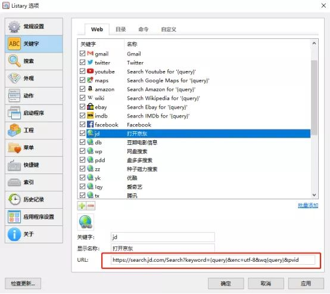
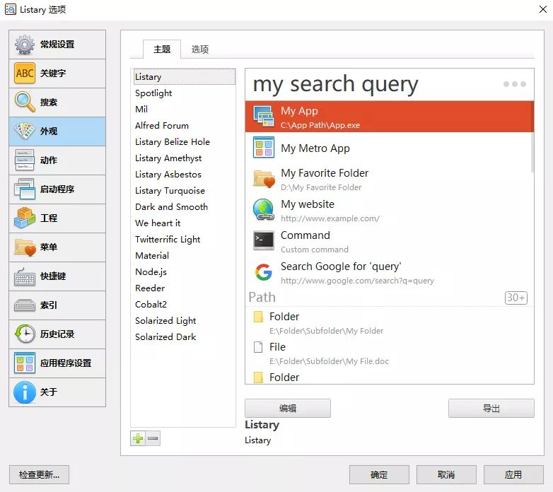

# 干货| listary 使用技巧,让搜索更快

39 人赞同了该文章

你是否经常需要某个文件却找不到？

右键另存为，却发现不是自己要储存的位置?

“Win键+R”搜不到软件，还要去桌面找快捷方式?

打开资源管理器，满满的文件列表，眼花缭乱？

Windows 孱弱的自带搜索又慢又卡？

……

------

**一款软件，１１个使用技巧，效率提升90%**

每天光解决这些问题就要花费大量时间，心情受影响，有效工作时间被压缩，不得不加班，真是糟糕透了！

这一切 Listary 都能轻松帮你解决，它可以快速定位文件、执行智能命令、记录访问历史、快速切换目录、收藏常用项目等,**极大提高效率，提升幸福感！**

## **一、快速切换，加强保存**

大家都知道 Windows 文件管理器的打开和保存有多难用，一层层打开目录，一不小心进错一层目录，还得返回上层重新选择。

而使用Listary就方便多了，比如当你下载文件选择保存目录时，在选择目录的提示框下方会有一个Listary搜索框（自动触发，无需双击“Ctrl”唤醒），你可以直接搜索你要保存的目录。

如果你要保存的目录早已打开，那么在下载页面“Ctrl+G”就能直接切换。此外，你还可以在历史记录中使用最近打开的文件夹，在文件另存为时尤其方便，炒鸡好用！！

操作展示

## **二、智能排序**

因为 Listary 是一款国产软件，所以**拼音首字母搜索**功能是它的一大特色。但使用首字母搜索，由于有可能存在多个同首字母相同的程序和文件，会产生多个结果，给准确定位带来麻烦。

但是你只要一两次选择你想要打开文件、程序，下次输入时，便会把你想要的结果排在第一位。**另外，如果你只想搜索文件，在搜索词后加空格即可。**

操作展示

## **三、网络搜索**

找到浏览器，双击打开，再输入搜索，这是一般人网络搜索的步骤，不是特别繁琐，但绝对不是最快的。

Listary 支持网络搜索，如果你想在谷歌上搜索 ABC，那你只需在 Listary 的搜索框中输入 gg ABC（中间要空格） 就能打开浏览器搜索。

除了系统设置好的关键词搜索方式，**你还可以自行添加，参考方法如下：**

以京东为例，先使用需要的网站的搜索功能，随意搜索某一关键词，查看官方的搜索链接，然后将搜索的关键词部分替换为{query}，检验链接能否使用。

然后复制链接，进入 Lisatry 进行设置即可！

小坚果已经为大家整理了十几个常用的网址，大家文末获取即可，Pro 版的用户可直接复制**批量添加。**

## **四、秒搜万份文件**

都说 Windows 自带的搜索速度很慢，**到底有多慢？**我们实验一下，同样搜索“123”的内容，Windows 自带的搜索用了 3 分 9 秒完成搜索，而 LIstary 只用了 1 秒就完成了搜索。
**如果你每天搜索 20 次，你将浪费近 1 小时，事倍功半！**

天下武功唯快不破，Listary不仅仅是快，还兼具“准”和“狠”，对比两者的搜索结果则一目了然。

● **搜索结果不完整：**Listary 的搜索结果排名靠前的是可用的文件夹和文件，而用Windows 资源管理器搜索的结果是许多系统文件在前，而且部分文件搜索不到。

●**呈现方式不清晰：**Listary 的搜索结果可以高亮，文件位置和类型一眼看到，相比之下 Windows 资源管理器的搜索结果无法高亮，看的眼花。

● **对搜索结果的操作选项少：**Listary可对文件进行发送、移动、复制文件路径、收藏等操作，而 Windows 本身可进行的选项少之又少，这是大家都知道的。

## **五、快捷唤醒，不止双击“Ctrl”**

任意界面双击“Ctrl”打开搜索框，这是很多人喜欢 Listary 的重要原因。

但是，Listary 还有骚操作，在资源管理器内，直接输入关键字即可搜索。比如我要查看的"豆瓣"文件里的内容，直接键入豆瓣。你会发现，光标已经自动定位在关键字匹配的文件上了，回车直接打开，整个过程如行云流水。

不过，在资源管理器中，这种直接键入搜索的模式只可搜索文件，启动应用、网络搜索等功能将被禁用。

## **六、快速启动应用**

老司机都知道 Win 键+ R 可快速执行 Ｗindows 自带的运行工具，但是这里只能执行 Ｗindows 自带的一些工具或在 Ｗindows 环境变量目录下的一些应用。比如：cmd、notepad等。而使用 Listary 则只需要：双击 Ctrl ，搜索。

除此之外，将常用文件添加到收藏夹也是个不错的选择。

## **七、收藏和历史**

**如果能像浏览器一样固定标签页、添加书签、保存历史记录，那找文件岂不是会更快？**

现在使用 Listary 的收藏夹功能，您可以将文件夹/文件/应用添加到“收藏夹”部分，点击打开即可，鼠标放置于文件夹上还能展示出二级三级文件夹，一目了然。

而历史记录则可以让你快速打开最新浏览的文件夹，不用返回到资源管理器中。

Listary 提供了多种方式让用户更便捷地定位和打开文件，而除了这些，L**istary　Pro** **还有很多很实用的增强功能和特性**，譬如 **Project (项目汇聚搜索)**、**FuzzyNavigation** (搜索当前文件夹里面的所有文件) 、**模糊导航、工程文件和搜索过滤器**等等。

## **八、指定父文件夹名称**

当您获得太多搜索结果时，您可以使用此语法让 Listary 仅显示父文件夹名称包含特定关键字的结果，快速缩小范围。

附加尾缀\ 到一个关键字，表明它是父文件夹路径的一部分。

示例：搜索 Listary 在 Windows 文件夹内:

- win\Lis
- win\ Lis
- Lis win\

## **九、搜索过滤器**

键入搜索过滤器关键字后加冒号，使您能搜索特定文件夹中的特定文件扩展名或文件夹。
目前系统默认搜索过滤器（可自行添加）：

- folder: 文件夹
- file: 文件
- doc: 文章
- pic: 图片
- audio: 音频
- video: 视频

示例：搜索一个文件夹 ， game 作为其名称的一部分:

folder: game

game folder:

## **十、工程文件**

就是让我可以在指定的目录下搜索文件，而不是全局搜索。

例如：我们将“C:\Users\坚果云\Desktop\黄河”添加进了工程列表，并给了它一个关键字“黄河”。我们可以在任意地方通过“黄河 xxx”来搜索这个文件夹下的文件。

## **十一、自定义主题**

**好看的皮囊多姿多彩，有趣的灵魂万里挑一。**当两者结合在一起，它不香吗？ListaryPro提供了十几种主题供选择，如果不喜欢，也可以自己设置主题。

## **▍最后**

“时间就是金钱”，“快一点，再快一点”，当效率被前所未有的重视时，优质的工具应该被了解。Listary让搜索定位的步骤更少，让打开文件的方式更快更便捷，值得推荐。

https://zhuanlan.zhihu.com/p/89695381