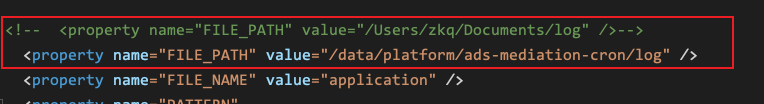
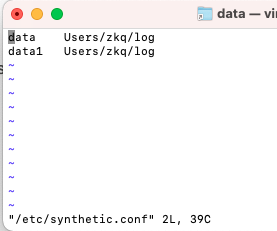
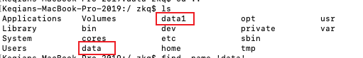
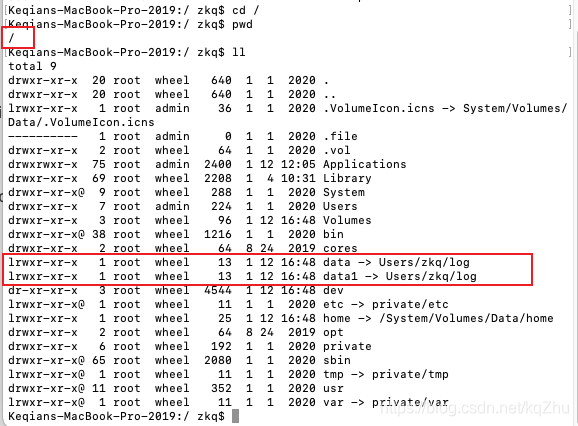

# 无法在Mac中创建/data文件夹

## 起因 : 无法在 mac 根目录下创建文件

spring 项目中设置了日志路径为/data/platform/*** , 但是在 Mac 中本地 debug 程序时, 不可以创建/data/platform , 每次都要手动更改FILE_PATH 很麻烦, 于是研究了一下为何在 Mac中无法在创建/data文件夹

 

## 原因 : MAC 更新BigSur后默认有系统文件保护, 根目录没有权限

因为MAC 更新BigSur后默认有系统文件保护, 根目录没有权限 (其实从catalina起安全性提升就不可以了)

所以,

简单来说 , catalina系统后物理文件是不能在root目录下面创建的, synthetic.conf提供了把文件创建到根目录下面的机制, 就是把目录挂载到我们的/下面 , Mac官方提供给我们的做法。

 

## 解决方法 : 使用synthetic.conf将文件挂载

1、***sudo vi /etc/synthetic.conf***

2、进行文件映射 or 软连接,如:

***data  Users/zkq/log***

***data1  Users/zkq/log***

(键入 i 进行编辑, 完成编辑后键入 Esc , 输入 :wq , 回车. 即可)

(注意必须使用 tab 键分隔，否则重启不会生效)

(上述是 : 建立data到Users/zkq/loga的链接)

3、必须重启电脑才会生效

4、记得在你的用户目录下***mkdir log\***

做完这些步骤后, 我们可以看到, 在系统根目录下出现了 data1 , data 文件夹, 软连接到 /Users/zkq/log : 

 

## 结果 : 完美解决

做完上述步骤后, 本地 debug 项目不再需要手动改代码, 重新指定FILE_PATH, 直接run 就会将/data/platform/ads-mediation-cron/log 实际创建到 /Users/zkq/log/platform/ads-mediation-cron/log 中. 

[无法在Mac中创建/data文件夹_kqZhu的博客-CSDN博客](https://blog.csdn.net/kqZhu/article/details/112542303)