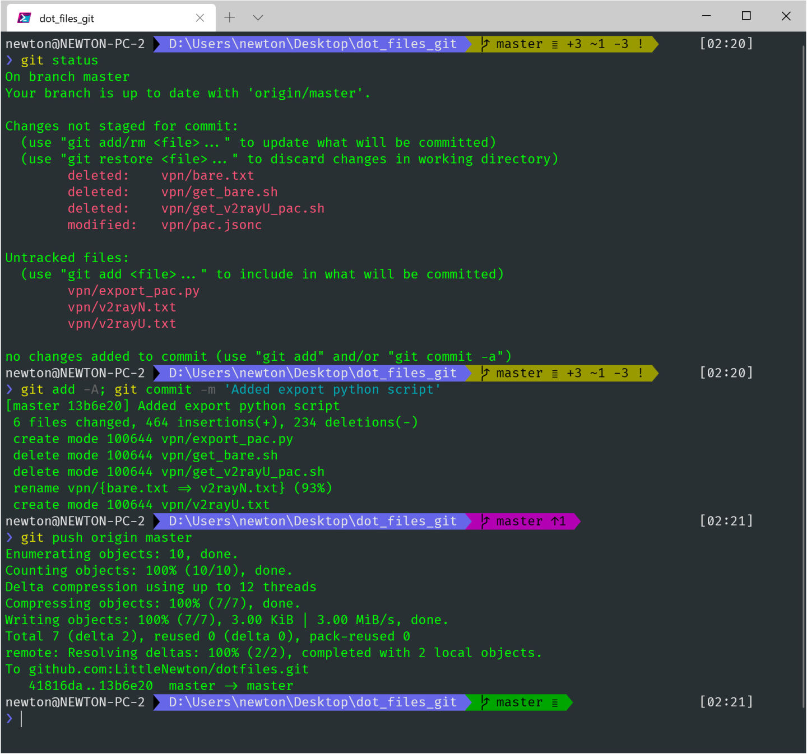
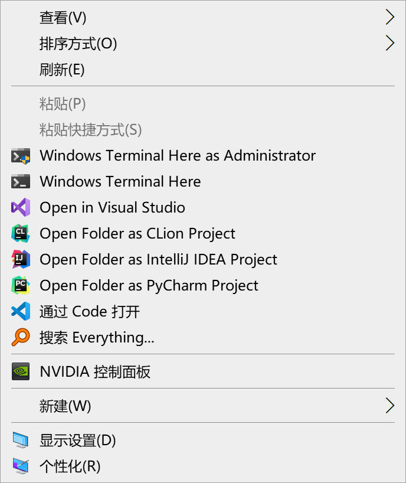
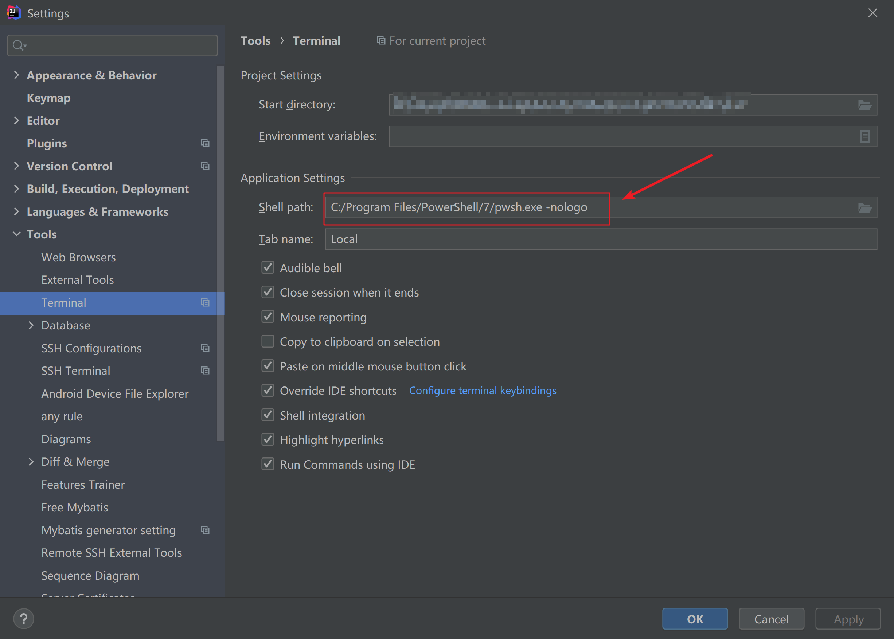

# Windows Terminal 完美配置 PowerShell 7.1

B站UP主: -老湿基-

586 人赞同了该文章

> **坑边闲话**：忆往昔岁月，不堪回首，伟大的 Windows 竟然拿不出一个像样的终端模拟器。mintty.exe 和 封装后的 cmder 之流，总是有各种问题，而且不兼容 emoji 字符。后来，全网 Windows 用户随着一个华丽的广告沸腾了，微软宣布了终端软件 Windows Terminal 的开发进程，而且开源！如今，Windows Terminal 预览版 已经陪伴我们走过了挺长一段时间，其稳定性和易用性已经非常不错，关键是颜值相当高。**如果你是一个追求完美与和谐的 User，那么请跟上我的步伐，我们重新起航！**

**重要提醒**：本文的所有配置经过多重考验，**请勿在配置过程中突发奇想**而走弯路，一定要认真阅读每一个段落、每一个句子！


图 1：常规展示


图 2：在 git 目录下的效果。


## 1. 安装 Windows Terminal

相信这一步对大多数人不构成任何困难，去 **Microsoft Store** 搜索下载就是了。

> 该项难度系数：0

## 2. 安装字体

这里仅推荐一款字体：**Fira Code**。该字体支持 ligature 连字功能，而且是一款专门为代码显示准备的字体。该字体开源，广受海内外程序员好评！

[单击此处从 GitHub 下载。](https://link.zhihu.com/?target=https%3A//github.com/tonsky/FiraCode/releases/download/3.1/FiraCode_3.1.zip)

装上该字体，即可进入下一步。

> 该项难度系数：1

（或许有人登 Github 有网络问题，请自行解决。）

## 3. 安装新款 Powershell Core  

首先声明，我们这儿用的 Powershell 与 Windows 自带的 Powershell 是完全不同的两个东西，除了功能相似和名字相同，两者内在已经天差地别。

自带的 Powershell **错误提示冗长**，**颜值低**，**速度慢**，总之就是不值得去用。

那么 Powershell Core 是什么呢？这是伟大的 **.Net Core 跨平台战略**的一个重要组成部分，微软设想，要让强大的 .Net 在所有平台上通用，让这么强大的 Powershell 在所有平台上都能用，古老的 bash 可以退休了！

基于以上愿景，微软开始了漫长而辉煌的征程。

开源，还是开源。在 [https://github.com/PowerShell/PowerShell/releases](https://link.zhihu.com/?target=https%3A//github.com/PowerShell/PowerShell/releases) 这个GitHub 链接里，有目前 Powershell 的最新版，我建议你从 release 里选个最新的 preview 版本。**经过测试，这些预览版都相当稳定。**

[直接单击此处下载 x86-64 Windows 64 位 .msi 安装包。](https://github.com/PowerShell/PowerShell/releases/download/v7.0.4/PowerShell-7.0.4-win-x64.msi)

> 该项难度系数：1

难度同样来自于访问 Github。

## 4. 安装 Powershell 插件

这一步是灵魂。

直接上代码：打开刚装好的新版 powershell，逐行输入命令。

```powershell
# 1. 安装 PSReadline 包，该插件可以让命令行很好用，类似 zsh
Install-Module -Name PSReadLine -AllowPrerelease -Force

# 2. 安装 posh-git 包，让你的 git 更好用
Install-Module posh-git -Scope CurrentUser

# 3. 安装 oh-my-posh 包，让你的命令行更酷炫、优雅
Install-Module oh-my-posh -Scope CurrentUser
```

安装过程可能有点慢，**好像卡住了一样**，但是请耐心等待几分钟。

> 该项难度系数：0

后面两个包的**来源可能不受系统信任**，不用管它，如果让你选择是否信任，直接输入 `Y` 即可。

## 5. 配置 Windows Terminal

这一项是灵魂。

只有新款 Powershell 而没有 Windows Terminal，好比吃肉不放盐。

简单点，直接上配置代码，遇到不懂的地方，自己读注释。记得将此设置默认配置（代码已经给出）。

```json
// 默认的配置就是我们的新 powershell（重要！！！）
"defaultProfile": "{574e775e-4f2a-5b96-ac1e-a2962a402336}",

{
    // Powershell 7.1.0-preview.2 配置
    "guid": "{574e775e-4f2a-5b96-ac1e-a2962a402336}",
    "hidden": false,
    "name": "pwsh",
    // 注意：一定要写上 -nologo，否则开启 powershll 会有一段话输出，很讨厌！
    "commandline": "C:/Program Files/PowerShell/7/pwsh.exe -nologo",
    "source": "Windows.Terminal.PowershellCore",
    // 启动菜单一定要设置为 <.>，否则后面重要的一步将会无效！
    "startingDirectory": ".",
    // 字体
    "fontFace": "Fira Code",
    "fontSize": 11,
    "historySize": 9001,
    "padding": "5, 5, 20, 25",
    "snapOnInput": true,
    "useAcrylic": false,
    // 颜色
    "colorScheme": "Homebrew"
},
```

同时附上 Homebrew 配色，该配色经过我改良。

```json
{
    "name": "Homebrew",
    "black": "#000000",
    "red": "#FC5275",
    "green": "#00a600",
    "yellow": "#999900",
    "blue": "#6666e9",
    "purple": "#b200b2",
    "cyan": "#00a6b2",
    "white": "#bfbfbf",
    "brightBlack": "#666666",
    "brightRed": "#e50000",
    "brightGreen": "#00d900",
    "brightYellow": "#e5e500",
    "brightBlue": "#0000ff",
    "brightPurple": "#e500e5",
    "brightCyan": "#00e5e5",
    "brightWhite": "#e5e5e5",
    "background": "#283033",
    "foreground": "#00ff00"
},
```

特别注意，用其他配色可能**降低颜值**。

> 该项难度系数：0

需要懂点 json，还**需要会配置 Windows Terminal**。

## 6. 添加右键菜单

这一步是**灵魂中的灵魂**。

> **这里涉及修改注册表，小白请勿手残改坏注册表，强烈建议事前建立系统还原点！**

Github 上面已经有 powershell 脚本了，可以用管理员身份运行该脚本 + 某些参数以实现配置右键菜单。

[原版 Github 仓库](https://link.zhihu.com/?target=https%3A//github.com/lextm/windowsterminal-shell/)

[我修改后的脚本仓库](https://link.zhihu.com/?target=https%3A//github.com/LittleNewton/windows_terminal_here)

建议下载我这个，然后在管理员模式的 powershell 7 里运行：

```text
.\install.ps1 mini
```

记住一定要以**管理员身份**在 powershell 7 里面运行该脚本。


图 3： 用我修改后的脚本安装之后的效果如图


**目前发现问题**：该脚本会读取 Windows Terminal 的 profile，然后把其中的非隐藏项目添加到右键菜单（默认视图），这之后如果你修改了 profile，那么需要用 `uninstall.ps1` 脚本先清除右键菜单，然后重新 install 一遍。

## 7. 添加 Powershell 启动参数

在 powershell 中输入

```powershell
notepad.exe $Profile
```

紧接着在弹出的页面中输入下面这一长串代码，保存并关闭。这个 Profile 配置文件与 .zshrc / .bashrc 文件一样，都是控制启动前参数的。

```powershell
<#
 * FileName: Microsoft.PowerShell_profile.ps1
 * Author: 刘 鹏
 * Email: littleNewton6@outlook.com
 * Date: 2020, May. 1
 * Copyright: No copyright. You can use this code for anything with no warranty.
#>


#------------------------------- Import Modules BEGIN -------------------------------
# 引入 posh-git
Import-Module posh-git

# 引入 oh-my-posh
Import-Module oh-my-posh

# 设置 PowerShell 主题
Set-Theme Paradox
#------------------------------- Import Modules END   -------------------------------


#-------------------------------  Set Hot-keys BEGIN  -------------------------------
# 设置 Tab 键补全
# Set-PSReadlineKeyHandler -Key Tab -Function Complete

# 设置 Ctrl+d 为菜单补全和 Intellisense
Set-PSReadLineKeyHandler -Key "Tab" -Function MenuComplete

# 设置 Ctrl+d 为退出 PowerShell
Set-PSReadlineKeyHandler -Key "Ctrl+d" -Function ViExit

# 设置 Ctrl+z 为撤销
Set-PSReadLineKeyHandler -Key "Ctrl+z" -Function Undo

# 设置向上键为后向搜索历史记录
Set-PSReadLineKeyHandler -Key UpArrow -Function HistorySearchBackward

# 设置向下键为前向搜索历史纪录
Set-PSReadLineKeyHandler -Key DownArrow -Function HistorySearchForward
#-------------------------------  Set Hot-keys END    -------------------------------


#-------------------------------    Functions BEGIN   -------------------------------
# Python 直接执行
$env:PATHEXT += ";.py"

# 更新 pip 的方法
function Update-Packages {
    # update pip
    Write-Host "Step 1: 更新 pip" -ForegroundColor Magenta -BackgroundColor Cyan
    $a = pip list --outdated
    $num_package = $a.Length - 2
    for ($i = 0; $i -lt $num_package; $i++) {
        $tmp = ($a[2 + $i].Split(" "))[0]
        pip install -U $tmp
    }

    # update TeX Live
    $CurrentYear = Get-Date -Format yyyy
    Write-Host "Step 2: 更新 TeX Live" $CurrentYear -ForegroundColor Magenta -BackgroundColor Cyan
    tlmgr update --self
    tlmgr update --all
}
#-------------------------------    Functions END     -------------------------------


#-------------------------------   Set Alias Begin    -------------------------------
# 1. 编译函数 make
function MakeThings {
    nmake.exe $args -nologo
}
Set-Alias -Name make -Value MakeThings

# 2. 更新系统 os-update
Set-Alias -Name os-update -Value Update-Packages

# 3. 查看目录 ls & ll
function ListDirectory {
    (Get-ChildItem).Name
    Write-Host("")
}
Set-Alias -Name ls -Value ListDirectory
Set-Alias -Name ll -Value Get-ChildItem
#-------------------------------    Set Alias END     -------------------------------
```

------


## 8. 添加 idea terminal





非常完美。

## 结束语

为什么不用 WSL 作为默认界面？当然，这也很好，但是在某些编辑和交互控制上，**Powershell 才是 Windows 上的正主**，WSL 说白了，就是个临时替代之用的。对于老程序员，当然是“我全都要”。

经过测试，该做法**界面美观，性能优异，配置简单**，值得大家使用。在此强烈推荐！

> **Cover 劳动节第一篇文章**
> 本文使用 [Zhihu On VSCode](https://zhuanlan.zhihu.com/p/106057556) 创作并发布


[Windows Terminal 完美配置 PowerShell 7.1 - 知乎 (zhihu.com)](https://zhuanlan.zhihu.com/p/137595941)