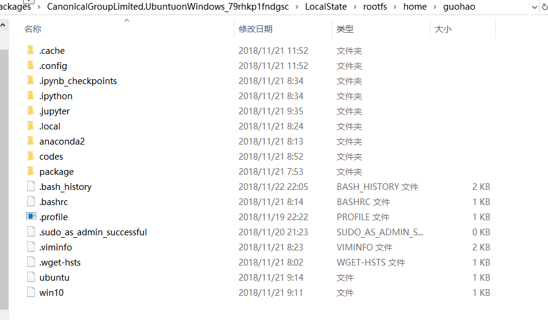

# win10与子系统ubuntu之间互访文件

在window10的store里面 搜索ubuntu，下载，可以安装

注意： 初次打开有许多软件都没安装，可以新进行 sudo apt-get update,之后在进行其他的操作

 

## 1、下载的子系统ubuntu存放的位置如下：

```
C:\Users\xxx\AppData\Local\Packages\CanonicalGroupLimited.UbuntuonWindows_79rhkp1fndgsc\LocalState\rootfs\home\xxx
```

例如我的存放位置：C:\Users\11637\AppData\Local\Packages\CanonicalGroupLimited.UbuntuonWindows_79rhkp1fndgsc\LocalState\rootfs\home\guohao



## 2、ubuntu系统下访问win10的目录（以e盘为例）：


然后创建win10（这里笔者起名为ubuntu）的快捷方式

```
$ ln -s /mnt/e/dev/ubuntu ~/ubuntu 
```

在ubuntu下通过一下命令即可查看win10对应的相关目录文件


https://www.cnblogs.com/guohaoblog/p/10005465.html