# 从安装到基本设置——Win10子系统入门简明教程

在生物信息学的分析中，Linux的使用是绕不开的。例如很多生信软件只有Linux版，一些R包也没有Windows版。但是很多人都使用Windows电脑。以前我们的选择无非两种：双系统和虚拟机。双系统的话安装、配置以及和Windows系统文件交换较为麻烦，而虚拟机有额外的性能消耗。

可喜的是微软在Win10最新版中加入了适用于Linux的Windows子系统（Windows Subsystem for Linux，WSL），使得你可以在Windows下安装运行一个Linux环境。

## 简介

> 适用于Linux的Windows子系统允许开发人员直接在Windows上运行Linux环境——包括大多数命令行工具、实用工具和应用程序--直接在 Windows 上，不需修改，没有虚拟机的额外资源开销。

上文是微软官方文档对子系统的描述，还是很简明直接地描述了子系统的特性。

## 安装

子系统这个功能已经在最新版的Windows 10中自带，所以**请需要的各位先升级至最新版Windows 10**。如果你已经是最新版了，则可以按下面的教程安装子系统。

首先，通过“Windows功能”开启子系统。

在Cortana搜索框中输入“Windows功能”，在弹出结果中选择“启用或关闭Windows功能”。

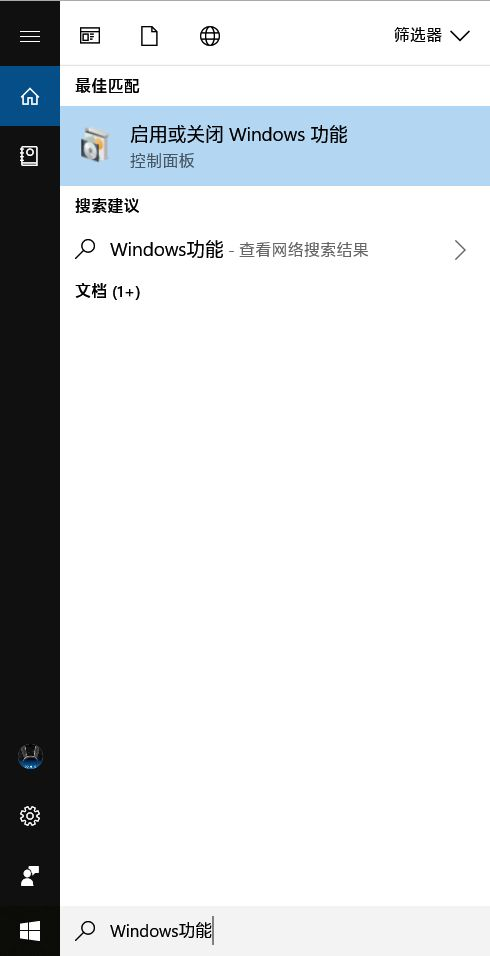


在弹出的“Windows功能”窗口中找到“适用于Linux的Windows子系统”勾起，之后按下“确定”。

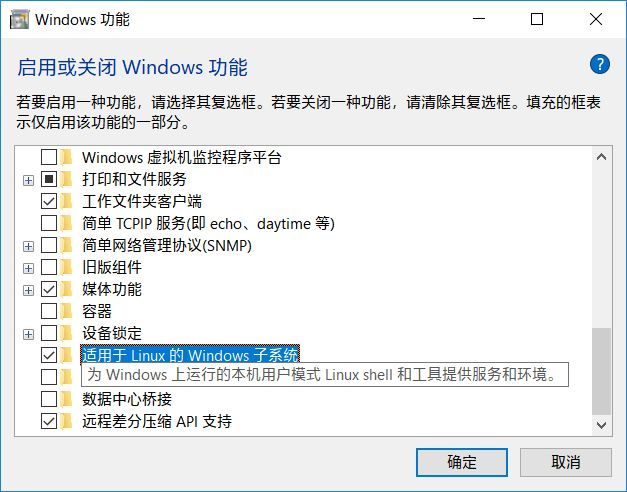

Windows会自动搜索并安装一些所需的文件，完成后会提示你重启后才会生效，选择“立即重新启动”。

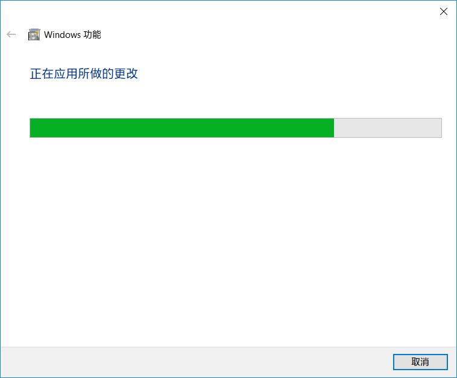

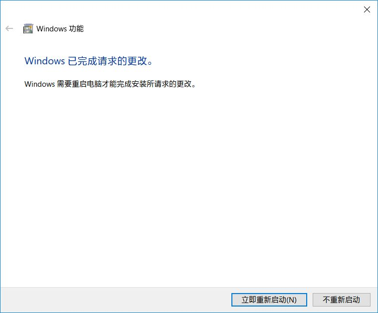

重启后打开应用商店，搜索“Linux”，选择“在Windows上运行Linux”。

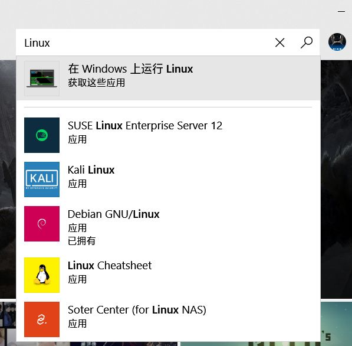

进入的页面中有多个Linux发行版供选择，个人建议选择Ubuntu。

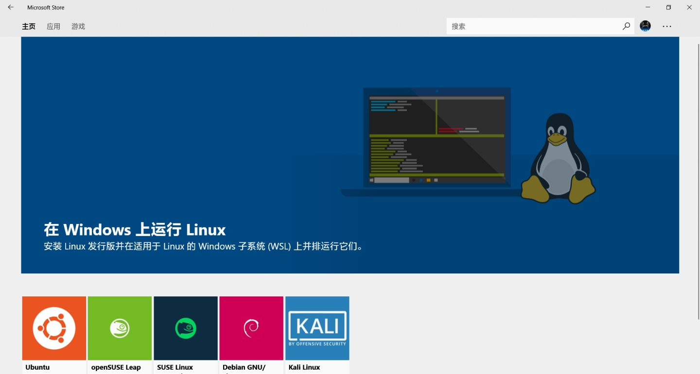


安装后选择启动，首次进入需要等待一段时间才可以开始初始设置。


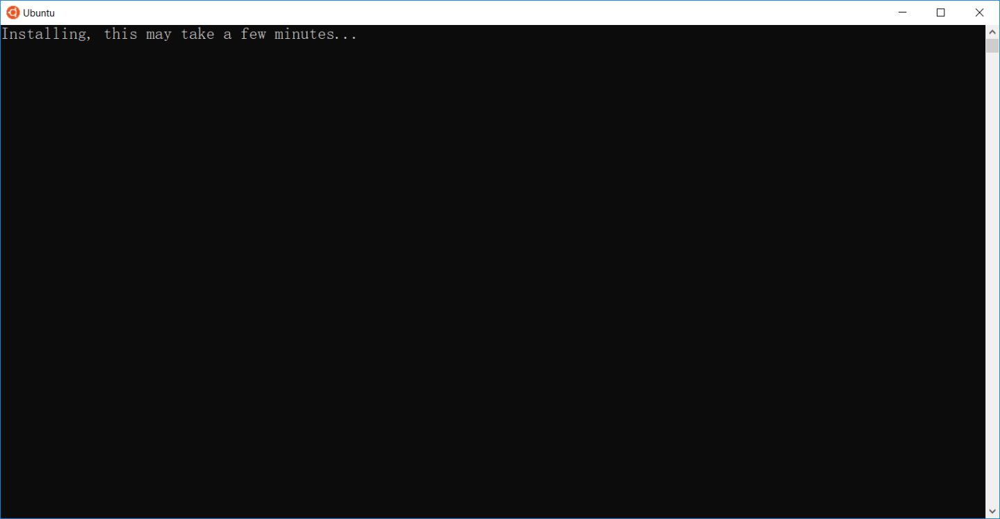

安装完成后就会要求你输入用户名和密码

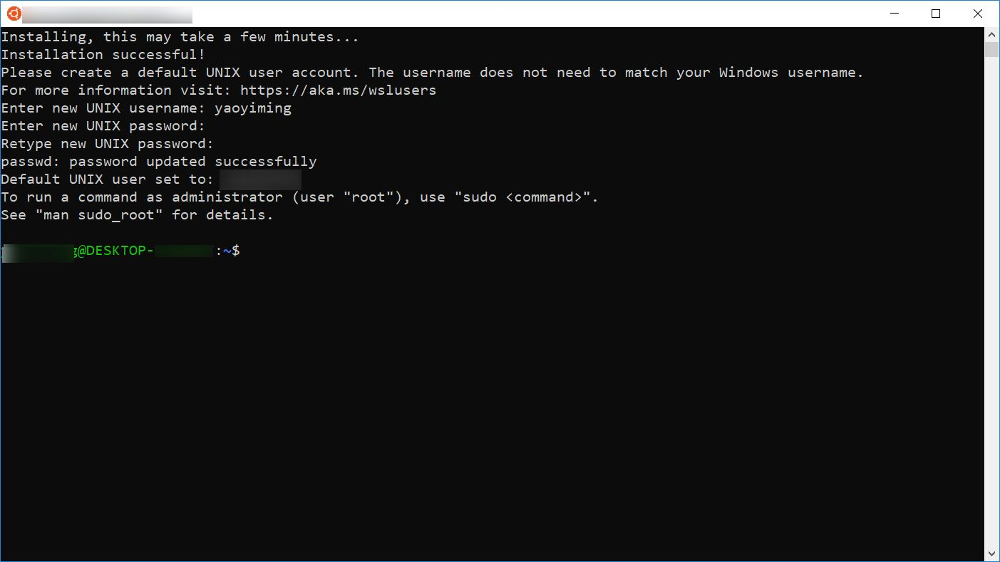

设置完用户名和密码后子系统本身的安装就已经完成了。

## 基本设置

为了今后的使用方便，我们需要对子系统进行基本的设置并安装一些软件。

在这之前先说说**子系统和Windows本身的文件交换方式。**

**Windows下各分区会挂载在子系统的“/mnt/”下，例如“D:\test\”在子系统中就是“/mnt/d/test/”。**

更改Ubuntu软件源

```text
sudo sed -i 's/archive.ubuntu.com/mirrors.ustc.edu.cn/g' /etc/apt/sources.list
```

使新源生效

```text
sudo apt update
```

安装htop以方便日后查看任务运行情况

```text
sudo apt install htop
```

安装Anaconda：详情参见

[孟浩巍：生物信息学100个基础问题 —— 番外2: 用Anaconda快速搭建生物信息学分析平台zhuanlan.zhihu.com](https://zhuanlan.zhihu.com/p/35711429)

安装R语言（推荐Microsoft R Open，是微软基于官方开源版进行二次开发的R，兼容性一致，但是你无需做任何特别的事就可以直接使用多核运算，并对矩阵计算有专门的优化）：

到Microsoft R Open下载页面（[Home](https://link.zhihu.com/?target=https%3A//mran.microsoft.com/download)）下载Ubuntu对应的包，下载下来是一个“tar.gz”的压缩包。

进入到所下载安装包的目录，在地址栏输入“bash”并回车，子系统会开启，且会自动进入到资源管理器当前目录。

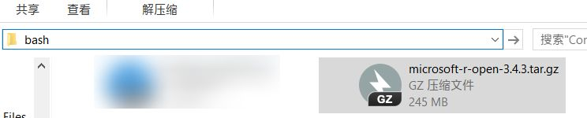

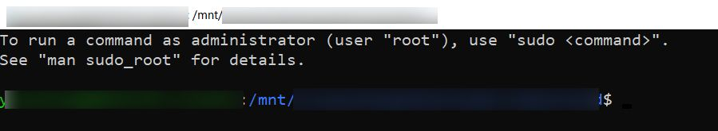

这个时候输入下方命令

```text
cp microsoft-r-open-3.5.1.tar.gz  ~
```

这个就是把安装包拷贝到子系统当前用户的home目录下。

回到home目录

```text
cd ~
```

当然，嫌上面的步骤麻烦的话可以用下面的命令直接把安装包下载到home目录

```text
wget https://mran.blob.core.windows.net/install/mro/3.5.3/ubuntu/microsoft-r-open-3.5.3.tar.gz
```

解压安装包

```text
tar -zxvf microsoft-r-open-3.5.3.tar.gz
```

进入解压出来的目录

```text
cd microsoft-r-open/
```

启动安装

```text
sudo ./install.sh
```

启动安装后会有两个协议，按回车进入，按q退出，退出后输入“y”后回车，而后就会开始安装。

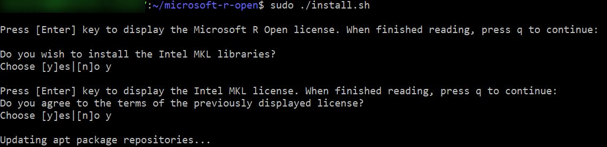

出现以下提示即表明安装完成


为了后续的R包安装正常，通过下面这条命令安装一些库和编译工具

```console
sudo apt install make cmake gfortran gcc g++ libpng-dev libcurl4-openssl-dev libxml2-dev libssl-dev
```

至此，子系统本身的安装、基本设置就完成了。


https://zhuanlan.zhihu.com/p/35735513