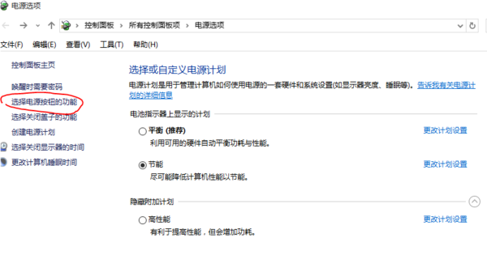
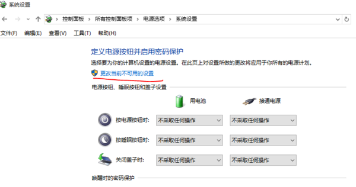
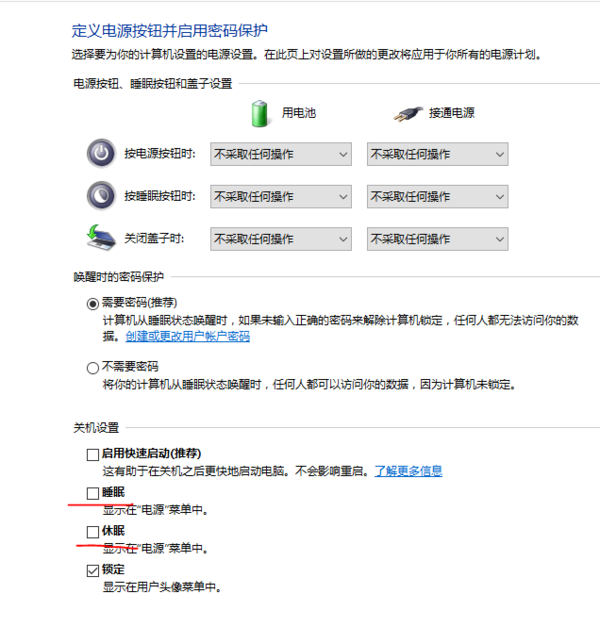

# win10休眠和睡眠有什么不同

两者定义的本质区别：

1、“睡眠”的最大特点就是内存不断电，维持其中的数据。同时，另有交换文件存储这些数据，即便是在睡眠过程中意外断电（如检修或被人拔掉插座），重启后还可以自动恢复。

2、休眠将当前工作环境转换为休眠文件，保存在系统盘的根目录下，下次开机后会自动恢复现场。休眠文件保存之后，机器会彻底关闭。

电脑休眠（Hibernate）：将系统切换到该模式后，系统会自动将内存中的数据全部转存到硬盘上一个休眠文件中，然后切断对所有设备的供电。这样当恢复的时候，系统会从硬盘上将休眠文件的内容直接读入内存，并恢复到休眠之前的状态。这种模式完全不耗电，因此不怕休眠后供电异常，但代价是需要一块和物理内存一样大小的硬盘空间（好在现在的硬盘已经跨越TB级别了，大容量硬盘越来越便宜）。而这种模式的恢复速度较慢，取决于内存大小和硬盘速度，一般都要1分钟左右，甚至更久。

电脑睡眠（Sleep）：电脑睡眠是Windows Vista中的新模式，这种模式结合了待机和休眠的所有优点。将系统切换到睡眠状态后，系统会将内存中的数据全部转存到硬盘上的休眠文件中（这一点类似休眠），然后关闭除了内存外所有设备的供电，让内存中的数据依然维持着（这一点类似待机）。这样，当我们想要恢复的时候，如果在睡眠过程中供电没有发生过异常，就可以直接从内存中的数据恢复（类似待机），速度很快；但如果睡眠过程中供电异常，内存中的数据已经丢失了，还可以从硬盘上恢复（类似休眠），只是速度会慢一点。不过无论如何，这种模式都不会导致数据丢失。

如何查看并操作两个选项：

1）开始菜单并选择“电源选项”。

2）点击“选择电源按钮的功能”。

3）点击“更改当前不可用的设置”。

4）随后就可以看到“关机设置”列表中的“睡眠”和“休眠”选项，将其选中并保存即可。

 

https://zhidao.baidu.com/question/2118694500064637387.html