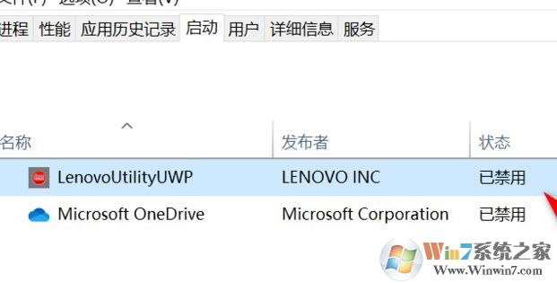

### 联想笔记本win10系统 FN+Q 热键不能用的修复方法

1、去应用商店下载Lenovo Utility 下载更新一下该软件，安装好后重启一下系统（是选择【重启】，不是选择【关机】在开机）；

```
应用商店搜：LenovoUtility
不要带空格键，有的；；
带空格（Lenovo Utility）就搜不到
```

2、如果已经安装，那么右键点击“任务栏”，打开“任务管理器”，切换到“启动”，查看Lenovo Utility功能是否处于禁用状态，如图：



3、鼠标右键Lenovo Utility，启用此功能，重启电脑后，按下“Fn+Q”键，功能可以正常使用。


以上便是winwin7小编给大家分享介绍的联想笔记本win10系统 FN+Q 热键不能用的有效解决方法，有需要的用户不要错过快来试试吧！


http://www.winwin7.com/JC/18293.html