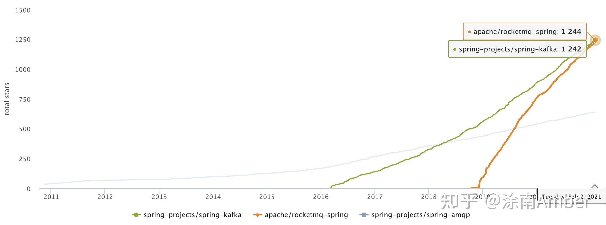
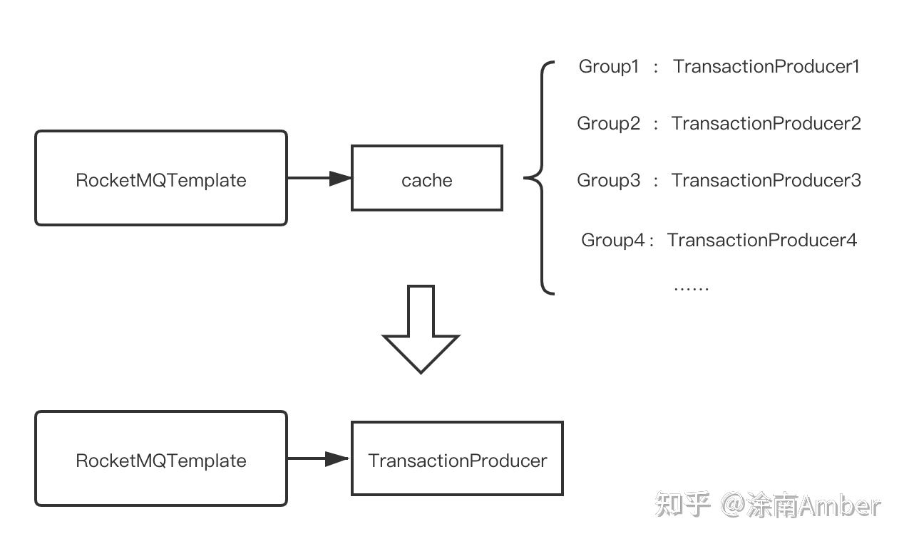

# RocketMQ-Spring 为什么能成为 Spring 生态中最受欢迎的messaging实现？

2019 年 1 月，孵化 6 个月的 RocketMQ-Spring 作为 Apache RocketMQ 的子项目正式毕业，发布了第一个 Release 版本 2.0.1。该项目是把 RocketMQ 的客户端使用 Spring Boot 的方式进行了封装，可以让用户通过简单的 annotation 和标准的 Spring Messaging API 编写代码来进行消息的发送和消费。当时 RocketMQ 社区同学请 Spring 社区的同学对 RocketMQ-Spring 代码进行 review，引出一段[罗美琪（RocketMQ）和春波特（Spring Boot）的故事](https://link.zhihu.com/?target=https%3A//mp.weixin.qq.com/s%3F__biz%3DMzIxODM2NTQ3OQ%3D%3D%26mid%3D2247483907%26idx%3D2%26sn%3D10970974cd335896782ed6eb1096c5b3%26scene%3D21%23wechat_redirect)。

时隔两年，RocketMQ-Spring 正式发布 2.2.0。在这期间，RocketMQ-Spring 迭代了数个版本，以 RocketMQ-Spring 为基础实现的 Spring Cloud Stream RocketMQ Binder、Spring Cloud Bus RocketMQ 登上了 [Spring 的官网](https://link.zhihu.com/?target=https%3A//spring.io/projects/spring-cloud-alibaba)，Spring 布道师 baeldung 向国外同学介绍[如何使用 RocketMQ-Spring](https://link.zhihu.com/?target=https%3A//www.baeldung.com/apache-rocketmq-spring-boot)，越来越多国内外的同学开始使用 RocketMQ-Spring 收发消息，RocketMQ-Spring 仓库的 star 数也在短短两年时间内超越了 Spring-Kafka 和 Spring-AMQP（注：两者均由 Spring 社区维护），成为 Apache RocketMQ 最受欢迎的生态项目之一。





RocketMQ-Spring 的受欢迎一方面得益于支持丰富业务场景的 RocketMQ 与微服务生态 Spring 的完美契合，另一方面也与 RocketMQ-Spring 本身严格遵循 Spring Messaging API 规范，支持丰富的消息类型分不开。

## 遵循 Spring Messaging API 规范

Spring Messaging 提供了一套抽象的 API，对消息发送端和消息接收端的模式进行规定，不同的消息中间件提供商可以在这个模式下提供自己的 Spring 实现：在消息发送端需要实现的是一个 XXXTemplate 形式的 Java Bean，结合 Spring Boot 的自动化配置选项提供多个不同的发送消息方法；在消息的消费端是一个 XXXMessageListener 接口（实现方式通常会使用一个注解来声明一个消息驱动的 POJO），提供回调方法来监听和消费消息，这个接口同样可以使用 Spring Boot 的自动化选项和一些定制化的属性。

### 1. 发送端

RocketMQ-Spring 在遵循 Spring Messaging API 规范的基础上结合 RocketMQ 自身的功能特点提供了相应的 API。在消息的发送端，RocketMQ-Spring 通过实现 RocketMQTemplate 完成消息的发送。如下图所示，RocketMQTemplate 继承 AbstractMessageSendingTemplate 抽象类，来支持 Spring Messaging API 标准的消息转换和发送方法，这些方法最终会代理给 doSend 方法，doSend 方法会最终调用 syncSend，由 DefaultMQProducer 实现。


除 Spring Messaging API 规范中的方法，RocketMQTemplate 还实现了 RocketMQ 原生客户端的一些方法，来支持更加丰富的消息类型。值得注意的是，相比于原生客户端需要自己去构建 RocketMQ Message（比如将对象序列化成 byte 数组放入 Message 对象），RocketMQTemplate 可以直接将对象、字符串或者 byte 数组作为参数发送出去（对象序列化操作由 RocketMQ-Spring 内置完成），在消费端约定好对应的 Schema 即可正常收发。

```text
RocketMQTemplate Send API：
    SendResult syncSend(String destination, Object payload) 
    SendResult syncSend(String destination, Message<?> message）
    void asyncSend(String destination, Message<?> message, SendCallback sendCallback)
    void asyncSend(String destination, Message<?> message, SendCallback sendCallback)
    ……
```

### 2. 消费端

在消费端，需要实现一个包含 @RocketMQMessageListener 注解的类（需要实现 RocketMQListener 接口，并实现 onMessage 方法，在注解中进行 topic、consumerGroup 等属性配置），这个 Listener 会一对一的被放置到 DefaultRocketMQListenerContainer 容器对象中，容器对象会根据消费的方式(并发或顺序)，将 RocketMQListener 封装到具体的 RocketMQ 内部的并发或者顺序接口实现。在容器中创建 RocketMQ DefaultPushConsumer 对象，启动并监听定制的 Topic 消息，完成约定 Schema 对象的转换，回调到 Listener 的 onMessage 方法。

```text
@Service
@RocketMQMessageListener(topic = "${demo.rocketmq.topic}", consumerGroup = "string_consumer", selectorExpression = "${demo.rocketmq.tag}")
public class StringConsumer implements RocketMQListener<String> {
    @Override
    public void onMessage(String message) {
        System.out.printf("------- StringConsumer received: %s \n", message);
    }
}
```

除此 Push 接口之外，**在最新的 2.2.0 版本中，RocketMQ-Spring 实现了 RocketMQ Lite Pull Consumer**。通过在配置文件中进行 consumer 的配置，利用 RocketMQTemplate 的 Recevie 方法即可主动 Pull 消息。

```text
配置文件resource/application.properties：

rocketmq.name-server=localhost:9876
rocketmq.consumer.group=my-group1
rocketmq.consumer.topic=test

Pull Consumer代码：

while(!isStop) {
    List<String> messages = rocketMQTemplate.receive(String.class);
    System.out.println(messages);
}
```

## 丰富的消息类型

RocketMQ Spring 消息类型支持方面与 RocketMQ 原生客户端完全对齐，包括同步/异步/one-way、顺序、延迟、批量、事务以及 Request-Reply 消息。在这里，主要介绍较为特殊的事务消息和 request-reply 消息。

### 1. 事务消息

RocketMQ 的事务消息不同于 Spring Messaging 中的事务消息，依然采用 RocketMQ 原生事务消息的方案。如下所示，发送事务消息时需要实现一个包含 @RocketMQTransactionListener 注解的类，并实现 executeLocalTransaction 和 checkLocalTransaction 方法，从而来完成执行本地事务以及检查本地事务执行结果。

```text
// Build a SpringMessage for sending in transaction
Message msg = MessageBuilder.withPayload(..)...;
// In sendMessageInTransaction(), the first parameter transaction name ("test")
// must be same with the @RocketMQTransactionListener's member field 'transName'
rocketMQTemplate.sendMessageInTransaction("test-topic", msg, null);

// Define transaction listener with the annotation @RocketMQTransactionListener
@RocketMQTransactionListener
class TransactionListenerImpl implements RocketMQLocalTransactionListener {
    @Override
    public RocketMQLocalTransactionState executeLocalTransaction(Message msg, Object arg) {
        // ... local transaction process, return bollback, commit or unknown
        return RocketMQLocalTransactionState.UNKNOWN;
    }

    @Override
    public RocketMQLocalTransactionState checkLocalTransaction(Message msg) {
        // ... check transaction status and return bollback, commit or unknown
        return RocketMQLocalTransactionState.COMMIT;
    }
}
```

在 2.1.0 版本中，RocketMQ-Spring 重构了事务消息的实现，如下图所示，旧版本中每一个 group 对应一个 TransactionProducer，而在新版本中改为每一个 RocketMQTemplate 对应一个 TransationProducer，从而解决了并发使用多个事务消息的问题。当用户需要在单进程使用多个事务消息时，可以使用 ExtRocketMQTemplate 来完成（一般情况下，推荐一个进程使用一个 RocketMQTemplate，ExtRocketMQTemplate 可以使用在同进程中需要使用多个 Producer / LitePullConsumer 的场景，可以为 ExtRocketMQTemplate 指定与标准模版 RocketMQTemplate 不同的 nameserver、group 等配置），并在对应的 RocketMQTransactionListener 注解中指定 rocketMQTemplateBeanName 为 ExtRocketMQTemplate 的 BeanName。





### 2. Request-Reply 消息

在 2.1.0 版本中，RocketMQ-Spring 开始支持 Request-Reply 消息。Request-Reply 消息指的是上游服务投递消息后进入等待被通知的状态，直到消费端返回结果并返回给发送端。在 RocketMQ-Spring 中，发送端通过 RocketMQTemplate 的 sendAndReceivce 方法进行发送，如下所示，主要有同步和异步两种方式。异步方式中通过实现 RocketMQLocalRequestCallback 进行回调。

```text
// 同步发送request并且等待String类型的返回值
String replyString = rocketMQTemplate.sendAndReceive("stringRequestTopic", "request string", String.class);

// 异步发送request并且等待User类型的返回值
rocketMQTemplate.sendAndReceive("objectRequestTopic", new User("requestUserName",(byte) 9), new RocketMQLocalRequestCallback<User>() {
    @Override public void onSuccess(User message) {
        ……
    }

    @Override public void onException(Throwable e) {
        ……
    }
});
```

在消费端，仍然需要实现一个包含 @RocketMQMessageListener 注解的类，但需要实现的接口是 RocketMQReplyListener<T, R> 接口（普通消息为 RocketMQListener 接口），其中 T 表示接收值的类型，R 表示返回值的类型，接口需要实现带返回值的 onMessage 方法，返回值的内容返回给对应的 Producer。

```text
@Service
@RocketMQMessageListener(topic = "stringRequestTopic", consumerGroup = "stringRequestConsumer")
public class StringConsumerWithReplyString implements RocketMQReplyListener<String, String> {
    @Override
    public String onMessage(String message) {
        ……
        return "reply string";
    }
}
```

RocketMQ-Spring 遵循 Spring 约定大于配置（Convention over configuration）的理念，通过启动器（Spring Boot Starter）的方式，在 pom 文件引入依赖（groupId：org.apache.rocketmq，artifactId：rocketmq-spring-boot-starter）便可以在 Spring Boot 中集成所有 RocketMQ 客户端的所有功能，通过简单的注解使用即可完成消息的收发。在 [RocketMQ-Spring Github Wiki](https://link.zhihu.com/?target=https%3A//github.com/apache/rocketmq-spring/wiki) 中有更加详细的用法和常见问题解答。

据统计，从 RocketMQ-Spring 发布第一个正式版本以来，RocketMQ-Spring 完成 16 个 bug 修复，37 个 imporvement，其中包括事务消息重构，消息过滤、消息序列化、多实例 RocketMQTemplate 优化等重要优化，欢迎更多的小伙伴能参与到 RocketMQ 社区的建设中来，罗美琪（RocketMQ）和春波特（Spring Boot）的故事还在继续……


[RocketMQ-Spring 为什么能成为 Spring 生态中最受欢迎的messaging实现？ - 知乎 (zhihu.com)](https://zhuanlan.zhihu.com/p/349023879)