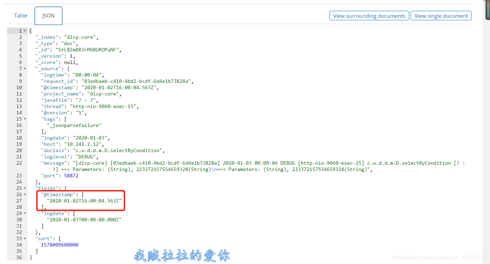

# elasticsearch基本操作之--使用QueryBuilders进行范围时间组合查询

2020-01-03 14:50:25

> QueryBuilder 是es中提供的一个查询接口

```javascript
private SearchResponse getApiResponseByDetail(SearchRequestBuilder responseBuilder,String condition) {
        String time1 = "2020-01-02T00:00:00.000Z";
        String time2 = "2020-01-02T15:59:59.000Z";
        RangeQueryBuilder rangequerybuilder = QueryBuilders
                //传入时间，目标格式2020-01-02T03:17:37.638Z
                .rangeQuery("@timestamp")
                .from(time1).to(time2);
 
        SearchResponse searchResponse = responseBuilder.setQuery(
                QueryBuilders.boolQuery()
                       //must表示and
                       .must(rangequerybuilder) //根据时间范围查询
                       .must(QueryBuilders.existsQuery("api_id"))
                       .must(QueryBuilders.matchPhraseQuery("detail", condition))
        ).setExplain(true).execute().actionGet();
        return searchResponse;
    }
```

注意：es存储日志 是按照UTC时间格式存放，以@timestamp 作为时间范围查询条件，即from（Date1） to（Date2）Date1、Date2入参必须是标准的utc格式；本地时间转utc？不清楚的小伙伴可以看下这篇 [ java如何实现本地时间转成UTC时间格式](https://blog.csdn.net/weixin_43970743/article/details/103815903)？



----------------------------------------------------------------分割线--------------------------------------------------------------------
1、BoolQuery( ) 用于组合多个叶子或复合查询子句的默认查询

- must 相当于 与 & =
- must not 相当于 非 ~  ！=
- should 相当于 或  |  or 
- filter  过滤

```javascript
boolQuery().must(termQuery("content", "test1"))
           .must(termQuery("content", "test4")) 
           .mustNot(termQuery("content", "test2"))
           .should(termQuery("content", "test3"))
           .filter(termQuery("content", "test5"));
```

###  2、Elasticsearch java api 常用查询方法QueryBuilder构造举例

ps:以下来源：http://www.mamicode.com/info-detail-2113729.html

## 精确查询

以下字段名用${fieldName}代替，具体值用${fieldValue}代替

**1、数字**

```java
//单个
QueryBuilder qb1 = QueryBuilders.termQuery("${fieldName}", "${fieldValue}");
 
//批量
QueryBuilder qb1 = QueryBuilders.termsQuery("${fieldName}", "${fieldValues}");
```

**2、字符串**

```javascript
//单个
QueryBuilder qb1 = QueryBuilders.termQuery("${fieldName}.keyword", "${fieldValue}");
 
//批量
QueryBuilder qb1 = QueryBuilders.termsQuery("${fieldName}.keyword", "${fieldValues}");
```

## 模糊查询

**1、数字**

数字查询都为精确查询

**2、字符串**

```javascript
QueryBuilder qb1 = QueryBuilders.moreLikeThisQuery(new String[]{"${fieldName}"}, new String[]{"${fieldValue}"}, null);
```

## 范围查询

 **数字** 

```javascript
//闭区间查询
QueryBuilder qb1 = QueryBuilders.rangeQuery("${fieldName}").from(${fieldValue1}).to(${fieldValue2}); 
 
//开区间查询
QueryBuilder qb1 = QueryBuilders.rangeQuery("${fieldName}").from(${fieldValue1}, false).to(${fieldValue2}, false);
 
//大于
QueryBuilder qb1 = QueryBuilders.rangeQuery("${fieldName}").gt(${fieldValue});
 
 //大于等于
QueryBuilder qb1 = QueryBuilders.rangeQuery("${fieldName}").gte(${fieldValue}); 
 
//小于
QueryBuilder qb1 = QueryBuilders.rangeQuery("${fieldName}").lt(${fieldValue}); 
 
//小于等于
QueryBuilder qb1 = QueryBuilders.rangeQuery("${fieldName}").lte(${fieldValue});
```

### 多条件查询

```
QueryBuilder qb1 = QueryBuilders.moreLikeThisQuery(new String[]{"${fieldName1}"}, new String[]{"${fieldValue1}"}, null);
QueryBuilder qb2 = QueryBuilders.rangeQuery("${fieldName2}").gt("${fieldValue2}");
QueryBuilder qb3 = QueryBuilders.boolQuery().must(qb1).must(qb2);
```


[elasticsearch基本操作之--使用QueryBuilders进行范围时间组合查询_大白兔的blog-CSDN博客_querybuilders组合查询](https://blog.csdn.net/weixin_43970743/article/details/103819632)