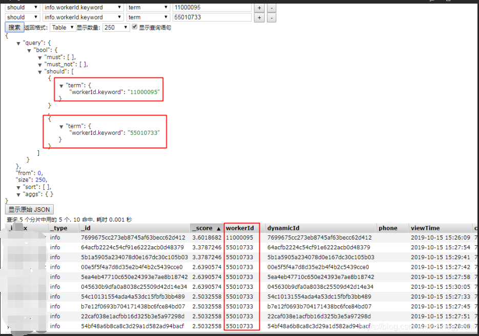
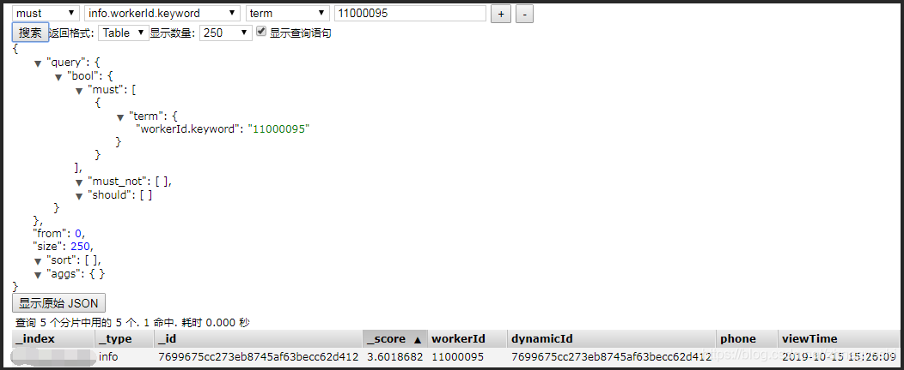
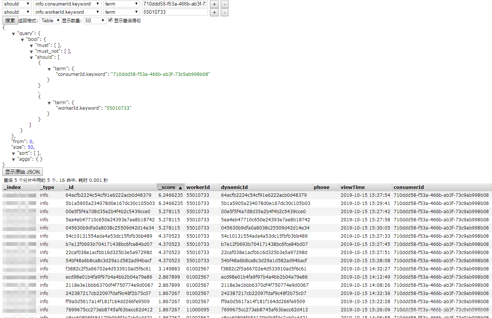
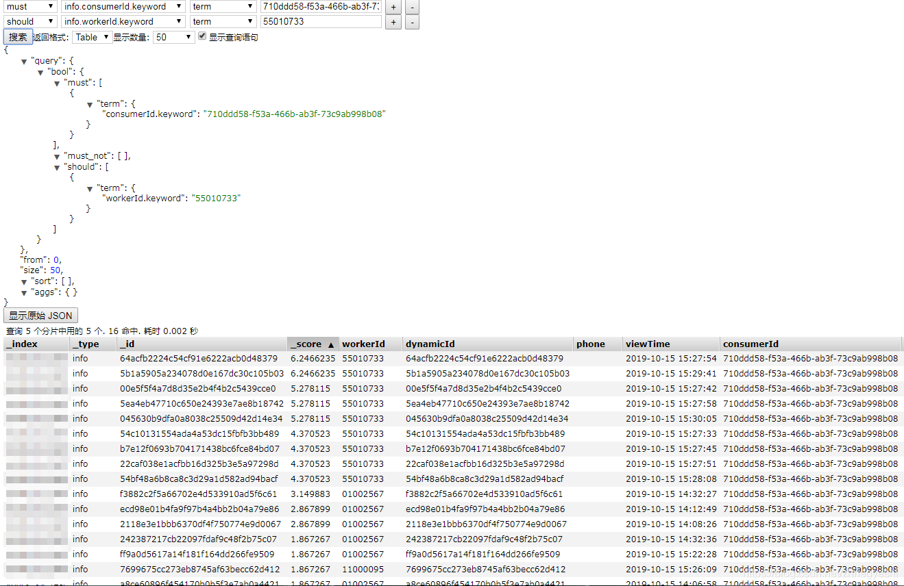

# elasticsearch多条件查询must和should不能同时生效问题

2019-10-16 14:34:38

## **1、前言**

​    must 

​        所有的语句都 必须（must） 匹配，与 AND 等价。 

​    must_not 

​        所有的语句都 不能（must not） 匹配，与 NOT 等价。 

​    should 

​        至少有一个语句要匹配，与 OR 等价

## **2、正常的should查询**



## **3、正常的must查询**

****

## **4、must和should组合查询，should失效**

### **4.1、原始数据**

****

### **4.2、组合查询结果（只有must生效，should不生效，并不是正常理解，先满足must然后在must的基础上进行should查询）**

****

## **5、转换成复杂的组合查询，就是满足一定的条件下，在满足条件1或者满足条件2或者满足条件3**

```json
{
    "query": {
        "bool": {
            "must": [
                {
                    // 先满足前置条件
                    "bool": {
                        "must": [
                            {
                                "term": {
                                    "dynamicType.keyword": "201"
                                }
                            },
                            {
                                "prefix": {
                                    "viewTime.keyword": "2019-10-11"
                                }
                            }
                        ]
                    }
                },
                {
                    // 在满足后置条件
                    "bool": {
                        "should": [
                            {
                                "term": {
                                    "uniqueKey.keyword": "3a91b0abd3507ee8b7165e710382a411"
                                }
                            },
                            {
                                "term": {
                                    "uniqueKey.keyword": "e5a359bcff112a98a6f7ea968d00ae3a"
                                }
                            },
                            {
                                "term": {
                                    "uniqueKey.keyword": "0fb98f5dd7f86ff7d3f7c105d27cddb0"
                                }
                            },
                            {
                                "term": {
                                    "uniqueKey.keyword": "ccc0a51553fc33e7c19bb822f8ff6048"
                                }
                            }
                        ]
                    }
                }
            ]
        }
    },
    "from": 0,
    "size": 10,
    "sort": [
        {
            "viewTime.keyword": {
                "order": "desc"
            }
        }
    ],
    "aggs": {}
}
```

## java代码

```java
//and查询
BoolQueryBuilder queryBuilderAll = boolQuery();
BoolQueryBuilder mustQueryBuilderAnd = boolQuery();
mustQueryBuilderAnd.must().add(matchQuery("conditionA", "A"));
mustQueryBuilderAnd.must().add(matchQuery("conditionB", "B"));
queryBuilderAll.must(mustQueryBuilderAnd);

//or查询
BoolQueryBuilder mustQueryBuilderOr = boolQuery();
mustQueryBuilderOr.should().add(matchQuery("conditionC", "C"));
mustQueryBuilderOr.should().add(matchQuery("conditionD", "D"));
queryBuilderAll.must(mustQueryBuilderOr);
```


## *6、总结**

​    es做多条件复杂查询时，要先分析具体的查询场景，尽可能的拆分成数学公式的样子去分解查询步骤，然后在组合查询的json参数


[(15条消息) ES多条件查询must和should不能同时生效问题_zhnegyeshi的博客-CSDN博客](https://blog.csdn.net/zhnegyeshi/article/details/102584708?utm_medium=distribute.pc_relevant.none-task-blog-BlogCommendFromBaidu-3.control&depth_1-utm_source=distribute.pc_relevant.none-task-blog-BlogCommendFromBaidu-3.control)

[(15条消息) 【水滴石穿】ES must与should组合使用的正确方式_lajigagawill的博客-CSDN博客](https://blog.csdn.net/lajigagawill/article/details/106425791?utm_medium=distribute.pc_relevant.none-task-blog-searchFromBaidu-1.control&depth_1-utm_source=distribute.pc_relevant.none-task-blog-searchFromBaidu-1.control)