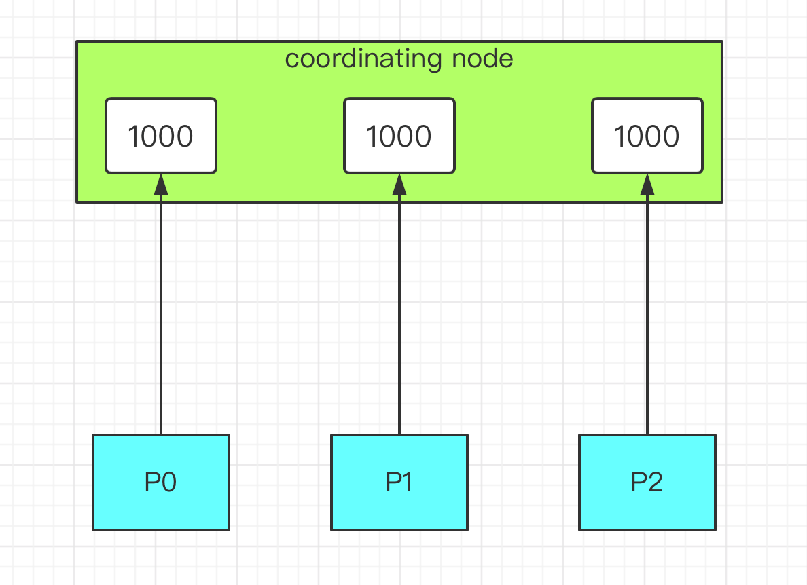
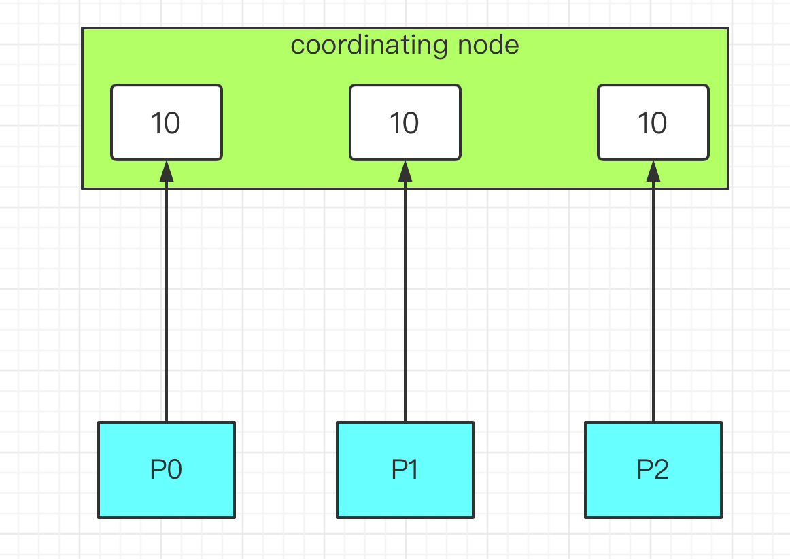

# elasticsearch 分页 from size, scroll 和 search after

##  引言

我们使用mysql的时候经常遇到分页查询的场景，在mysql中使用limit关键字来实现分页。比如下面的示例。

```
select * from orders_history where type=8 limit 100,100;
select * from orders_history where type=8 limit 1000,100;
select * from orders_history where type=8 limit 10000,100;
```

ElasticsSearch（以下简称ES）同样也有很多分页查询的场景，比如在数据量比较大的情况下，并且查询条件比较复杂，在mysql中无法命中索引，我们往往会选择使用ES的分页查询。

ES实现分页查询有几种不同的方案，每种方案都有自己的优缺点，下面就带你来分别看下。

**示例中使用的数据我尽量使用kibana自带的，这样方便有些读者实际测试文中的示例。**

## 分页的几种方案

### from/size方案

这是ES分页最常用的一种方案，跟mysql类似，from指定查询的起始位置，size表示从起始位置开始的文档数量。看个例子。

```
GET /kibana_sample_data_ecommerce/_search
{
  "from": 0,
  "size" : 10,
  "query": {
    "bool": {
      "must": [
        {"match": {
          "customer_first_name": "Diane"
        }}
      ],
      "filter": {
        "range": {
          "order_date": {
            "gte": "2020-01-03"
          }
        }
      }
    }
  },
  "sort": [
    {
      "order_date": {
        "order": "asc"
      }
    }
  ]
}
```

这个例子是查询客户名字带有diane，并且订单时间大于2020-01-03的订单信息，并且查询的结果按照时间升序。

使用起来很简单，不过ES默认的分页深度是10000，也就是说from+size超过10000就会报错，我们可以试下，会报下面的错误：

```
{
  "error": {
    "root_cause": [
      {
        "type": "illegal_argument_exception",
        "reason": "Result window is too large, from + size must be less than or equal to: [10000] but was [10009]. See the scroll api for a more efficient way to request large data sets. This limit can be set by changing the [index.max_result_window] index level setting."
      }
    ],
    "type": "search_phase_execution_exception",
    "reason": "all shards failed",
    "phase": "query",
    "grouped": true,
```

其实很多时候，业务场景很少遇到这种深度分页的情况，一般通过页面查询，不会有人会翻到这么深的页数。

不过，如果我们的业务场景确实需要超过10000条记录的分页，有办法解决吗？当然有。ES内部是通过index.max_result_window这个参数控制分页深度的，我们可以针对特定的索引来修改这个值。

```
curl -XPUT IP:PORT/index_name/_settings -d '{ "index.max_result_window" :"100000"}'
```

这里是把深度分页的限制改成了10万。

事实上，ES之所以有这个限制，是因为在分布式环境下深度分页的查询效率会非常低。比如我们现在查询第from=990，size=10这样的条件，这个在业务层就是查询第990页，每页展示10条数据。

但是在ES处理的时候，会分别从每个分片上拿到1000条数据，然后在coordinating的节点上根据查询条件聚合出1000条记录，最后返回其中的10条。所以分页越深，ES处理的开销就大，占用内存就越大。



### search after方案

有时候我们会遇到一些业务场景，需要进行很深度的分页，但是可以不指定页数翻页，只要可以实时请求下一页就行。比如一些实时滚动的场景。

ES为这种场景提供了一种解决方案：search after。

search after利用实时有游标来帮我们解决实时滚动的问题，简单来说前一次查询的结果会返回一个唯一的字符串，下次查询带上这个字符串，进行下一页的查询。看个例子：

```
GET /kibana_sample_data_ecommerce/_search
{
  "size" : 2,
  "query": {
    "bool": {
      "must": [
        {"match": {
          "customer_first_name": "Diane"
        }}
      ],
      "filter": {
        "range": {
          "order_date": {
            "gte": "2020-01-03"
          }
        }
      }
    }
  },
  "sort": [
    {
      "order_date": "desc",
      "_id": "asc"
     
    }
  ]
}
```

首先查询第一页数据，我这里指定取回2条，条件跟上一节一样。唯一的区别在于sort部分我多加了id，这个是为了在order_date字段一样的情况下告诉ES一个可选的排序方案。因为search after的游标是基于排序产生的。

注意看查询结果的最后，有个类似下面这样的东东：

```
"sort" : [
          1580597280000,
          "RZz1f28BdseAsPClqbyw"
        ]
```

在下一页的查询中，我们带上这个玩意，如下：

```
GET /kibana_sample_data_ecommerce/_search
{
  "size" : 2,
  "query": {
    "bool": {
      "must": [
        {"match": {
          "customer_first_name": "Diane"
        }}
      ],
      "filter": {
        "range": {
          "order_date": {
            "gte": "2020-01-03"
          }
        }
      }
    }
  },
  "search_after":
      [
          1580597280000,
          "RZz1f28BdseAsPClqbyw"
        ],
  "sort": [
    {
      "order_date": "desc",
      "_id": "asc"
     
    }
  ]
}
```

就这样一直操作就可以实现不断的查看下一页了。

其实仔细想想这个操作原理并不复杂，以前笔者在mysql的场景下也用过类似的方案。我们来看看上一节讨论的那个问题，比如通过一直下一页，翻到了990页，当继续下页时，因为有了排序的唯一标识，ES只需从每个分片上拿到满足条件的10条文档，然后基于这30条文档最终聚合成10条结果返回即可。


很显然，开销小很多。

### scroll api方案

还有一种查询场景，我们需要一次性或者每次查询大量的文档，但是对实时性要求并不高。ES针对这种场景提供了scroll api的方案。这个方案牺牲了实时性，但是查询效率确实非常高。
先来看个示例：

```
POST /kibana_sample_data_ecommerce/_search?scroll=1m
{
    "size": 10,
    "query": {
        "match_all" : {
        }
    }
}
```

首先我们第一次查询，会生成一个当前查询条件结果的快照，后面的每次滚屏（或者叫翻页）都是基于这个快照的结果，也就是即使有新的数据进来也不会别查询到。

上面这个查询结果会返回一个scroll_id，拷贝过来，组成下一条查询语句，

```
POST /_search/scroll
{
    "scroll" : "1m",
  "scroll_id" : "DXF1ZXJ5QW5kRmV0Y2gBAAAAAAAAA5AWNGpKbFNMZnVSc3loXzQwb0tJZHBtZw=="
}
```


以此类推，后面每次滚屏都把前一个的scroll_id复制过来。注意到，后续请求时没有了index信息，size信息等，这些都在初始请求中，只需要使用scroll_id和scroll两个参数即可。

很多人对scroll这个参数容易混淆，误认为是查询的限制时间。这个理解是错误的。这个时间其实指的是es把本次快照的结果缓存起来的有效时间。

scroll 参数相当于告诉了 ES我们的search context要保持多久，后面每个 scroll 请求都会设置一个新的过期时间，以确保我们可以一直进行下一页操作。启用游标查询可以通过在查询的时候设置参数 `scroll` 的值为我们期望的游标查询的过期时间。 **游标查询的过期时间会在每次做查询的时候刷新**，所以这个时间只需要足够处理当前批的结果就可以了，而不是处理查询结果的所有文档的所需时间

我们继续讨论一个问题，scroll这种方式为什么会比较高效？

ES的检索分为查询（query）和获取（fetch）两个阶段，query阶段比较高效，只是查询满足条件的文档id汇总起来。fetch阶段则基于每个分片的结果在coordinating节点上进行全局排序，然后最终计算出结果。

scroll查询的时候，在query阶段把符合条件的文档id保存在前面提到的search context里。 后面每次scroll分批取回只是根据scroll_id定位到游标的位置，然后抓取size大小的结果集即可。

这里只简单说下。后面计划以源码的方式详细分析原理。

## 总结

- from/size方案的优点是简单，缺点是在深度分页的场景下系统开销比较大，占用较多内存。
- search after基于ES内部排序好的游标，可以实时高效的进行分页查询，但是它只能做下一页这样的查询场景，不能随机的指定页数查询。
- scroll方案也很高效，但是它基于快照，不能用在实时性高的业务场景，建议用在类似报表导出，或者ES内部的reindex等场景。

**参考**

- https://www.elastic.co/guide/en/elasticsearch/reference/7.1/search-request-from-size.html
- https://www.elastic.co/guide/en/elasticsearch/reference/7.1/search-request-scroll.htm


[ES分页看这篇就够了 | 码农家园 (codenong.com)](https://www.codenong.com/cs105478557/)