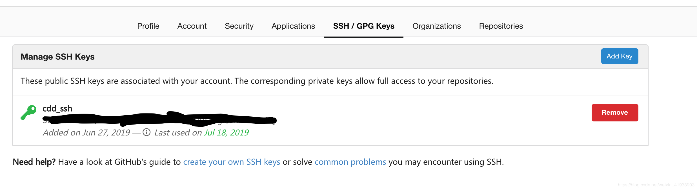
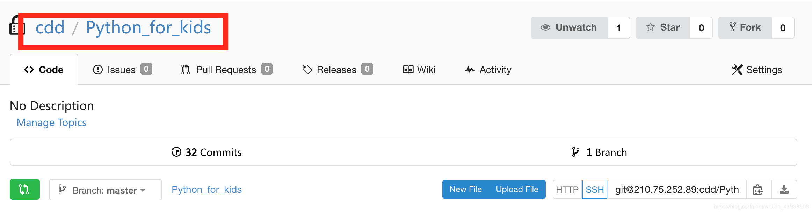
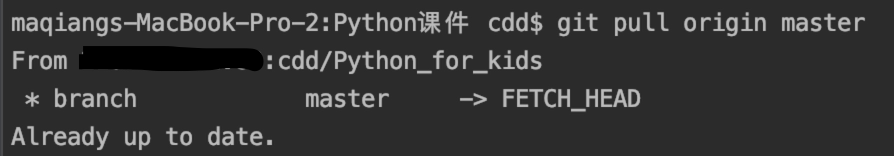

# git已经配好密钥，仍需要输入密码的问题

添加ssh-key文档: gitlab :  settings => SSH Keys

# 一、问题描述

今天上传文件到gitlab，无论是push或者pull都会**提示输入密码**（如下图）。通常来说，只要配好密钥，就不需要再次输入密码。
<奇怪的点：之前已经配好密钥，且几天前还成功上传文档。>


# 二、问题解决方案

## 1. check你的git账号是否有正确的git密钥

登陆账号，找到SSH密钥界面，确认有配过密钥，如下图。故需要继续检查。


## 2. 查看远程库地址是否一致

在本地git库目录终端下，输入以下代码，输出所匹配的远程库。

```
git remote -v
1
```



上边两个图，第一个图终端显示的匹配的远程库名称，和第二个图git库名称是一致的，不存在匹配问题。故需要继续检查。

## 3. 重新添加私钥

在目标终端下，按照如下命令行重新添加私钥

```
ssh-add ~/.ssh/id_rsa

```

添加成功后，重新尝试是否可以push和pull

*可以啦！问题解决！完结撒花！*


https://blog.csdn.net/weixin_41938903/article/details/97246188