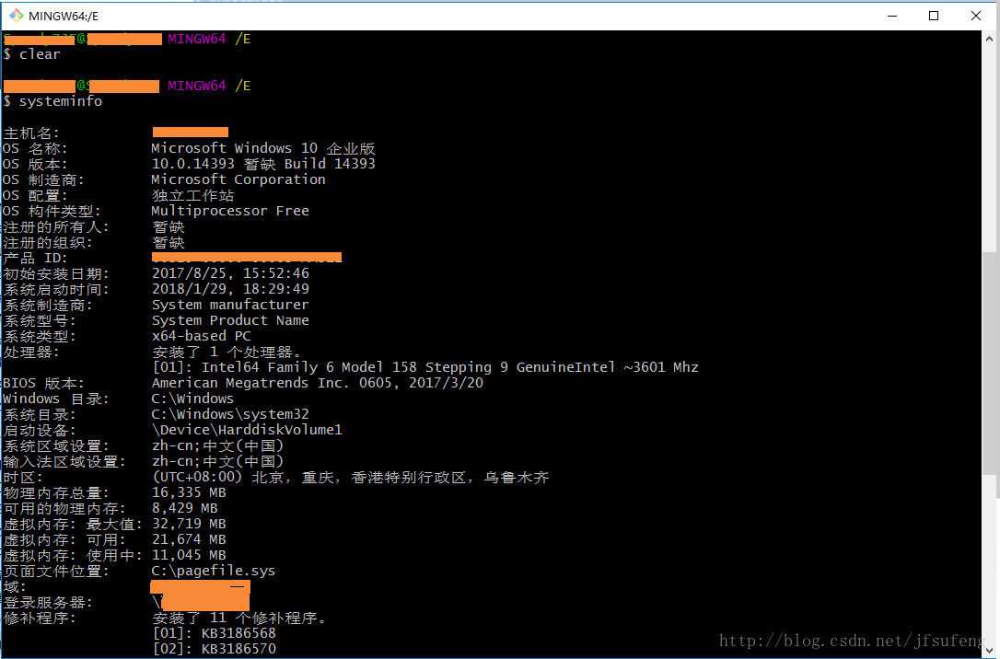

# windows下git bash中文乱码解决办法 不支持中文的简单解决办法

问题描述，我打开gitbash，输入平时常用的命令如 ipconfig、systeminfo 等，输出的结果中英文正常、中文是乱的；故自己测试了一下，修改如下，解决问题。

1.打开GitBash（git-bash.exe）后，对窗口右键->Options->Text->Locale改为zh_CN，Character set改为GBK ;

2.键入exit退出关闭再打开就Okay啦。

之后，就可以了。Okay后的效果如下：

原文链接：https://blog.csdn.net/jfsufeng/java/article/details/79219673