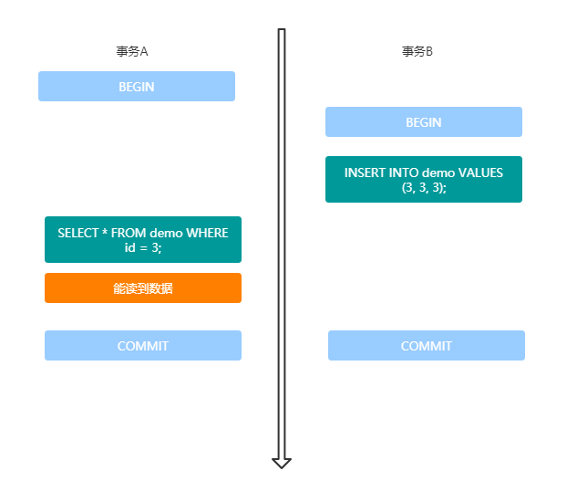
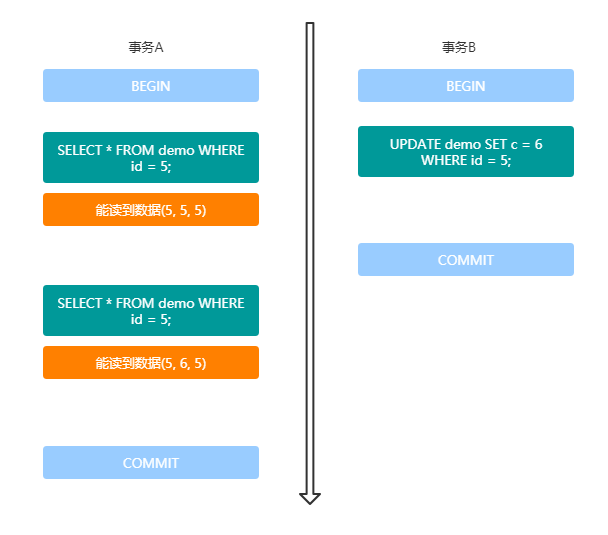
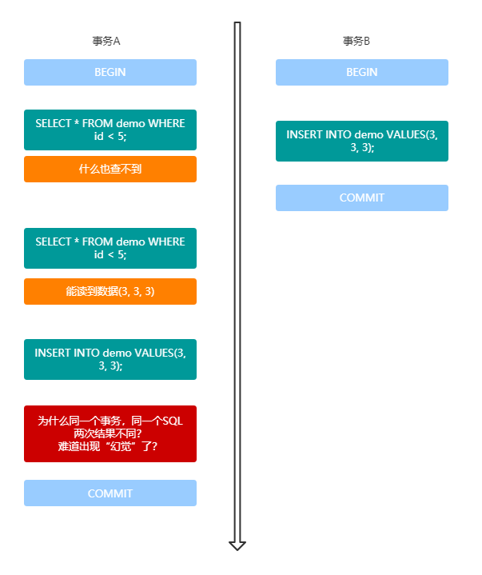
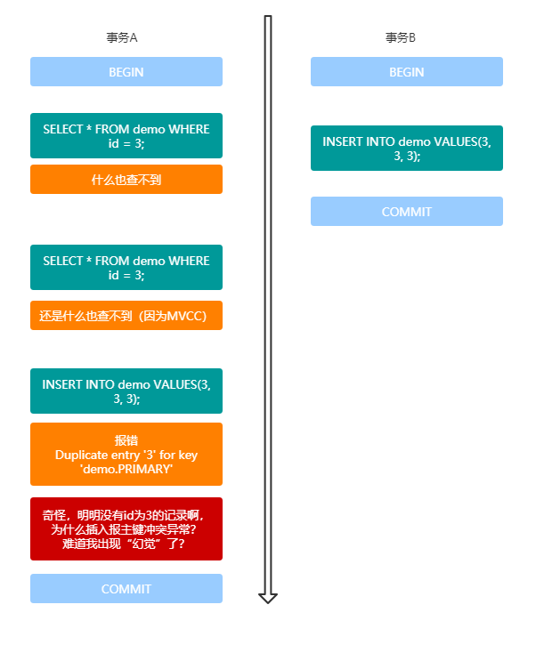
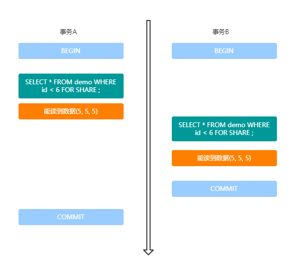
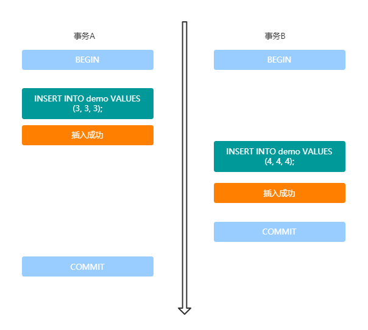
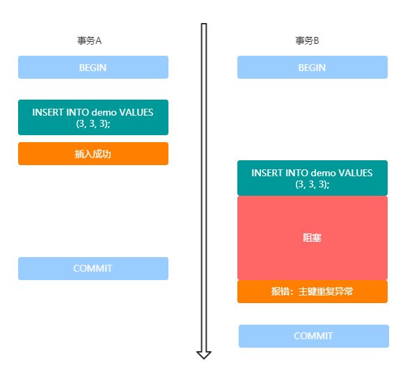
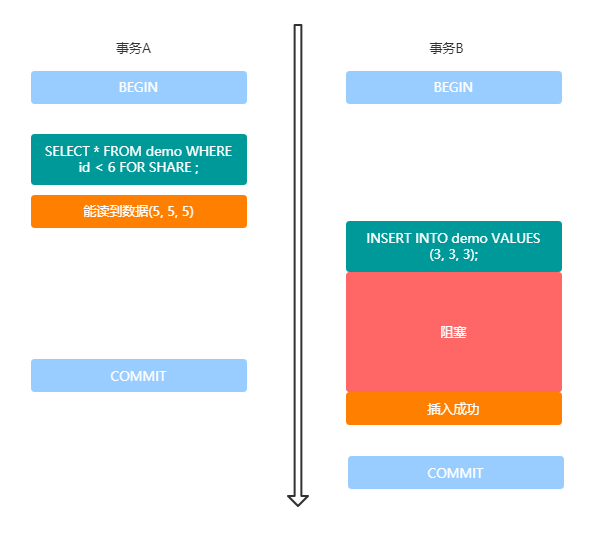
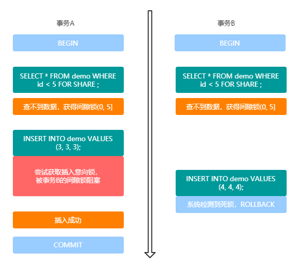

# InnoDB的行锁，原来为你做了这么多！

2020-09-26 09:48:15

阅读次数 - 65

*label*数据库MySQLInnoDB间隙锁插入意向锁

## 荒腔走板

这周暂时也没有荒腔走板环节，太忙了最近。。。

## 从事务的隔离级别谈起

众所周知，事务有四大特性，简称ACID：原子性、一致性、隔离性、持久性。

对于隔离性，简单来说就是多个事务之间是彼此隔离的，互不影响。但想要做到完全的互不影响是很难的，因为数据的强一致性，很多时候需要牺牲性能去达成。比如如果我们能接受事务的串行执行，那一定是互不影响的。然而现实是，MySQL作为一个数据库，必然是要支持一定程度的并行执行的，也就是多个事务同时去执行。

> 凡并行程序，往往是在性能和数据一致性上做取舍。较好的解决方案要么是最终一致，要么是尽量缩小串行执行的范围。

如果多个事务同时并行执行，在没有隔离的情况，可能会发生脏读、不可重复读、幻读的问题。

案例数据（demo表）：

| id(主键) | c（普通索引） | d（无索引） |
| -------- | ------------- | ----------- |
| 5        | 5             | 5           |
| 10       | 10            | 10          |
| 15       | 15            | 15          |
| 20       | 20            | 20          |
| 25       | 25            | 25          |

**脏读**

一个事务读取了另一个事务未提交的数据。



**不可重复读**

一个事务读取同一行数据，多次读取结果不同。



**幻读**

一个事务读取到了别的事务插入的数据。



但InnoDB因为使用了MVCC，读取的是“快照”版本，有一些不同，但如果不上锁，同样可能会有幻读问题。



事务用了四种不同的隔离级别用来解决这些问题。

- Read uncommitted(未提交读)
- Read Committed(已提交读，简称RC)
- Repeatable Reads(可重复读，简称RR)
- Serializable(串行化)

隔离级别越高，解决的问题越多，但并发性能也会越差。它们之间的关系如下表：

| 隔离级别         | 脏读 | 不可重复读 | 幻读 |
| ---------------- | ---- | ---------- | ---- |
| Read uncommitted | 是   | 是         | 是   |
| Read Committed   |      | 是         | 是   |
| Repeatable Reads |      |            | 是   |
| Serializable     |      |            |      |

> 但InnoDB有些许不同，InnoDB默认的隔离级别是RR，但是通过MVCC和间隙锁来一定程度上的解决了幻读的问题。这也是我们今天这篇文章后面会详细介绍的。

## 无锁思想：MVCC

MVCC即“多版本并发控制”，但是它在很多情况下避免了加锁操作，因此开销更低。

主流的关系型数据库都实现了MVCC，但实现机制各有不同。实际上MVCC也没有一个统一的标准。但大都实现了非阻塞的读操作，写操作也只是锁定必要的行。本文以下内容所说的MVCC都指的是InnoDB实现的MVCC。

在Mysql的InnoDB引擎，是通过给每行记录后面保存两个隐藏的列来实现的。一个是保存行的创建时间，另一个保存了行的过期时间（或删除时间）。

> 实际上存储的并不是实际的一个时间戳，而是“系统版本号”。

每次开启一个事务，系统版本号都会递增。事务开始时，系统版本号会作为事务的版本号，用来和查询到的行的版本号进行比较。

MVCC只在REPEATABLE READ和READ COMMITTED两个隔离级别下工作，其它两个隔离级别不能工作。因为READ UNCOMMITTED总是读取最新的数据行，而不是符合当前事务版本的数据行。而SERIALIZABLE则会对所有读取的行都加锁。

在MySQL中，正常的`SELECT`语句，后面不加`FOR UPDATE`和`LOCK IN SHARE MODE`的，就是用的MVCC去读。

> MVCC和我们在应用层面去实现的“乐观锁”有一样的思想：用版本号，在尽量无锁的情况下实现一定程度的一致性。

## InnoDB行锁的概念

InnoDB的行锁（也称为临键锁） Next-Key Locks，**是MySQL对外暴露的锁的基本单位，它会智能选择记录锁或间隙锁，锁住一行或多行或一个间隙**。而记录锁又分为共享锁和排他锁，间隙锁的概念下面有一个插入意向锁。这些锁的关系大概是这样：


## 记录锁

所谓记录锁 Record Locks，就是锁住确定的一行行记录。它分为共享锁和排它锁。分别对应不同的SQL写法。

### 共享锁

共享锁 Shared Locks ，简称S锁。使用以下SQL可能触发：

```
SELECT ... LOCK IN SHARE MODE
```

之所以说“可能”触发，是因为它查到了数据库有确定的记录才会锁住这些记录，否则会变成间隙锁。这个其实很好理解，找到了数据，才锁它。如果没找到数据，就锁这个间隙。

### 排他锁

排他锁 Exclusive locks ，简称X锁。使用一下SQL可能触发：

```
SELECT ... FOR UPDATE
```

这里的“可能”含义与上面同理，不赘述。

## 间隙锁

间隙锁 Gap - Lock，顾名思义，锁住一个间隙。上文我们提到过，InnoDB默认的隔离级别是RR，但是通过间隙锁来一定程度上的解决了幻读的问题。它是怎么解决的呢？就是通过间隙锁来解决的。

上面两种SQL，如果没有查找到确定的记录，就会根据条件去锁住一个间隙。间隙锁是根据已有数据的一个左开右闭的区间。

还是这个案例数据（假设数据都是从1开始）：

| id(主键) | c（普通索引） | d（无索引） |
| -------- | ------------- | ----------- |
| 5        | 5             | 5           |
| 10       | 10            | 10          |
| 15       | 15            | 15          |
| 20       | 20            | 20          |
| 25       | 25            | 25          |

对于下面这些区间的操作，会有对应的间隙锁：(0, 5], (5, 10], (10, 15], (15, 20], (20, 25], (25, 正无穷)。

什么意思呢？假如你的SQL查询的范围不同，那它锁住的区间就不同。比如：

```
-- 锁住(0, 5]
SELECT * FROM demo where id = 3;

-- 锁住(10, 15]
SELECT * FROM demo where id = 11;
```

间隙锁其实是“共享”的。也就是说，多个事务可以获取同一个区间的间隙锁。



### 插入意向锁

插入意向锁 Insert Intention Locks，代表当前事务准备插入一行数据。使用INSERT语句会获得插入意向锁。

**插入意向锁和插入意向锁之间是兼容的，只要插入的键值不同，就不会相互阻塞**。比如以下两个SQL，在不同的事务中，哪怕它们在同一个间隙，只要没有间隙锁，就不会阻塞：



但如果两个事务插入同一个key，那就会阻塞。



插入意向锁可以保证两个事务插入key不同的数据的时候不冲突，提升并发性。

**但是间隙锁会阻塞插入意向锁**！这也可以理解，因为InnoDB想在RR隔离级别就解决幻读问题。所以A事务用SELECT语句获取了一个间隙锁，自然不希望B事务在这个期间往这个间隙插入一条新的记录。



## 与索引的关系

不管哪种行级锁，**行级锁的其实都是索引**。所以在上面的demo中，如果对id（主键）或者column c（普通索引）操作，都会触发相应的行级锁，但如果对column d（无索引）做同样的操作，InnoDB就会对表中所有数据加锁，实际效果跟表级锁一样。

所以一定要注意，如果要上锁，需要注意是否走了索引，不要弄成了表级锁造成安全事故。

## 一个死锁案例

最后给一个关于间隙锁和插入意向锁的死锁案例吧，也是之前在项目上遇到过的真实案例。

### 过程

- 事务A select … for update 查找一个不存在的数据，获得间隙锁；
- 事务B select … for update 查找一个不存在的数据，获得相同位置的间隙锁；
- 事务A insert into … 到这个间隙，尝试获得插入意向锁，但被事务B持有的间隙锁阻塞。
- 事务B insert into … 到这个间隙，尝试获得插入意向锁，但被事务A持有的间隙锁阻塞，MySQL监测到死锁，回滚事务B；
- 因为事务B回滚，所以事务B持有的间隙锁被释放，所以之前事务A的插入语句不再阻塞，顺利执行插入操作。

> 报错信息：Deadlock found when trying to get lock; try restarting transaction

用图把这个过程描述出来：



### 最终结果

事务A插入成功，事务B因为死锁被回滚。

### 总结

间隙锁主要还是用于防止幻读的情况，所以多个事务能够同时获取同一段间隙锁本身并没有问题，间隙锁能够阻塞插入意向锁也并没有问题。

而插入意向锁可以看成是一种特殊的间隙锁，是用于在同一个间隙，插入不同的数据，不会互相阻塞。它比普通间隙锁的数据一致性更低，但并发性能更好；

### 解决思路

普通间隙锁还是主要用于读操作防止幻读。所以我们在想进行插入操作的时候，其实没有必要对即将插入的间隙使用普通间隙锁，直接使用insert语句产生的插入意向锁就好了。

如果要保证数据的一致性，可以使用插入意向锁配合主键、唯一键等约束。

## 附录

那些在文章中用过的SQL：

```mysql
-- 建表
create table demo
(
	id int unsigned not null,
	c int unsigned not null,
	d int unsigned not null,
	constraint demo_pk
		primary key (id),
	constraint idx_c
		unique (c)
);

-- 插数据
INSERT INTO demo VALUES
(5, 5, 5),
(10, 10, 10),
(15, 15, 15),
(20, 20, 20),
(25, 25, 25);

-- 设置隔离级别 未提交读
SET SESSION TRANSACTION ISOLATION LEVEL READ UNCOMMITTED ;

-- 设置隔离级别 已提交读
SET SESSION TRANSACTION ISOLATION LEVEL READ COMMITTED ;

-- 设置隔离级别 可重复读
SET SESSION TRANSACTION ISOLATION LEVEL REPEATABLE READ ;

-- 设置隔离级别 串行化
SET SESSION TRANSACTION ISOLATION LEVEL SERIALIZABLE ;

-- 禁止自动提交事务
SET AUTOCOMMIT = 0;

-- 开启事务
BEGIN;

-- 提交事务
COMMIT;

-- 会获取锁的查询
SELECT * FROM demo WHERE id < 5 FOR UPDATE ;
```

 

https://yasinshaw.com/articles/109