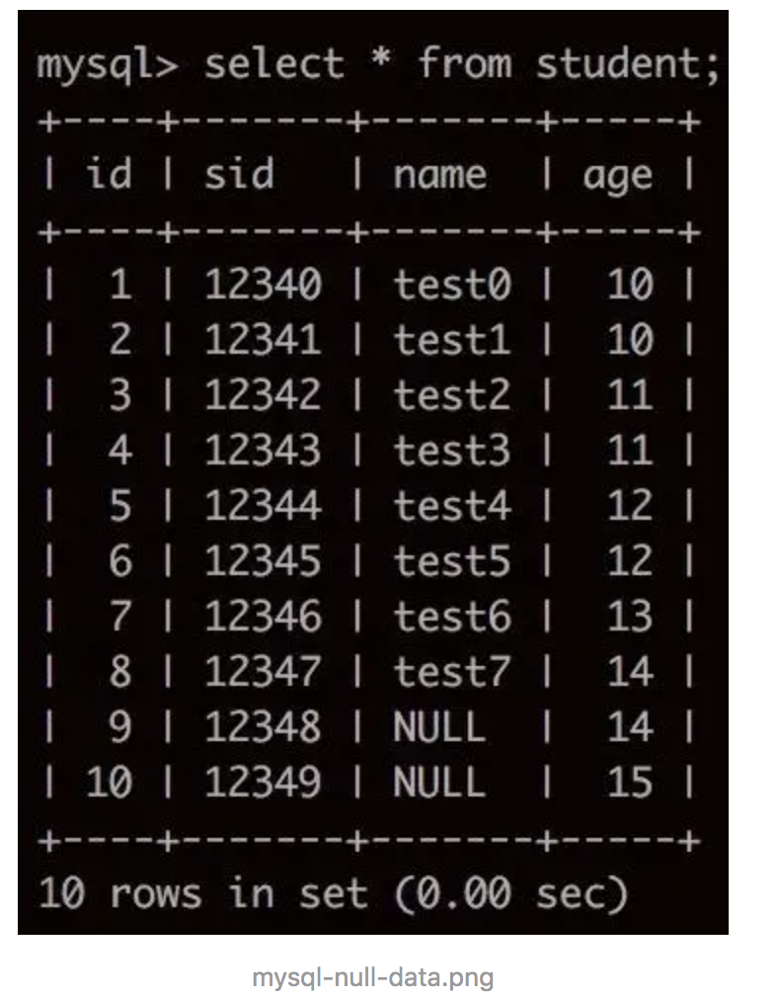
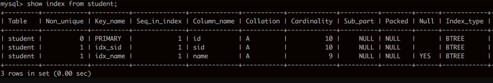
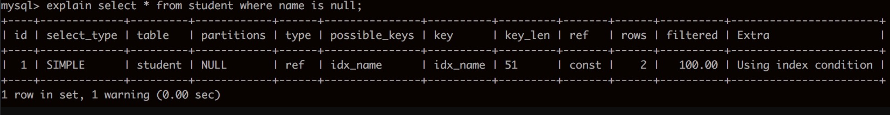
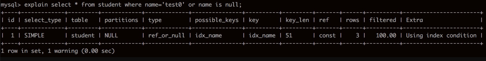
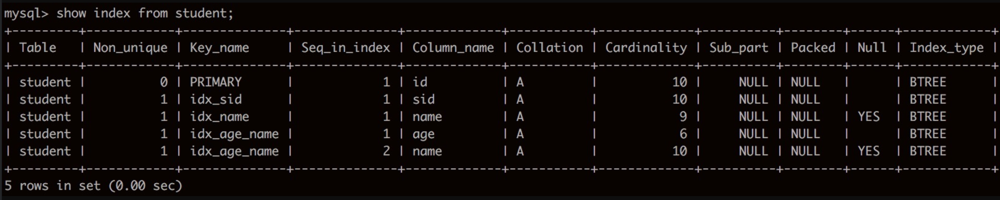
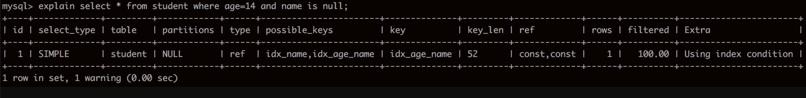

# MySQL中NULL对索引的影响

0.6572018.02.02 20:19:19字数 512阅读 17,900

看了很多博客，也听过很多人说，包括我们公司的DBA，说MySql中如果某一列中含有null，那么包含该列的索引就无效了。

翻了下《高性能MySQL第二版》和《MySQL技术内幕——InnoDB存储引擎第2版》，并没有看到关于这个的介绍。但在本地试了下，null列是可以用到索引的，不管是单列索引还是联合索引，但仅限于`is null`，`is not null`是不走索引的。

后来在官方文档中找到了说明，如果某列字段中包含null，确实是可以使用索引的，地址：[https://dev.mysql.com/doc/refman/5.7/en/is-null-optimization.html](https://link.jianshu.com/?t=https%3A%2F%2Fdev.mysql.com%2Fdoc%2Frefman%2F5.7%2Fen%2Fis-null-optimization.html)。

在mysql5.6和5.7下均可，存储引擎为InnoDB。

数据如下：

#### 1. 单列索引

给`name`列建单列索引：

mysql-null-index1.png

- 查询`name`为`null`的行：

  

  mysql-null-query1.png

  

- 查询`name`为`'test0'`或为`null`的行：

  

  mysql-null-query2.png

  可以发现都可以用到索引。

  

#### 2. 联合索引

给age和name添加联合索引：

mysql-null-index2.png

- 查询`age`为`14`并且`name`为`null`的行：

  

  mysql-null-query3.png

  可以发现同样用到了索引。

#### 3. 其他

虽然MySQL可以在含有null的列上使用索引，但不代表null和其他数据在索引中是一样的。

不建议列上允许为空。最好限制`not null`，并设置一个默认值，比如`0`和`''`空字符串等，如果是datetime类型，可以设置成`'1970-01-01 00:00:00'`这样的特殊值。

对MySQL来说，`null`是一个特殊的值，`Conceptually, NULL means “a missing unknown value” and it is treated somewhat differently from other values`。比如：不能使用`=,<,>`这样的运算符，对`null`做算术运算的结果都是`null`，`count`时不会包括`null`行等，`null`比空字符串需要更多的存储空间等。

https://www.jianshu.com/p/3cae3e364946