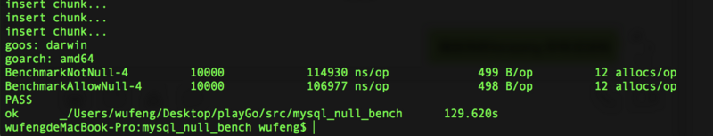
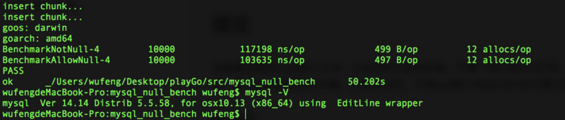
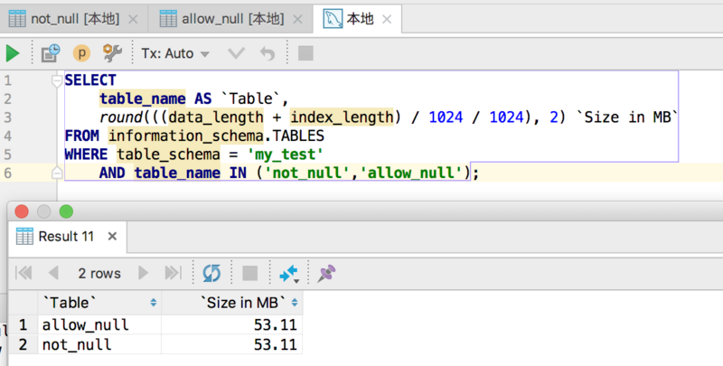

[TOC]

# NULL列索引失效？测试一下NULL对mysql性能的影响

更新于 2019-07-25  约 6 分钟

最近公司规范数据库方面的一些东西，老程序员告诉我mysql里不准使用null，说是含null值的列没法索引，对性能影响很大。我第一次听说这个，对此将信将疑，之前用null并索引并没有感觉到不妥，可能是数据量小吧。于是我去google了一顿，但是并没有找到权威的说法。

V2EX——[关于null的索引不生效的传说是真的么?](https://www.v2ex.com/t/60437#r_544199)

> by shiny:
> 由于数据库的复杂性，以讹传讹的空间非常大，快赶上中医养生了。避免使用 NULL 的理由，在高性能MySQL里有提到一段。建议大家多读些书，少看网上的奇技淫巧。特意把书翻出来摘录了下以供参考：
> 要尽量避免 NULL
> 要尽可能地把字段定义为 NOT NULL。即使应用程序无须保存 NULL（没有值），也有许多表包含了可空列（Nullable Column）,这仅仅是因为它为默认选项。除非真的要保存 NULL，否则就把列定义为 NOT NULL。
> MySQL难以优化引用了可空列的查询，它会使索引、索引统计和值更加复杂。可空列需要更多的储存空间，还需要在MySQL内部进行特殊处理。当可空列被索引的时候，每条记录都需要一个额外的字节，还可能导致 MyISAM 中固定大小的索引(例如一个整数列上的索引)变成可变大小的索引。
> 即使要在表中储存「没有值」的字段，还是有可能不使用 NULL 的。考虑使用 0、特殊值或空字符串来代替它。
> 把 NULL 列改为 NOT NULL 带来的性能提升很小，所以除非确定它引入了问题，否则就不要把它当作优先的优化措施。然后，如果计划对列进行索引，就要尽量避免把它设置为可空。

stackoverflow——[NULL in MySQL (Performance & Storage)](https://stackoverflow.com/questions/229179/null-in-mysql-performance-storage)

> by Arian Acosta:
> Advantage of using NULLS over Empty Strings or Zeros:
> 1 NULL requires 1 byte
> 1 Empty String requires 1 byte (assuming VARCHAR)
> 1 Zero requires 4 bytes (assuming INT)
> You start to see the savings here:
> 8 NULLs require 1 byte
> 8 Empty Strings require 8 bytes
> 8 Zeros require 32 bytes
> On the other hand, I suggest using NULLs over empty strings or zeros, because they're more organized, portable, and require less space. To improve performance and save space, focus on using the proper data types, indexes, and queries instead of weird tricks.

中英文用户们对此都是争论不休，在群里问了一下老前辈，前辈表示mysql这个东西很玄乎，还是自己写性能测是最靠谱，说的好那么开始写吧。

## 测试环境

- mysql 5.7
- golang 1.9.2
- mac os 10.13.1

## 测试思路

- 建两张类似的表，有id,name,number三列，给name建索引，两张表区别是一个允许null一个not_null
- 随机生成若干条数据，包含一些name为空的数据
- 将相同的数据插入两个表中，区别空值是一个用null一个用‘’
- 测试SELECT * FROM table WHERE NAME = ? 的性能

## 测试代码

[https://github.com/win5do/pla...](https://github.com/win5do/playGo/blob/master/src/mysql_null_bench/mysql_null_test.go)

进入文件所在目录运行：go test -v -run=none -bench=. -benchmem

## 测试结果

mysql5.7 mock100w条数据 null完全没影响

mysql5.5 还是100w条

储存空间占用也是相同的，null占空间 ‘’同样占空间

## 写测试代码碰到的坑

为什么要用golang，因为最近在学习golang，通过写代码来加深对语言的理解。而且golang自带测试工具，做性能测试非常方便。

第一个坑，以前没用过golang连接数据库，写create语句的时候一直提示syntax error，仔细检查了好几遍，没有错误啊。后来翻了翻文档发现连接是加上**multiStatements=true**参数才能使用多行sql。

第二个坑就是insert语句拼接的太长会导致write pipe broken，mock50000行时没问题，但100000行就报错了，解决办法就是分块插入，10000行插一下。

第三个坑，就是query之后是要close的

## 结论

测试了mysql5.7和5.5版本，null对索引没有影响，甚至允许null的还快一丢丢（或者说我的测试太过于简单，不成立？）。不要一棒子把null打死，该用就用，null的语义化很好，配合orm使用基本无痛。比如时间列，不用null用个0000-00-00不要太蛋痛。

那句老话：

> 过早的优化是万恶之源

仅凭中医理论优化更是无可救药

更重要的，**用golang写代码真的很cool**

https://segmentfault.com/a/1190000012691565