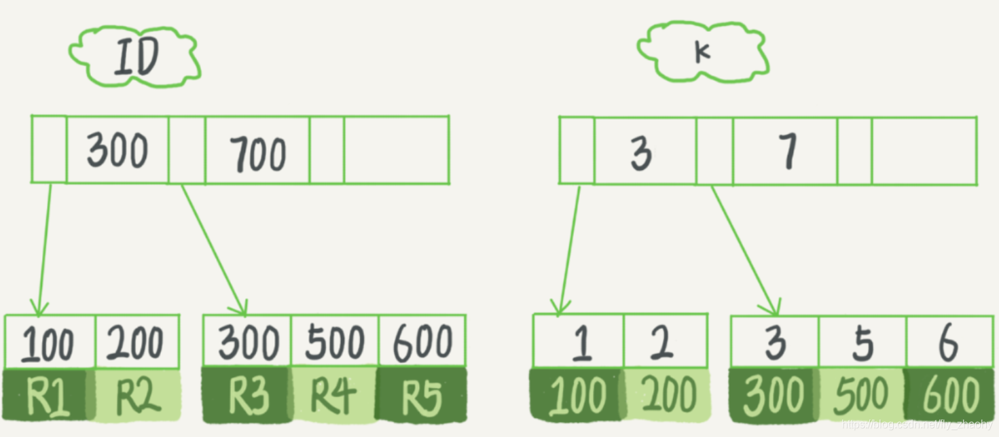

# 主键索引和普通索引有什么区别

 2020-01-17 09:57:19

  在 MySQL 中, 索引是在存储引擎层实现的, 所以并没有统⼀的索引标准, 由于 InnoDB 存储引擎在 MySQL数据库中使⽤最为⼴泛, 下⾯以 InnoDB 为例来分析⼀下其中的索引模型.在 InnoDB 中, 表都是根据主键顺序以索引的形式存放的, InnoDB 使⽤了 B+ 树索引模型，所以数据都是存储在 B+ 树中的, 如图所示:

从图中可以看出, 根据叶子节点内容不同,索引类型分为主键索引和非主键索引.
**主键索引**也被称为聚簇索引,**叶子节点存放的是整行数据**; 而**非主键索引**被称为二级索引,**叶子节点存放的是主键的值**.
如果根据主键查询, 只需要搜索ID这颗B+树
而如果通过非主键索引查询, 需要先搜索k索引树, 找到对应的主键, 然后再到ID索引树搜索一次, 这个过程叫做回表.
**总结, 非主键索引的查询需要多扫描一颗索引树, 效率相对更低.**

[主键索引和普通索引有什么区别?_fly_zhaohy的博客-CSDN博客_主键索引和普通索引的区别](https://blog.csdn.net/fly_zhaohy/article/details/104014391)