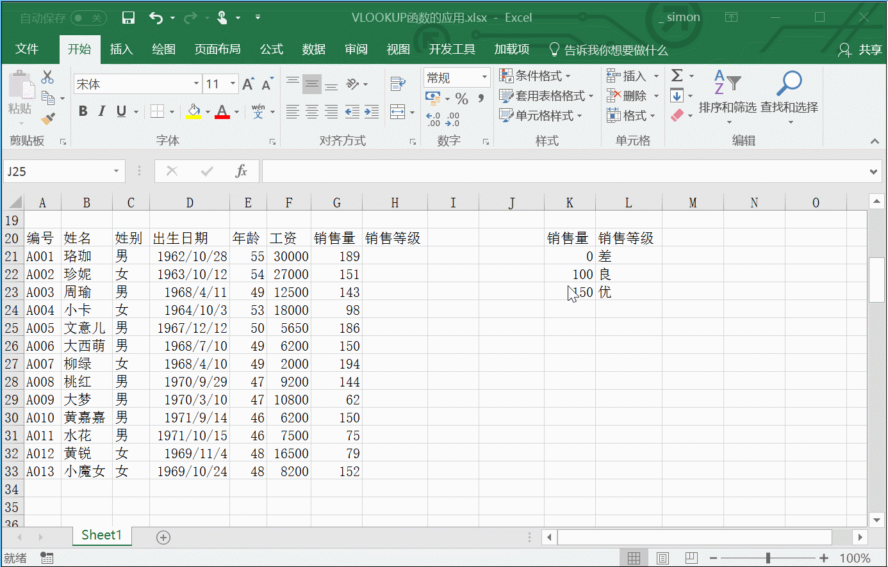
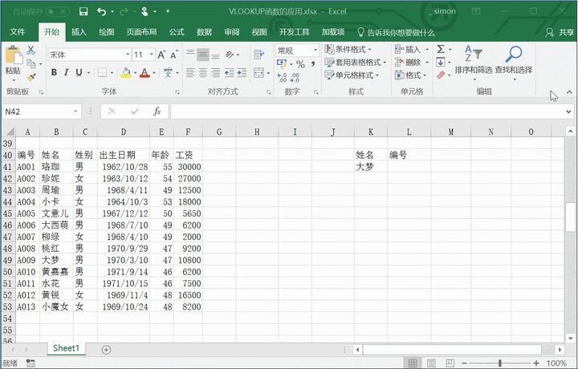
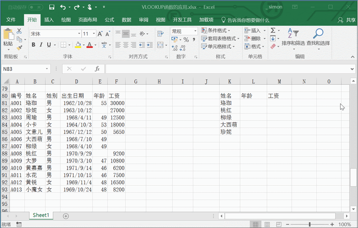
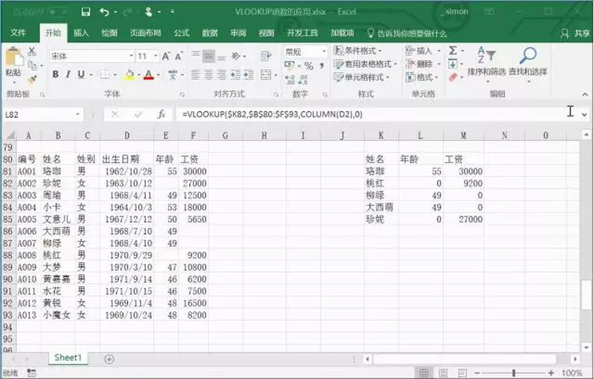
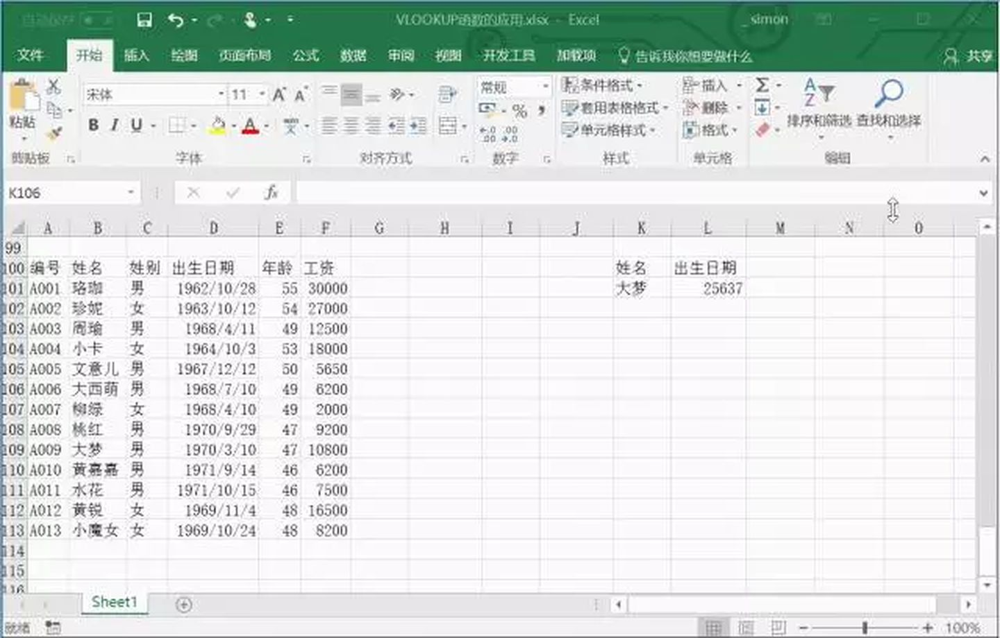
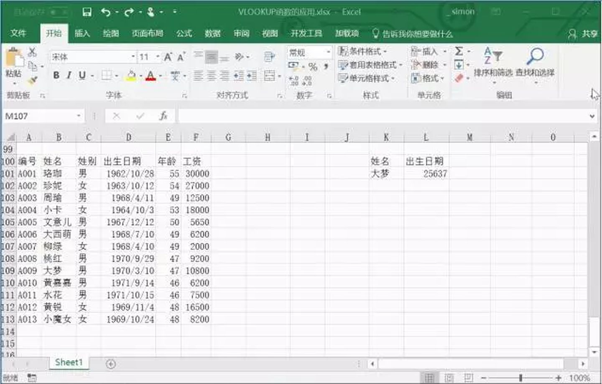

# Excel函数之王，Vlookup到底怎么用？

在我们日常工作中，有关查找的问题会非常多，比如根据姓名查找身份证，根据工号查找职务，根据学号查找成绩等等。

说到查找函数，大部分人都会想到使用VLOOKUP函数，但是VLOOKUP函数在使用过程却存在许多问题。那么究竟如何才能使用好VLOOKUP函数？今天我们来探讨一下关于查找函数的使用。

## **【1】函数语法**

=VLOOKUP(lookup_value,table_array,col_index_num,[range_lookup])

lookup_value：要查找的值，也被称为查阅值。

table_array：查阅值所在的区域。请记住，查阅值应该始终位于所在区域的第一列，这样 VLOOKUP 才能正常工作。例如，如果查阅值位于单元格 C2 内，那么您的区域应该以 C 开头。

col_index_num区域中包含返回值的列号。例如，如果指定 B2：D11 作为区域，那么应该将 B 算作第一列，C 作为第二列，以此类推。

[range_lookup]（可选）如果需要返回值的近似匹配，可以指定TRUE；如果需要返回值的精确匹配，则指定 FALSE。如果没有指定任何内容，默认值将始终为 TRUE 或近似匹配。

## **【2】精确查找**

手头上的一份工资表，根据姓名来查找对应的基本工资，一个人只对应一个值，这就是精确查找。

\1. 在L2单元格内输入公式VLOOKUP，并且按【Tab】键进入函数

\2. 打开编辑栏中FX函数参数对话框

\3. 在查阅值中输入单元格K2

\4. 在区域中选择B2：F14

\5. 工资这一列是属于所选区域中的第五列，因此填入参数5

\6. 在最后的参数中输入数字0以表示精确匹配

## **【3】模糊查找**

有时候我们要找的数据并不是唯一对应的，而是在一个范围区间内，可以多个查阅值对应一个值，比如查找销售量所对应的销售等级，这个时候就需要用到模糊查找。

1. 在单元格H21内输入公式VLOOKUP
2. 打开编辑栏中函数参数对话框
3. 在查阅值中输入单元格G21
4. 在区域中选择$K$21：$L$23（注意，这里的区域一定要用【$】来锁定，同时区域数据要由小到大排列）
5. 销售等级这一列属于选取中的第二列，因此填入数字2
6. 在最后的参数中输入数字1表示近似匹配
7. 双击填充柄来填充销售等级这一列数据

## **【4】反向查找**

利用VLOOKUP函数查找的时候，查阅值应当始终位于所在区域的第一列，但是我们要查找的目标位于查阅值的前一列，那应该如何操作呢？

1. 在单元格L41内输入公式VLOOKUP
2. 打开函数参数对话框输入对应的参数
3. 注意，在查阅区域中输入IF({0,1},A41:A53,B41:B53)，利用IF函数重组区域，让两列颠倒位置
4. 最后输入数字0以表示精确匹配，完成VLOOKUP函数的反向查找

## **【5】多项查找**

当我们需要根据姓名查找到多列数据的时候，在每一列中都输入一次函数虽说也能达到效果，但是这并不是一个最快捷的方法。

1. 在单元格L61内输入公式VLOOKUP
2. 在查阅值中输入单元格$K61，由于横向填充要保持K列不变，因此用【$】锁定K列
3. 在区域中选择$B$60:$F$73（注意，这里姓名作为查阅值，一定要让区域中姓名列作为第一列）
4. 在第三个参数中输入COLUMN(D1)，年龄这一列属于查阅区域中的第四列
5. 在最后的参数中输入数字0以表示精确匹配，并且拖拽填充单元格

## **【6】空值显示为空白**

很多时候在我们数据表中有的单元格是空值，但是在我们利用VLOOKUP函数查找时候却显示为0。

本来就是空值，若我们想要结果的0显示为空白，应该如何操作呢？

动图

原本的公式不变，在公式后面输入【&】和英文状态下的双引号，把空单元格显示为空

## **【7】查找值显示为日期**

当VLOOKUP查找返回的是日期的时候，结果却显示的是数字，例如查找大梦的生日，结果却是数字25637。

动图

方法一

在excel中日期的储存本身就是以数字的格式进行储存，我们可以用TEXT函数辅助我们转换格式。

动图

\1. 保持原有的VLOOKUP函数不变

\2. 在函数前面添加TEXT函数

\3. 在第二个参数中输入YYYY/M/D表示把数字转化为日期

方法二

单元格默认的格式是常规格式，因此数字的常规格式显示的是数值，我们还可以通过直接设定单元格格式来解决这个问题。

动图

\1. 选中单元格并且点击右键

\2. 打开设置单元格格式选项

\3. 在分类中把常规改为日期

\4. 点击确定即可

查找函数中最常用的就是VLOOKUP函数了，以上只是函数中常用的几个基础小技巧，与之相关的更多技能，欢迎大家来评论留言探讨。

[Excel函数之王，Vlookup到底怎么用？ - 知乎 (zhihu.com)](https://zhuanlan.zhihu.com/p/29161495)