# 打工人最火的10个Excel小技巧，一看就会

[波神老师](https://my.hupu.com/171545857699426) ([58级](https://my.hupu.com/171545857699426/topic)) 楼主 2020-10-27 11:17

打工人最火的10个Excel小技巧，一看就会 由  波神老师 发表在[虎扑步行街](https://bbs.hupu.com/all-gambia)·[步行街主干道](https://bbs.hupu.com/bxj) https://bbs.hupu.com/bxj 公众号（ **迷途小球迷**）更多干货实用文章zt  

## **1、照片蓝底换红底**  

操作方法：选中照片 - 工具 - 删除背景  

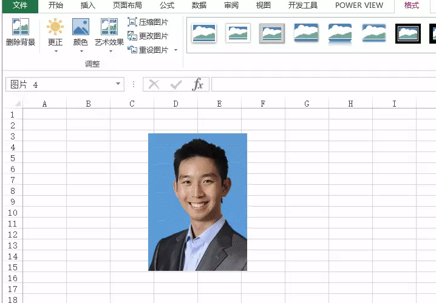

## **2、一键求和**  

操作方法：选取数据区域，按Alt + = 一键完成求和

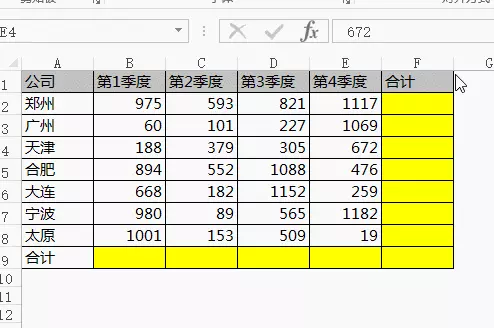

## **3、一键找不同**  

操作方法：选取两列数据，按Ctrl+ 斜杠 一秒找出不同的值

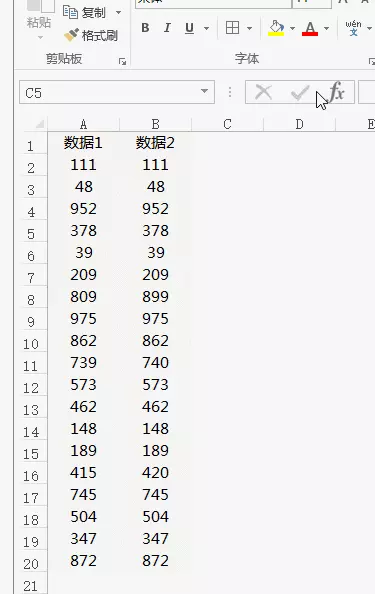

 

## **4、两表快速核对**  

操作方法：复制其中一个表格数据，选中另一个表格 - 选择性粘贴 - 减

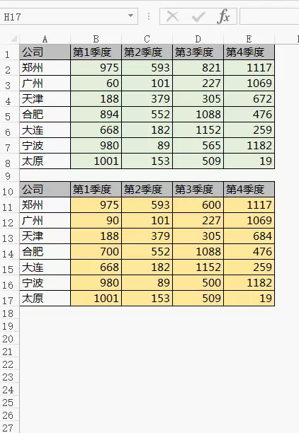

## **5、身份证里提取生日** 

步骤1、复制身份证号码到生日列 步骤2、数据 - 分列。第1步选固定宽度，第3步保留代表生日的8位数字并设置成日期格式。搞定  动画演示：

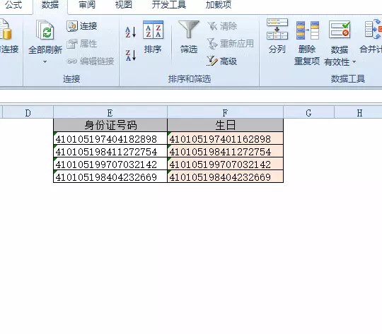

  

提取结果：

  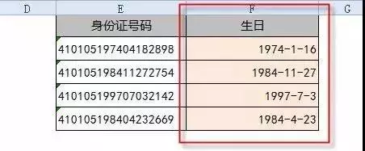   

## **6、一秒生成Excel图表**  

操作方法：选取数据区域，按Alt+F1一键插入图表  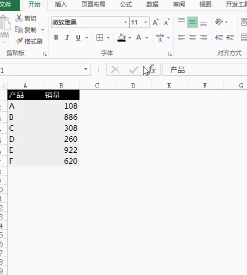   

## **7、数字拆分**  

操作方法：先输入一行内容，然后按Ctrl + E 快速拆分

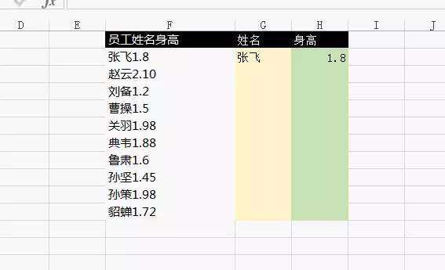

  

## **8、快速制作工资条**  

操作方法：在旁边列输入序号，复制两次，再复制标题行到最下面，然后按序号排序。

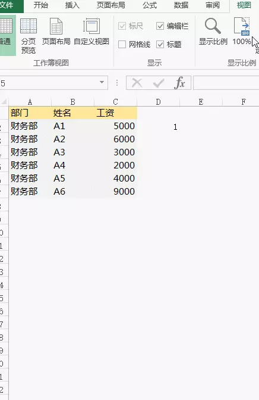

## **9、Excel表格打印到一张纸上**  

操作方法：页面布局 - 设置一页宽一页高

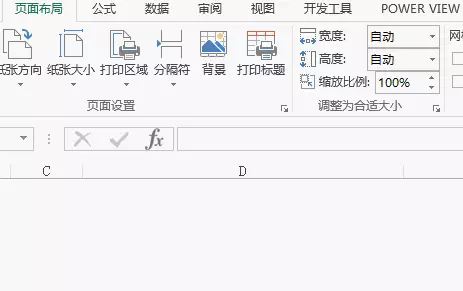

## **10、快速找出重复值**  

操作方法：选取两列 - 条件格式 - 突出显示单元格规则 - 重复值  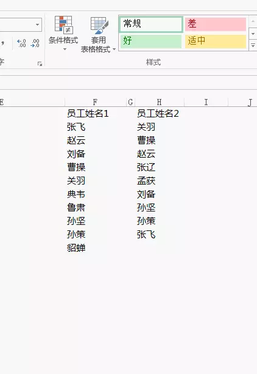

https://bbs.hupu.com/38839256.html?is_reflow=1&cid=&bddid=57880180597&puid=&client=d66c75fa8d15ce1e