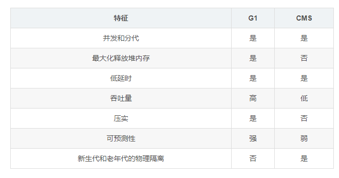
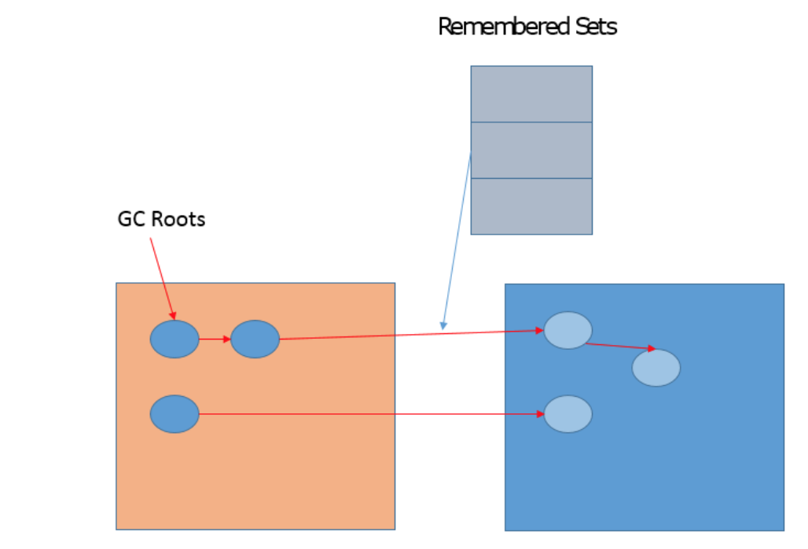

# 别总说 CMS、G1，该聊聊 ZGC 了

发布于: 2020 年 04 月 27 日

在开始介绍前，我们可以剧透几点：

- 根据不同分代的特点，收集器可能不同。有些收集器可以同时用于新生代和老年代，而有些时候，则需要分别为新生代或老年代选用合适的收集器。一般来说，新生代收集器的收集频率较高，应选用性能高效的收集器；而老年代收集器收集次数相对较少，对空间较为敏感，应当避免选择基于复制算法的收集器。
- **在垃圾收集执行的时刻，应用程序需要暂停运行**。
- 可以串行收集，也可以并行收集。
- 如果能做到并发收集（应用程序不必暂停），那绝对是很妙的事情。
- 如果收集行为可控，那也是很妙的事情。



CMS和G1作为垃圾收集器里的大杀器，是需要好好弄明白的，而且面试中也经常被问到，但对于ZGC却很少提及。



**希望大家带着下面的问题进行阅读，有目标的阅读，收获更多:**



1. 为什么没有一种牛逼的收集器像银弹一样适配所有场景？
2. CMS的优点、缺点、适用场景？
3. 为什么CMS只能用作老年代收集器，而不能应用在新生代的收集？
4. G1的优点、缺点、适用场景？
5. ZGC的由来及优缺点？



## 1 CMS收集器

**CMS（Concurrent Mark Sweep）收集器是一种以获取最短回收停顿时间为目标的收集器**。这是因为CMS收集器工作时，GC工作线程与用户线程可以`并发`执行，以此来达到降低收集停顿时间的目的。



CMS收集器仅作用于**老年代**的收集，是基于`标记-清除算法`的，它的运作过程分为4个步骤：



- 初始标记（CMS initial mark）
- 并发标记（CMS concurrent mark）
- 重新标记（CMS remark）
- 并发清除（CMS concurrent sweep）



其中，`初始标记`、`重新标记`这两个步骤仍然需要Stop-the-world。**初始标记仅仅只是标记一下GC Roots能直接关联到的对象，速度很快，并发标记阶段就是进行GC Roots Tracing的过程，而重新标记阶段则是为了修正并发标记期间因用户程序继续运作而导致标记产生变动的那一部分对象的标记记录，这个阶段的停顿时间一般会比初始阶段稍长一些，但远比并发标记的时间短。**



> CMS以流水线方式拆分了收集周期，将耗时长的操作单元保持与应用线程并发执行。只将那些必需STW才能执行的操作单元单独拎出来，控制这些单元在恰当的时机运行，并能保证仅需短暂的时间就可以完成。这样，在整个收集周期内，只有**两次短暂的暂停（初始标记和重新标记）**，**达到了近似并发的目的**。



CMS收集器**优点**：并发收集、低停顿。



CMS收集器**缺点**：



- CMS收集器对CPU资源非常敏感。
- CMS收集器无法处理浮动垃圾（Floating Garbage）。
- CMS收集器是基于标记-清除算法，该算法的缺点都有（内存碎片）。
- 停顿时间是不可预期的。



CMS收集器之所以能够做到并发，根本原因在于**采用基于“标记-清除”的算法并对算法过程进行了细粒度的分解**。前面篇章介绍过标记-清除算法将产生大量的内存碎片这对新生代来说是难以接受的，因此新生代的收集器并未提供CMS版本。



> 备注：说CMS是老年代收集器，其实不是非常准确。CMS 的各个收集过程其实是一个涉及年轻代和老年代的综合性垃圾回收器，在很多文章和书籍的划分中，都将 CMS 划分为了老年代垃圾回收器，加上它主要作用于老年代，所以一般误认为是。



另外要补充一点，JVM在暂停的时候，需要选准一个时机。由于JVM系统运行期间的复杂性，不可能做到随时暂停，因此引入了安全点的概念。



### 安全点(Safepoint)

**安全点，即程序执行时并非在所有地方都能停顿下来开始GC，只有在到达安全点时才能暂停**。Safepoint的选定既不能太少以至于让GC等待时间太长，也不能过于频繁以致于过分增大运行时的负荷。



安全点的初始目的并不是让其他线程停下，而是找到一个稳定的执行状态。在这个执行状态下，Java虚拟机的堆栈不会发生变化。这么一来，垃圾回收器便能够“安全”地执行可达性分析。只要不离开这个安全点，Java虚拟机便能够在垃圾回收的同时，继续运行这段本地代码。



程序运行时并非在所有地方都能停顿下来开始GC，只有在到达安全点时才能暂停。安全点的选定基本上是以程序“是否具有让程序长时间执行的特征”为标准进行选定的。“**长时间执行**”的最明显特征就是指令序列复用，例如方法调用、循环跳转、异常跳转等，所以具有这些功能的指令才会产生Safepoint。



对于安全点，另一个需要考虑的问题就是如何在GC发生时让所有线程（这里不包括执行JNI调用的线程）都“跑”到最近的安全点上再停顿下来。



两种解决方案：



- 抢先式中断（Preemptive Suspension）

  

  抢先式中断不需要线程的执行代码主动去配合，在GC发生时，首先把所有线程全部中断，如果发现有线程中断的地方不在安全点上，就恢复线程，让它“跑”到安全点上。现在几乎没有虚拟机采用这种方式来暂停线程从而响应GC事件。

​     

- 主动式中断（Voluntary Suspension）



  主动式中断的思想是当GC需要中断线程的时候，不直接对线程操作，仅仅简单地设置一个标志，各个线程执行时主动去轮询这个标志，发现中断标志为真时就自己中断挂起。轮询标志的地方和安全点是重合的，另外再加上创建对象需要分配内存的地方。



### 安全区域

指在一段代码片段中，引用关系不会发生变化。在这个区域中任意地方开始GC都是安全的。也可以把Safe Region看作是被扩展了的Safepoint。



## 2 G1收集器

G1重新定义了堆空间，打破了原有的分代模型，将堆划分为一个个区域。这么做的目的是在进行收集时不必在全堆范围内进行，这是它最显著的特点。区域划分的好处就是带来了`停顿时间可预测`的收集模型：用户可以指定收集操作在多长时间内完成。即G1提供了接近实时的收集特性。G1 的主要关注点在于达到可控的停顿时间，在这个基础上尽可能提高吞吐量。



G1 使用了停顿预测模型来满足用户指定的停顿时间目标，并基于目标来选择进行垃圾回收的区块数量。G1 采用`增量回收`的方式，每次回收一些区块，而不是整堆回收。要清楚 G1 不是一个实时收集器（只是接近实时），它会尽力满足我们的停顿时间要求，但也不是绝对的，它基于之前垃圾收集的数据统计，估计出在用户指定的停顿时间内能收集多少个区块。



G1与CMS的特征对比如下：





**G1具备如下特点：**



- **并行与并发**：G1能充分利用多CPU、多核环境下的硬件优势，使用多个CPU来缩短Stop-the-world停顿的时间，部分其他收集器原来需要停顿Java线程执行的GC操作，G1收集器仍然可以通过**并发**的方式让Java程序继续运行。
- 分代收集
- 空间整合：与CMS的标记-清除算法不同，G1从整体来看是基于**标记-整理算法**实现的收集器，从局部（两个Region之间）上来看是基于“**复制**”算法实现的。但无论如何，这两种算法都意味着G1运作期间不会产生内存空间碎片，收集后能提供规整的可用内存。**这种特性有利于程序长时间运行，分配大对象时不会因为无法找到连续内存空间而提前触发下一次GC**。
- 可预测的停顿：这是G1相对于CMS的一个优势，降低停顿时间是G1和CMS共同的关注点。



在G1之前的其他收集器进行收集的范围都是整个新生代或者老年代，而G1不再是这样。在堆的结构设计时，G1打破了以往将收集范围固定在新生代或老年代的模式，G1收集器将整个Java堆划分为多个大小相等的独立区域（Region）。Region是一块地址连续的内存空间，G1模块的组成如下图所示：




虽然还保留有新生代和老年代的概念，但新生代和老年代不再是物理隔离的了，它们都是一部分Region（不需要连续）的集合。Region的大小是一致的，数值是在`1M到32M`字节之间的一个2的幂值数，JVM会尽量划分`2048`个左右、同等大小的Region，这一点可以参看如下[源码](http://hg.openjdk.java.net/jdk/jdk/file/fa2f93f99dbc/src/hotspot/share/gc/g1/heapRegionBounds.hpp)。其实这个数字既可以手动调整，G1也会根据堆大小自动进行调整。



```
#ifndef SHAREVMGCG1HEAPREGIONBOUNDSHPP
#define SHAREVMGCG1HEAPREGIONBOUNDSHPP

#include "memory/allocation.hpp"

class HeapRegionBounds : public AllStatic {
private:
  // Minimum region size; we won't go lower than that.
  // We might want to decrease this in the future, to deal with small
  // heaps a bit more efficiently.
  static const sizet MINREGIONSIZE = 1024  1024;

  // Maximum region size; we don't go higher than that. There's a good
  // reason for having an upper bound. We don't want regions to get too
  // large, otherwise cleanup's effectiveness would decrease as there
  // will be fewer opportunities to find totally empty regions after
  // marking.
  static const sizet MAXREGIONSIZE = 32  1024 * 1024;

  // The automatic region size calculation will try to have around this
  // many regions in the heap (based on the min heap size).
  static const sizet TARGETREGIONNUMBER = 2048;

public:
  static inline sizet minsize();
  static inline sizet maxsize();
  static inline sizet targetnumber();
};

#endif // SHAREVMGCG1HEAPREGIONBOUNDSHPP
```



**G1收集器之所以能建立可预测的停顿时间模型，是因为它可以有计划地避免在整个Java堆中进行全区域的垃圾收集**。G1会通过一个合理的计算模型，计算出每个Region的收集成本并量化，这样一来，收集器在给定了“停顿”时间限制的情况下，总是能选择一组恰当的Regions作为收集目标，让其收集开销满足这个限制条件，以此达到实时收集的目的。



对于打算从CMS或者ParallelOld收集器迁移过来的应用，按照[官方](https://www.oracle.com/technetwork/java/javase/tech/g1-intro-jsp-135488.html) 的建议，如果发现符合如下特征，可以考虑更换成G1收集器以追求更佳性能：

- 实时数据占用了超过半数的堆空间；
- 对象分配率或“晋升”的速度变化明显；
- 期望消除耗时较长的GC或停顿（超过0.5——1秒）。



> 原文如下：Applications running today with either the CMS or the ParallelOld garbage collector would benefit switching to G1 if the application has one or more of the following traits.
>
> \- More than 50% of the Java heap is occupied with live data.
>
> \- The rate of object allocation rate or promotion varies significantly.
>
> \- Undesired long garbage collection or compaction pauses (longer than 0.5 to 1 second)



**G1收集的运作过程大致如下：**



- **初始标记（Initial Marking）**：仅仅只是标记一下GC Roots能直接关联到的对象，并且修改TAMS（Next Top at Mark Start）的值，让下一阶段用户程序并发运行时，能在正确可用的Region中创建新对象，**这阶段需要**`停顿线程`**，但耗时很短**。
- **并发标记（Concurrent Marking）**：是从GC Roots开始堆中对象进行可达性分析，找出存活的对象，**这阶段耗时较长**，但可与用户程序并发执行。
- **最终标记（Final Marking）**：是为了修正并发标记期间因用户程序继续运作而导致标记产生变动的那一部分标记记录，虚拟机将这段时间对象变化记录在线程Remembered Set Logs里面，最终标记阶段需要把Remembered Set Logs的数据合并到Remembered Set中，**这阶段需要**`停顿线程`**，但是可并行执行**。
- **筛选回收（Live Data Counting and Evacuation）**：首先对各个Region的回收价值和成本进行排序，根据用户所期望的GC停顿时间来制定回收计划。这个阶段也可以做到与用户程序一起并发执行，但是因为只回收一部分Region，时间是用户可控制的，而且停顿用户线程将大幅提高收集效率。



全局变量和栈中引用的对象是可以列入根集合的，这样在寻找垃圾时，就可以从根集合出发扫描堆空间。在G1中，引入了一种新的能加入根集合的类型，就是`记忆集`（Remembered Set）。Remembered Sets（也叫RSets）用来跟踪对象引用。G1的很多开源都是源自Remembered Set，例如，它通常约占Heap大小的20%或更高。并且，我们进行对象复制的时候，因为需要扫描和更改Card Table的信息，这个速度影响了复制的速度，进而影响暂停时间。





G1 比 ParallelOld 和 CMS 会需要更多的内存消耗，那是因为有部分内存消耗于簿记（accounting）上，如以下两个数据结构：

- Remembered Sets：每个区块都有一个 RSet，用于记录进入该区块的对象引用（如区块 A 中的对象引用了区块 B，区块 B 的 Rset 需要记录这个信息），它用于实现收集过程的并行化以及使得区块能进行独立收集。
- Collection Sets：将要被回收的区块集合。GC 时，在这些区块中的对象会被复制到其他区块中，总体上 Collection Sets 消耗的内存小于 1%。



### 卡表（Card Table）



有个场景，老年代的对象可能引用新生代的对象，那标记存活对象的时候，需要扫描老年代中的所有对象。因为该对象拥有对新生代对象的引用，那么这个引用也会被称为GC Roots。那不是得又做全堆扫描？成本太高了吧。



HotSpot给出的解决方案是一项叫做`卡表`（Card Table）的技术。该技术将整个堆划分为一个个大小为512字节的卡，并且维护一个卡表，用来存储每张卡的一个标识位。这个标识位代表对应的卡是否可能存有指向新生代对象的引用。如果可能存在，那么我们就认为这张卡是脏的。



在进行Minor GC的时候，我们便可以不用扫描整个老年代，而是在卡表中寻找脏卡，并将脏卡中的对象加入到Minor GC的GC Roots里。当完成所有脏卡的扫描之后，Java虚拟机便会将所有脏卡的标识位清零。



想要保证每个可能有指向新生代对象引用的卡都被标记为脏卡，那么Java虚拟机需要截获每个引用型实例变量的写操作，并作出对应的写标识位操作。



**卡表能用于减少老年代的全堆空间扫描，这能很大的提升GC效率**。



我们可以看下官方文档对G1的展望（这段英文描述比较简单，我就不翻译了）：

> **Future**:G1 is planned as the long term replacement for the Concurrent Mark-Sweep Collector (CMS). Comparing G1 with CMS, there are differences that make G1 a better solution. One difference is that G1 is a compacting collector. G1 compacts sufficiently to completely avoid the use of fine-grained free lists for allocation, and instead relies on regions. This considerably simplifies parts of the collector, and mostly eliminates potential fragmentation issues. Also, G1 offers more predictable garbage collection pauses than the CMS collector, and allows users to specify desired pause targets.



## 3 ZGC

ZGC(Z Garbage Collector)作为一种比较新的收集器，目前还没有得到大范围的关注。作为一款低延迟的垃圾收集器，它有如下几个亮点：

- 停顿时间不会超过 10ms
- 停顿时间不会随着堆的增大而增大（控制停顿时间在10ms内）
- 支持堆的大小范围很广（8MB-16TB）



在ZGC中，连逻辑上的也是重新定义了堆空间（不区分年轻代和老年代），只分为一块块的page，每次进行GC时，都会对page进行压缩操作，所以没有碎片问题。虽然ZGC属于很新的GC技术, 但优点不一定真的出众，ZGC只在特定情况下具有绝对的优势, 如`巨大的堆和极低的暂停需求`。而实际上大多数开发在这两方面都不太成问题(尤其是在服务器端), 而对GC的性能/效率更在意。也有一种观点认为ZGC是为大内存、多cpu而生，它通过分区的思路来降低STW。



ZGC在JDK14前只支持Linux, 从JDK14开始支持Mac和Windows。



可以从官网看下ZGC的Change Log：

- JDK 15 (under development)
- Improved NUMA awareness
- Support for Class Data Sharing (CDS)
- Support for placing the heap on NVRAM
- `<TBD>`



- JDK 14
- macOS support (JEP 364)
- Windows support (JEP 365)
- Support for tiny/small heaps (down to 8M)
- Support for JFR leak profiler
- Support for limited and discontiguous address space
- Parallel pre-touch (when using -XX:+AlwaysPreTouch)
- Performance improvements (clone intrinsic, etc)
- Stability improvements



- JDK 13
- Increased max heap size from 4TB to 16TB
- Support for uncommitting unused memory (JEP 351)
- Support for -XX:SoftMaxHeapSIze
- Support for the Linux/AArch64 platform
- Reduced Time-To-Safepoint



- JDK 12
- Support for concurrent class unloading
- Further pause time reductions



- JDK 11
- Initial version of ZGC
- Does not support class unloading (using -XX:+ClassUnloading has no effect)



可以看出ZGC未来可期，让我们拭目以待吧。

## 4 总结

查了下度娘有关G1的文章，绝大部分文章对G1的介绍都是停留在JDK7或更早期的实现很多结论已经存在较大偏差了，甚至一些过去的GC选项已经不再推荐使用。举个例子，JDK9中JVM和GC日志进行了重构，如PrintGCDetails已经被标记为废弃，而PrintGCDateStamps已经被移除，指定它会导致JVM无法启动。



本文对CMS和G1的介绍绝大部分内容也是基于JDK7，新版本中的内容有一点介绍，倒没做过多介绍，后面有机会可以再出专门的文章来重点介绍。通过分析CMS、G1的优缺点，就能更清楚ZGC的由来及优势，特别是停顿时间不超过10ms，是不是已经摩拳擦掌，跃跃欲试了？



## 5 参考

《深入理解Java虚拟机》

《HotSpot实战》

https://wiki.openjdk.java.net/display/zgc/Main

https://plumbr.io/handbook/garbage-collection-algorithms-implementations#g1

https://www.oracle.com/technetwork/tutorials/tutorials-1876574.html



 [别总说CMS、G1，该聊聊ZGC了 - InfoQ 写作平台](https://xie.infoq.cn/article/586f901cf8f38dd2f63b54a44)