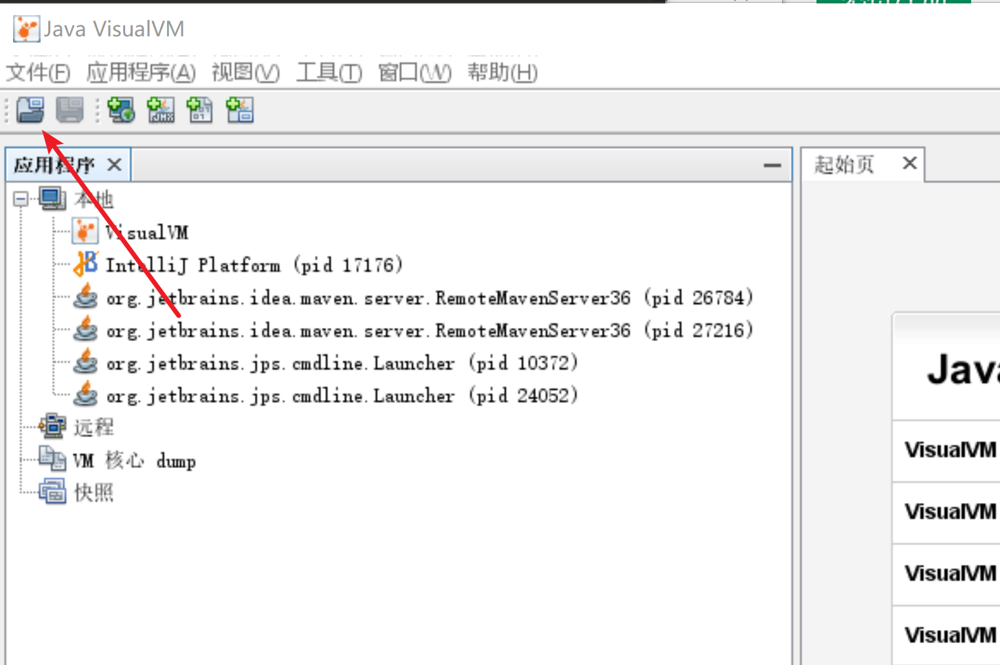

# 程序OOM，通过log日志定位，不要说自己具备高并发开发经验

原创java开发这些年2021-01-22 08:44:00

首先说一下，本人在开发中遇到的OOM异常基本也是通过看log日志去定位的(很多OOM异常是因为出现死循环或者查询返回的数据量多大，没有分页等等，通过异常日志我们确实能很快定位，但这不是正确的姿势。)，只是碰巧刚好日志打印的异常栈信息就是对应的代码问题。
很多博客也说了，定位OOM异常通过分析dump日志，因此深表疑惑，为什么明明看log日志就能解决的非要去分析dump日志，网上也没有检索到满意的答案，问了身边的很多开发，也仅仅说dump进行性能分析，log日志进行异常排查。在我几度深思中，突然开窍，特此写下原因。

## 正确姿势dump文件分析--intsmaze

请看大屏幕:

```java
public class OOMDump {
 
    static class OOMIntsmaze {
        public byte[] placeholder = new byte[64 * 1024];
    }
 
    public static void fillHeap(ArrayList<OOMIntsmaze> list, int num) throws Exception {
        for (int i = 0; i < num; i++) {
            list.add(new OOMIntsmaze());
            System.out.println(i);
        }
    }
 
    public static void main(String[] args) throws Exception {
        ArrayList<OOMIntsmaze> list = new ArrayList<OOMIntsmaze>();
        fillHeap(list,131);
        Thread.sleep(20000000);
    }
}
```

我们配置jvm参数如下 -Xmx10M -XX:+HeapDumpOnOutOfMemoryError -XX:HeapDumpPath=d://
当fillHeap(list,131)时，程序正常执行；当fillHeap(list,132)时，程序就会报OOM异常:

```
130
java.lang.OutOfMemoryError: Java heap space
Dumping heap to d://\java_pid10000.hprof ...
Exception in thread "main" java.lang.OutOfMemoryError: Java heap space
	at cn.intsmaze.dump.OOMDump$OOMIntsmaze.<init>(OOMDump.java:27)
	at cn.intsmaze.dump.OOMDump.fillHeap(OOMDump.java:34)
	at cn.intsmaze.dump.OOMDump.main(OOMDump.java:47)
	at sun.reflect.NativeMethodAccessorImpl.invoke0(Native Method)
	at sun.reflect.NativeMethodAccessorImpl.invoke(NativeMethodAccessorImpl.java:62)
	at sun.reflect.DelegatingMethodAccessorImpl.invoke(DelegatingMethodAccessorImpl.java:43)
	at java.lang.reflect.Method.invoke(Method.java:498)
Heap dump file created [10195071 bytes in 0.017 secs]
	at com.intellij.rt.execution.application.AppMain.main(AppMain.java:147)
```

通过异常日志我们可以看到，是因为代码
at cn.intsmaze.dump.OOMDump.fillHeap(OOMDump.java:34)
list.add(new OOMIntsmaze());
导致的问题，通过日志所见即所得，我立马解决了问题，为什么要看dump日志呢？我有病啊。

其实不然，骚年。假如main方法如下，执行

```
public static void main(String[] args) throws Exception {
        ArrayList<OOMIntsmaze> list = new ArrayList<OOMIntsmaze>();
        fillHeap(list,131);
        Map<String,OOMIntsmaze> map=new HashMap<String,OOMIntsmaze>();
        map.put("LIUYANG",new OOMIntsmaze());
        map.put("intsmaze",new OOMIntsmaze());
        Thread.sleep(20000000);
    }
```

这个时候我们通过异常日志发现是因为map.put("LIUYANG",new OOMIntsmaze());导致的，找到代码发现，map里面才插入了一条数据，没有出现死循环，怎么会导致OOM异常了，真是活久见了。

```
Exception in thread "main" java.lang.OutOfMemoryError: Java heap space
	at cn.intsmaze.dump.OOMDump$OOMIntsmaze.<init>(OOMDump.java:27)
	at cn.intsmaze.dump.OOMDump.main(OOMDump.java:49)
	at sun.reflect.NativeMethodAccessorImpl.invoke0(Native Method)
	at sun.reflect.NativeMethodAccessorImpl.invoke(NativeMethodAccessorImpl.java:62)
	at sun.reflect.DelegatingMethodAccessorImpl.invoke(DelegatingMethodAccessorImpl.java:43)
	at java.lang.reflect.Method.invoke(Method.java:498)
	at com.intellij.rt.execution.application.AppMain.main(AppMain.java:147)
```

设置10M我们可以发现list添加132各个元素时会发生OOM，这个时候我们向list添加131个元素，然后执行map添加，发现map添加一个元素就报错。此时的oom异常日志定位的是map添加元素导致的。
但是真实情况不是的，因为看代码也会发现map只添加了2个元素，怎么会是他造成的。map的添加只是刚好此时jvm内存达到容量上限了。
所以要找到根本问题，是需要通过dump文件分析OOM时，各个对象的容量状态。
而且实际情况中，map.put()的代码并不会向上面示例一样和list.add()代码放在一块，而是位于不同的包下，不同的业务流程中。这个时候看log日志去定位基本不可能了。
但是为什么大家出行OOM异常还是通过看log日志而且定位的位置是正确的。只是因为向list.add这种循环中，一直在执行，基本大概率是他触发的。

## **正确的姿势--intsmaze**

所以为了防患于未然，程序猿在开发的时候，一定要配置jvm启动参数HeapDumpOnOutOfMemoryError。
参数-XX：+HeapDumpOnOutOfMemoryError可以让虚拟机在出现内存溢出异常时Dump出当前的内存堆转储快照以便事后进行分析

```
-XX:+HeapDumpOnOutOfMemoryError -XX:HeapDumpPath=d://
```

## dump文件查看

java_pid3460.hprof

推荐使用jdk自带的visualVM，其在JDK_HOME/bin目录下，可搜：jvisualvm。注意：windows系统是jvisualvm.exe文件

然后装入快照即可。




[程序OOM，通过log日志定位，不要说自己具备高并发开发经验 (toutiao.com)](https://www.toutiao.com/i6919769030379225603/?tt_from=android_share&timestamp=1611362813&app=news_article&use_new_style=1&req_id=202101230846520100220201521087ABF5&share_token=3d39cbdb-8966-4189-a305-6b0dabb956d0&group_id=6919769030379225603)