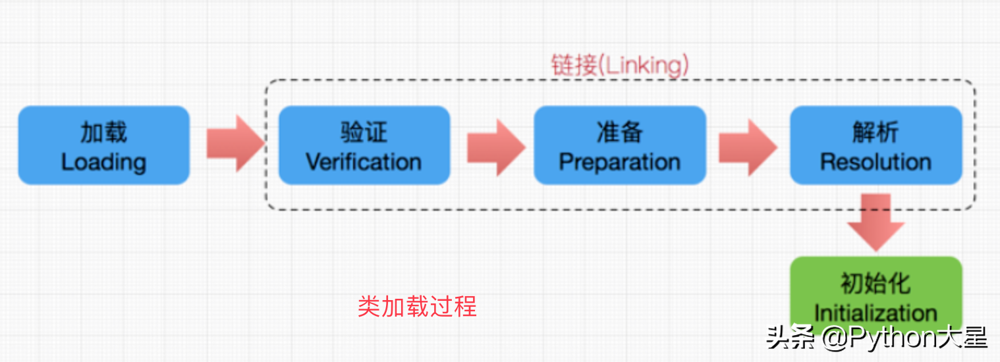
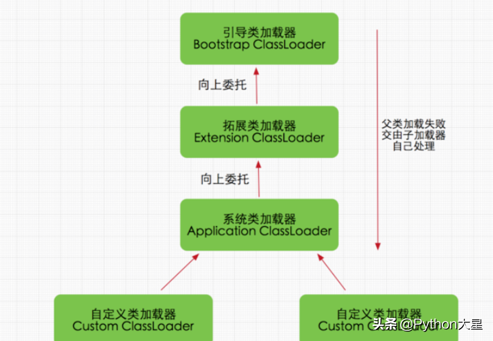
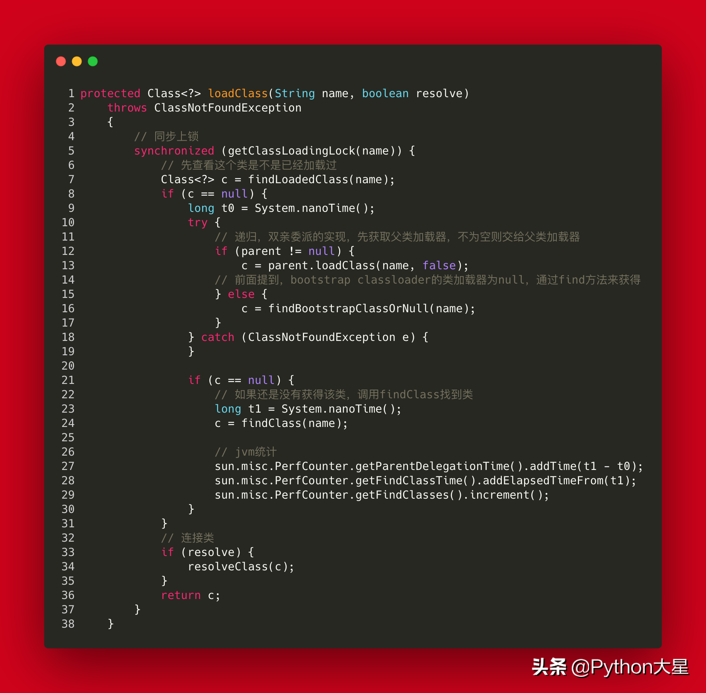

# 面试官：你说下 Java 的双亲委派机制

## 1、类的加载机制

① 加载：类加载的第一个阶段，通过类的全限定名来找到对应的 class 文件，将此 class 文件生成一个 class 对象。

② 链接：链接分为 3 个小部分，验证、准备、解析。

验证：验证的目的在于确保 class 文件的字节流中包含信息符合当前虚拟机要求，不会危害虚拟机自身安全。主要包括四种验证，文件格式验证，元数据验证，字节码验证，符号引用验证；

准备：给静态方法和静态变量赋予初值，比如 static int a；给其中的 a 赋予初值为 0，但是这里不会给 final 修饰的静态变量赋予初值，因为被 final 修饰的静态变量在编译期间就已经被赋予初值了；

解析：主要将常量池中的符号引用替换为直接引用的过程。

③ 初始化：类加载最后阶段，若该类具有超类，则对其进行初始化，执行静态初始化器和静态初始化成员变量 ，如前面只初始化了默认值的 static 变量将会在这个阶段赋值，成员变量也将被初始化。

## 2、类加载器

执行以上类加载过程的就是类加载器。

系统给我们提供的类加载器有 3 种：

① 启动类加载器（BootstrapClassLoader）

它负责将 /lib 路径下的核心类库或 -Xbootclasspath 参数指定的路径下的 jar 包加载到内存中，属于【顶级类加载器】。

② 扩展类加载器（ExtClassLoader ）

它负责加载 /lib/ext 目录下或者由系统变量 - Djava.ext.dir 指定位路径中的类库。

③ 系统类加载器（AppClassLoader）

它负责加载系统类路径 java -classpath 或 -D java.class.path 指定路径下的类库，也就是我们经常用到的 classpath 路径，开发者可以直接使用系统类加载器，一般情况下该类加载是程序中默认的类加载器，通过 ClassLoader#getSystemClassLoader() 方法可以获取到该类加载器。

除了系统提供的 3 种类加载器，

CustomClassLoader（用户自定义类加载器），java 编写，用户自定义的类加载器，可加载指定路径的 class 文件

## 3、双亲委派机制

当某个类加载器需要加载某个.class 文件时，它首先把这个任务委托给他的上级类加载器，递归这个操作，如果上级的类加载器没有加载，自己才会去加载这个类。

优点：

① 防止重复加载同一个.class。

② 保证核心.class 不能被篡改，保证安全。比如 Bootstrap ClassLoader 会加载 JVM 需要的核心 java 包，这时候网络上传来了一个名字是 java.lang.Integer 的类，Bootstrap ClassLoader 检测到该类已经被加载过了，所以直接返回 Class，而不是重新加载，便可以防止核心 API 库被随意篡改。

双亲委派的实现：

## 4、破坏双亲委派机制

① 不破坏双亲委派，重写 findClass 方法

② 破坏双亲委派，重写 loadClass 方法

https://www.toutiao.com/i6851113800435761668/?tt_from=android_share&utm_campaign=client_share&timestamp=1597715094&app=news_article&utm_medium=toutiao_android&use_new_style=1&req_id=20200818094454010014040089257232E6&group_id=6851113800435761668