# 深入理解Spring异常处理

## 1.前言

相信我们每个人在SpringMVC开发中，都遇到这样的问题：当我们的代码正常运行时，返回的数据是我们预期格式，比如json或xml形式，但是一旦出现了异常（比如：NPE或者数组越界等等），返回的内容确实服务端的异常堆栈信息，从而导致返回的数据不能使客户端正常解析； 很显然，这些并不是我们希望的结果。

我们知道，一个较为常见的系统，会涉及控制层，服务(业务)层、缓存层、存储层以及接口调用等，其中每一个环节都不可避免的会遇到各种不可预知的异常需要处理。如果每个步骤都单独try..catch会使系统显的很杂乱，可读性差，维护成本高；常见的方式就是，实现统一的异常处理，从而将各类异常从各个模块中解耦出来；

## 2.常见全局异常处理

在Spring中常见的全局异常处理，主要有三种：

（1）注解ExceptionHandler

（2）继承HandlerExceptionResolver接口

（3）注解ControllerAdvice

在后面的讲解中，主要以HTTP错误码：400（请求无效）和500（内部服务器错误）为例，先看一下测试代码以及没有任何处理的返回结果，如下：

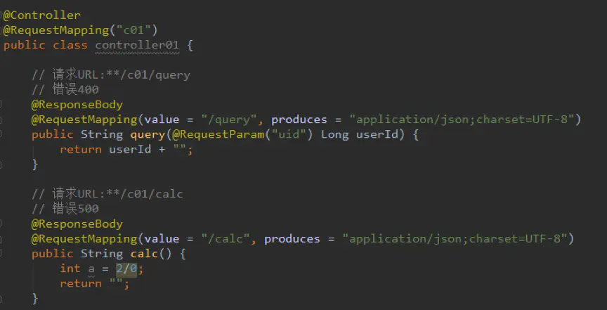

图1：测试代码

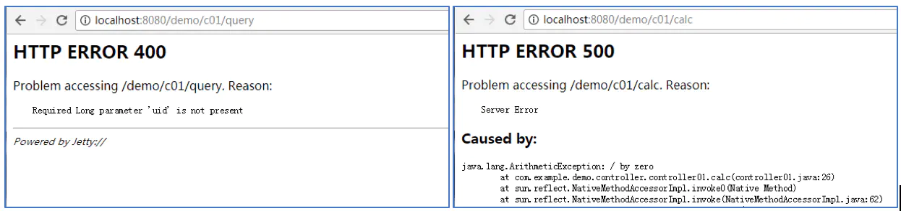

图2：没有异常的错误返回

### 2.1注解ExceptionHandler

注解ExceptionHandler作用对象为方法，最简单的使用方法就是放在controller文件中，详细的注解定义不再介绍。如果项目中有多个controller文件，通常可以在baseController中实现ExceptionHandler的异常处理，而各个contoller继承basecontroller从而达到统一异常处理的目的。因为比较常见，简单代码如下：

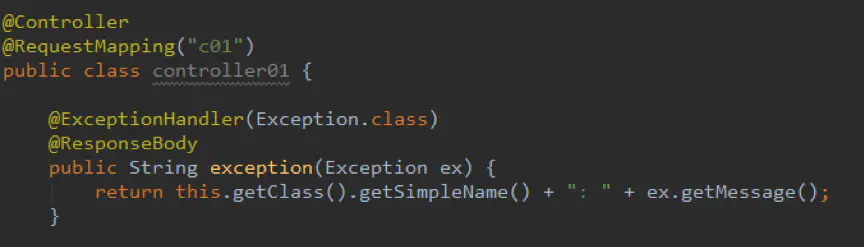

图3：Controller中的ExceptionHandler使用

在返回异常时，添加了所属的类名，便于大家记忆理解。运行看一下结果：

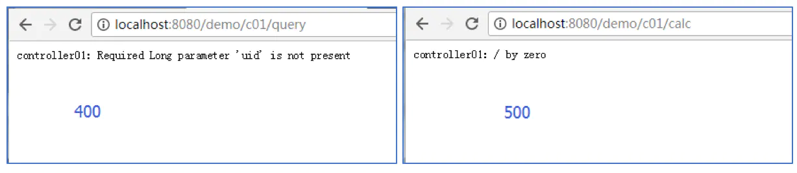

图4：添加ExceptionHandler之后的结果

- 优点：ExceptionHandler简单易懂，并且对于异常处理没有限定方法格式；
- 缺点：由于ExceptionHandler仅作用于方法，对于多个controller的情况，仅为了一个方法，所有需要异常处理的controller都继承这个类，明明不相关的东西，强行给他们找个爹，不太好。

### 2.2注解ControllerAdvice

这里虽说是ControllerAdvice注解，其实是其与ExceptionHandler的组合使用。在上文中可以看到，单独使用@ExceptionHandler时，其必须在一个Controller中，然而当其与ControllerAdvice组合使用时就完全没有了这个限制。换句话说，二者的组合达到的全局的异常捕获处理。

```java
@ControllerAdvice
@Slf4j
public class GlobalDefaultExceptionHandler {

    @ExceptionHandler(Exception.class)
    @ResponseBody
    public String defaultExceptionHandler(Exception ex) {
        return this.getClass().getSimpleName() + ":" + ex.getMessage();
    }
    // @ExceptionHandler(其他Exception.class )
    // @ExceptionHandler(自定义Exception. class )
}
```

图5：注解ControllerAdvice异常处理代码

在运行之前，需将之前Controller中的ExceptionHandler注释掉，测试结果如下：

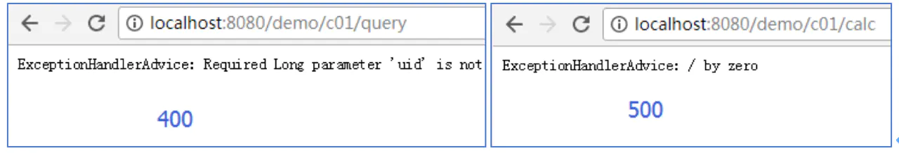

图6：注解ControllerAdvice异常处理结果

通过上面结果可以看到，异常处理确实已经变更为ExceptionHandlerAdvice类。这种方法将所有的异常处理整合到一处，去除了Controller中的继承关系，并且达到了全局捕获的效果，推荐使用此类方式；

### 2.3实现HandlerExceptionResolver接口

HandlerExceptionResolver本身SpringMVC内部的接口，其内部只有resolveException一个方法，通过实现该接口我们可以达到全局异常处理的目的。

```java
@Component
public class GlobalDefaultExceptionHandler implements HandlerExceptionResolver {
    @Override
    public ModelAndView resolveException(HttpServletRequest request,
                                         HttpServletResponse response,
                                         Object handler, Exception ex) {
        printWrite(this.getClass().getSimpleName() + ":" + ex.getMessage(), response);
        return new ModelAndView();
    }

    private void printWrite(String msg, HttpServletResponse response) {
        try {
            PrintWriter pw = response.getWriter();
            pw.write(msg);
            pw.flush();
            pw.close();
        } catch (Exception e) {
            e.printStackTrace();
        }
    }
}

```

图7：实现HandlerExceptionResolver接口 

同样在执行之前，将上述两个方法的异常处理都注释掉，运行结果如下：

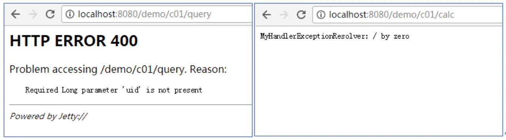

图8：实现HandlerExceptionResolver接口运行结果

可以看到500的异常处理已经生效了，但是400的异常处理却没有生效，并且根没有异常前的返回结果一样。这是怎么回事呢？不是说可以做到全局异常处理的么？没办法要想知道问题的原因，我们只能刨根问底，往Spring的祖坟上刨，下面我们结合Spring的源码调试，去需要原因。

## 3.Spring中异常处理源码分析

大家都知道，在Spring中第一个收到请求的类就是DispatcherServlet，而该类中核心的方法就是doDispatch，我们可以在该类中打断点，进而一步步跟进异常处理。

### 3.1 HandlerExceptionResolver实现类处理流程

参照如下的跟进步骤，在processHandlerException中断点，跟踪的结果如下图：


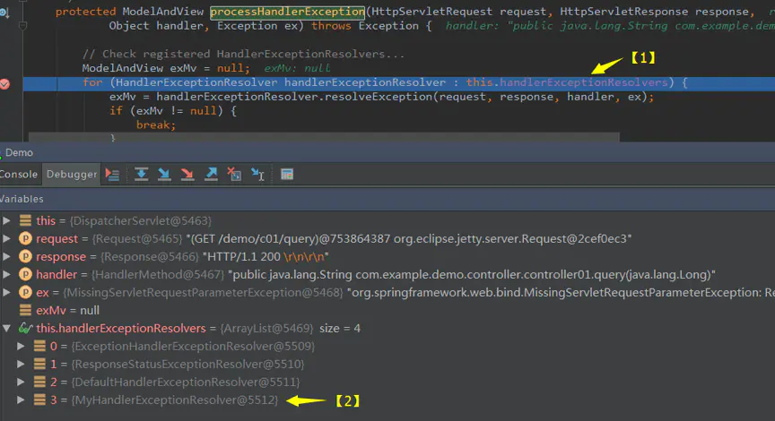

图9：processHandlerException断点

可以看到在图中箭头【1】处，在遍历 handlerExceptionResolvers 进而来处理异常，而在箭头【2】处，看到handlerExceptionResolvers 中共有4个元素，其中最后一个就是2.3方法定义的异常处理类

当前的请求query请求，根据上述现象可以推测出，该异常处理应该是在前3个异常处理中被处理了，从而跳过我们自定义的异常；带着这样的猜测，我们F8继续跟进，可以跟踪到该异常是被第三个，即**DefaultHandlerExceptionResolver**所处理。

- **DefaultHandlerExceptionResolver** ：SpringMVC默认装配了DefaultHandlerExceptionResolver，该类的doResolveException方法中主要对一些特殊的异常进行处理，并将这类异常转换为相应的响应状态码。而query请求触发的异常为MissingServletRequestParameterException，其恰好也是被DefaultHandlerExceptionResolver所针对的异常，故会在该类中被异常捕获。

到此真相大白了，可以看到我们的自定义类MyHandlerExceptionResolver确实可以做到全局处理异常，只不过对于query请求的异常，中间被DefaultHandlerExceptionResolver插了一脚，所以就跳过了MyHandlerExceptionResolver类的处理，从而出现400的返回结果。而对于calc请求，中间没有阻拦，所以就达到了预期效果。

### 3.2三类异常的处理顺序

到此我们一共介绍了3类全局异常处理，按照上面的分析可以看出，实现HandlerExceptionResolver接口的方式是排在最后处理，那么@ExceptionHandler和@ControllerAdvice这两个的顺序谁先谁后呢？ 将三类异常处理全部打开（之前注释掉了），运行一下看看效果：

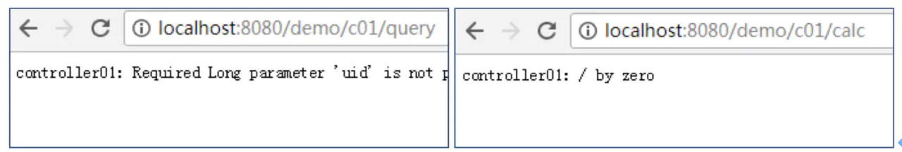

图10：异常处理全放开运行结果

通过现象可以看到，Controller中单独@ExceptionHandle异常处理排在了首位，@ControllerAdvice排在了第二位。严谨的童鞋可以写个Controller02，将query和calc复制过去，异常处理就不要了，这样请求c02的方法时，异常捕获的所属类名就都是@ControllerAdvice所在类了。

以上都是我们根据现象得到的结论，下面去Spring源码去找“证据”。在图9中，handlerExceptionResolvers中有4类处理器，而@ExceptionHandler和@ControllerAdvice的处理就在第一个ExceptionHandlerExceptionResolver中（之前断点跟进即可获知）。继续跟进直到进入ExceptionHandlerExceptionResolver类的doResolveHandlerMethodException方法，这里的HandlerMethod就是Spring将HTTP请求映射到指定Controller中的方法，而Exception就是需要被捕获的异常；继续跟进，看看使用这两个参数到底干了什么事儿。

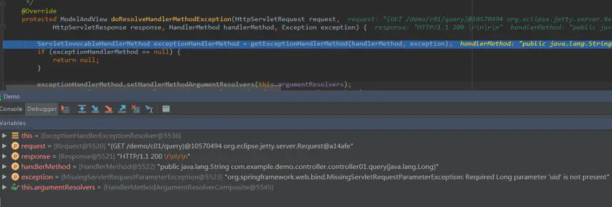

图11：doResolveHandlerMethodException断点

继续跟进getExceptionHandlerMethod方法，发现有两个变量可能就是问题的关键：exceptionHandlerCache和exceptionHandlerAdviceCache。首先，两者的变量名很值得怀疑；其次，前者在代码中看，明显是通过类作为key，从而得到一个处理器(resolver)，这恰好Controller中@ExceptionHandler处理规则相吻合；最后，这两个Cache的处理顺序，也符合之前的得到的结论。正如之前猜测的那样，Spring中确实是优先根据Controller类名去查找对应的ExceptionHandler，没有找到的话，再进行@ControllerAdvice异常处理。

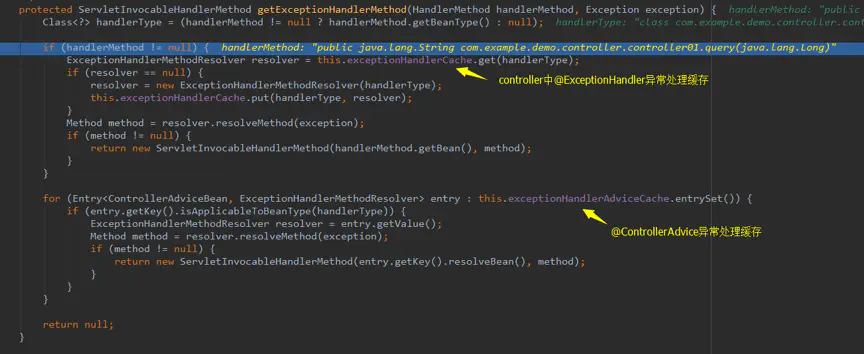

图12：两个异常处理Cache

**如有兴趣可继续深入挖掘Spring的源码，这里针对 ExceptionHandlerExceptionResolver 简单做个总结：**

- exceptionHandlerCache中包含Controller中的ExceptionHandler异常处理，处理时通过HandlerMethod得到Controller，进而再找到异常处理方法，需要注意的是，其是在异常处理过程中put值的；
- exceptionHandlerAdviceCache则是在项目启动时初始化的，大概思路是找到带有@ControllerAdvice注解的bean，从而缓存bean中的ExceptionHandler，在异常处理时需要对齐遍历查找处理，进而达到全局处理的目的。

### 3.3咸鱼翻身

介绍了这么多，简单画张图总结一下。蓝色的部分是Spring默认添加的3类异常处理器，黄色部分是我们添加的异常处理以及其所被调用的位置和顺序。看看哪里还有不太清楚的，往回翻翻看（ResponseStatusExceptionResolver是针对@ResponseStatus注解，这里不再详述）。

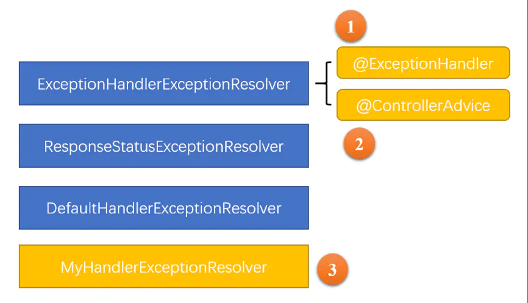

图13：异常总结

如果有需要将MyHandlerExceptionResolver提前处理，甚至排在ExceptionHandlerExceptionResolver之前，能做到么？答案是肯定的，在Spring中如果想将MyHandlerExceptionResolver异常处理提前，需要再实现一个Ordered接口，实现里面的getOrder方法即可，这里返回-1，将其放在最上面，这次咸鱼终于可以翻身了。

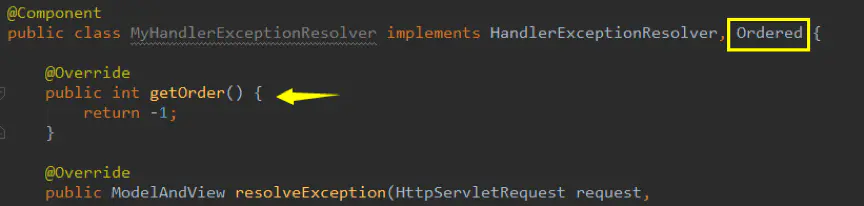

图14：实现Ordered接口

运行看一下结果是不是符合预期，提醒一下，我们三个异常处理都是生效的，如下图：

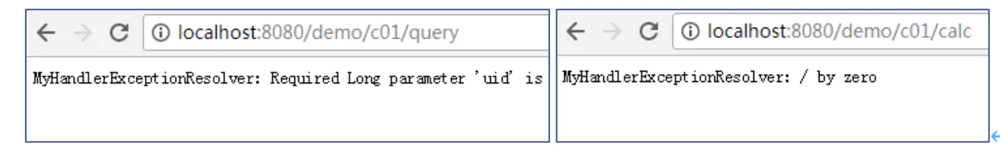

图15：实现Ordered接口运行结果

### 4.总结

本文主要通过介绍SpringMVC中三类常见的全局异常处理，在调试中发现了问题，进而引发去Spring源码中去探究原因，最终解决问题，希望大家能有所收获。当然Spring异常处理类不止介绍的这些，有兴趣的童鞋请自行探索！

## 参考链接：

[1] http://www.cnblogs.com/fangjian0423/p/springMVC-request-mapping.html

[2][blog.csdn.net/mll999888/a…](https://blog.csdn.net/mll999888/article/details/77621352)

[宜信技术学院](http://college.creditease.cn/)


https://juejin.im/post/5c4e6b6df265da61511519ae