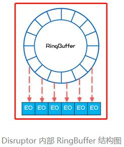
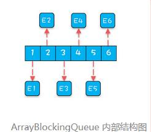

# Disruptor 为什么那么快？

一个简短的笔记。

Disruptor 快的核心秘诀是：基于数组、空间局部性良好、消除伪共享、无锁、支持批量消费。

# 1. 基于数组的内存局部性

Disruptor 底层是一个固定大小的环形数组，初始化的时候会顺序创建与数组长度一样数量的对象，以便让这些对象在内存上尽量挨着的。

顺序创建与随机创建在内存上的差别可以对比下面两张图（来自极客时间专栏《Java并发编程实战》）：

往队列里写入事件时，需要把事件的属性拷贝到这些预创建好的对象里，以保持内存的局部性。

> 这里的一个隐性要求是：事件的属性应该尽量是基本类型，如果是对象类型，存的是引用，访问引用指向的值时可能就是随机的内存访问。

# 2. 无锁

Disruptor 采用无锁、但是是线程安全的。无锁实现消除了锁竞争、等待。

实现上，每个写入者、读取者都维护一个自己的下标。读取者会读取写入者的下标来判断给定位置是否有有效的数据，写入者也会读取读取者的下标来判等给定位置的数据是否已经被消费。

Disruptor 保证每个下标只有一个线程会修改，因而不需要锁来保证线程安全性。

# 3. 消除伪共享

伪共享简单来说就是同一个缓存行的数据，有至少两个 CPU 处理器核进行修改，CPU A 和 B 分布要修改的数据 mem-A/mem-B 会加载到同一缓存行，CPU A 修改 mem-A 会导致 CPU B 缓存行里失效，需要重新从主存加载数据，从而导致效率降低。

Disruptor 的实现保证前面的每个下标会独占一个缓存行，从而消除伪共享。

# 4. 批量消费

批量消费比较容易理解，消费者顺序读取数组的一批数据进行处理 相比一次只能处理一个的效率更高。

批量也更好地利用了局部性优化。

# 5. 参考资料

[The LMAX Architecture](https://www.martinfowler.com/articles/lmax.html)

[LMAX 架构–笔记](https://coderbee.net/?p=2113)

[False Sharing 伪共享 – 译](https://coderbee.net/?p=566)

[Disruptor 为什么那么快？ | coderbee笔记](https://coderbee.net/index.php/concurrent/20200705/2134)