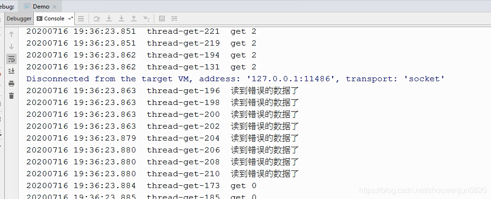

# 读锁有什么用？读为什么要加锁？

2020-07-16 19:58:55

## 读为什么要加锁？

1、有些同学认为读锁没有用，他们的理由是：读操作又不会修改数据，想读就读呗，无论读的是就值还是新值，反正能读到。

2、也有同学认为读锁是为了防止多线程读到的数据不一致。

我认为不是这个原因，只需要问两个问题就知道了，首先问不一致的是什么？然后反问不一致会导致什么问题呢？

有些同学认为不一致就是有些线程读的是旧值，有些读的是新值，所以不一致。但是反问导致什么问题，就不是很好回答了，可能回答说为了保险吧，哈哈哈。

实际上即使加读锁，还是会存在有的线程读旧值，有的线程读新值，甚至非公平锁情况下，先开始的线程反而读到新值，而后开始的线程反而读到旧值，所以读锁并不是为了保证多线程读到的值是一样的。

3、那么读锁的作用是什么呢？

任何锁表面上是互斥，但本质是都是为了避免原子性问题（如果程序没有原子性问题，那只用volatile来避免可见性和有序性问题就可以了，效率更高），读锁自然也是为了避免原子性问题，比如一个long型参数的写操作并不是原子性的，如果允许同时读和写，那读到的数很可能是就是写操作的中间状态，比如刚写完前32位的中间状态。long型数都如此，而实际上一般读的都是复杂的对象，那中间状态的情况就更多了。

**所以读锁是防止读到写的中间值**。

## 测试不加读锁

```java
public class Demo {
    public static final int MAX_VALUE = 2;
    //值，且值不大于 MAX_VALUE
    long value;
    //返回值
    long get(){
        CommonMethod.sleep(10);
        return value;
    }
    //值加1，模拟非原子的写操作
    void add(){
        //加法结果类似写操作的中间状态
        value++;
        CommonMethod.sleep(10);
        //重置为0
        if (value > MAX_VALUE){
            value = 0;
        }
    }
    public static void main(String[] args) {
        TestMethod.test(new Demo());
    }
}
```

**公共代码：**

```java
public class CommonMethod {
    private static AtomicLong UNIQ_ID = new AtomicLong();
    public static void sleep(long time){
        try {
            TimeUnit.MILLISECONDS.sleep(time);
        } catch (InterruptedException e) {
            e.printStackTrace();
        }
    }

    public static void log(String log){
        System.out.println(new SimpleDateFormat("yyyyMMdd HH:mm:ss.SSS").format(new Date())+ "  "+ Thread.currentThread().getName() + "  " + log);
    }

    public static void start(Collection<Thread> threads){
        threads.forEach(t->t.start());
    }

    public static void join(Thread thread){
        try {
            thread.join();
        } catch (InterruptedException e) {
            e.printStackTrace();
        }
    }

    public static void join(Collection<Thread> threads){
        threads.forEach(t-> join(t));
    }


    public static int randomInt(int high){
        return new Random().nextInt(high);
    }

    public static Long getUniqId(){
        return UNIQ_ID.getAndIncrement();
    }
}

```

**测试程序如下：**

```java
public class TestMethod {
    public static void test(Demo demo) {
        long start = System.currentTimeMillis();
        List<Thread> threads = new LinkedList<>();
        for (int i=0;i<10000;i++){
            //读线程
            threads.add(new Thread(() -> {
                            long value = demo.get();
                            if (value > Demo.MAX_VALUE){
                                CommonMethod.log("读到错误的数据了");
                                System.exit(-1);
                            }
                            CommonMethod.log("get " + value);
                        }, "thread-get-" + i));
            //写线程
            threads.add(new Thread(() -> demo.add() ,"thread-add-" + i));
        }

        CommonMethod.start(threads);
        CommonMethod.join(threads);
        CommonMethod.log(""+ demo.get());
        CommonMethod.log("耗时："+(System.currentTimeMillis()-start));
    }
}
```

测试结果如下图：


## 使用读写锁

```java
/**
 * 读写锁示例
 */
public class ReadWriteLockDemo extends Demo {
    private final ReadWriteLock rw = new ReentrantReadWriteLock();
    private final Lock rl = rw.readLock();
    private final Lock wl = rw.writeLock();
    @Override
    public long get(){
        rl.lock();
        try{
            return super.get();
        }finally {
            rl.unlock();
        }
    }
    @Override
    public void add(){
        wl.lock();
        try{
            super.add();
        }finally{
            wl.unlock();
        }
    }

    public static void main(String[] args) {
        TestMethod.test(new ReadWriteLockDemo());
    }

}
12345678910111213141516171819202122232425262728293031
```

测试结果：


测试环境：4核 8G

[读锁有什么用？读为什么要加锁？_zhouwenjun0820的博客-CSDN博客](https://blog.csdn.net/zhouwenjun0820/article/details/107392043)