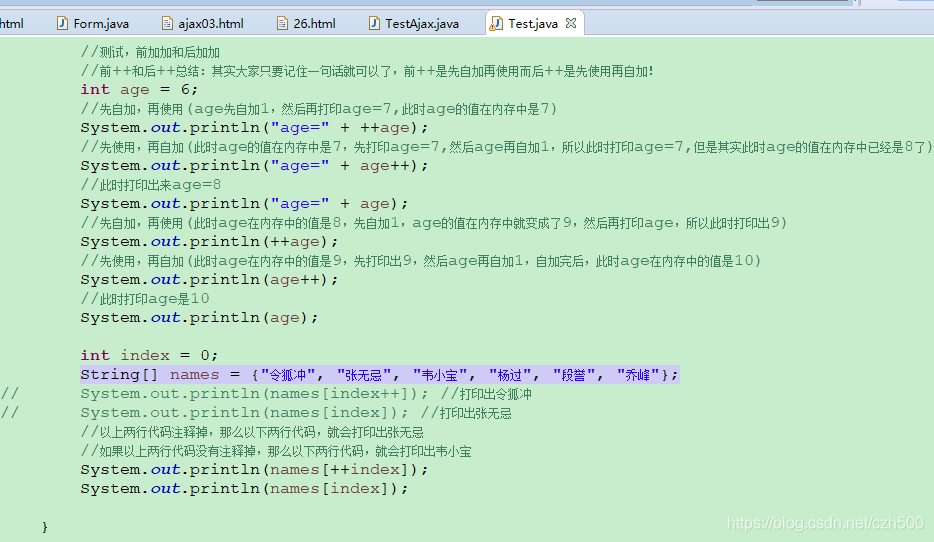
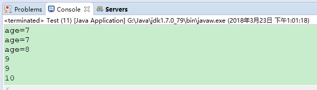
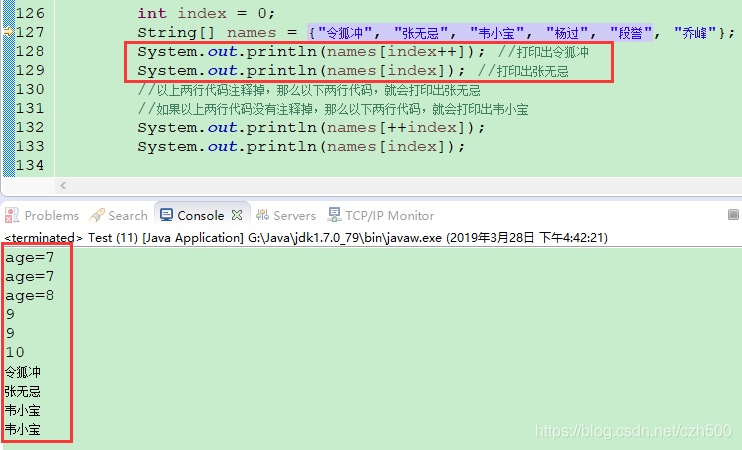
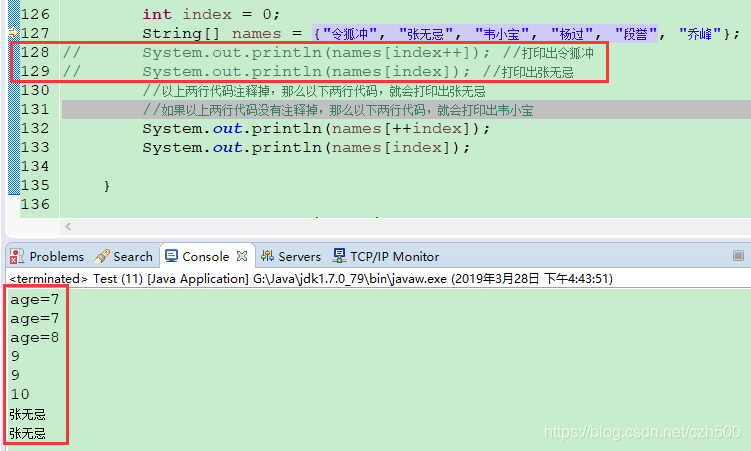

# java中的前++和后++

2018-03-23 13:17:37

java中的前++和后++，有很多人搞的很晕，不太明白！

今天我举几个例子说明下前++和后++的区别！

## 总结：

其实大家只要记住一句话就可以了，**前++是先自加再使用**而**后++是先使用再自加！**

请大家看下面的例子就明白了！ 



```java
public class Test {
	
public static void main(String[] args) {
 
//测试，前加加和后加加
//前++和后++总结：其实大家只要记住一句话就可以了，前++是先自加再使用而后++是先使用再自加！
int age = 6;
//先自加，再使用(age先自加1，然后再打印age=7,此时age的值在内存中是7)
System.out.println("age=" + ++age);
//先使用，再自加(此时age的值在内存中是7，先打印age=7,然后age再自加1，所以此时打印age=7,但是其实此时age的值在内存中已经是8了)
System.out.println("age=" + age++);
//此时打印出来age=8
System.out.println("age=" + age);
//先自加，再使用(此时age在内存中的值是8，先自加1，age的值在内存中就变成了9，然后再打印age，所以此时打印出9)
System.out.println(++age);
//先使用，再自加(此时age在内存中的值是9，先打印出9，然后age再自加1，自加完后，此时age在内存中的值是10)
System.out.println(age++);
//此时打印age是10
System.out.println(age);
                
int index = 0;
String[] names = {"令狐冲", "张无忌", "韦小宝", "杨过", "段誉", "乔峰"};
//System.out.println(names[index++]); //打印出令狐冲
//System.out.println(names[index]);   //打印出张无忌   
//以上两行代码注释掉，那么以下两行代码，就会打印出张无忌
//如果以上两行代码没有注释掉，那么以下两行代码，就会打印出韦小宝
System.out.println(names[++index]);  //打印出张无忌
System.out.println(names[index]);   //打印出张无忌
 }
}
```





