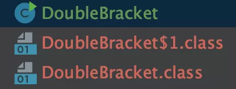
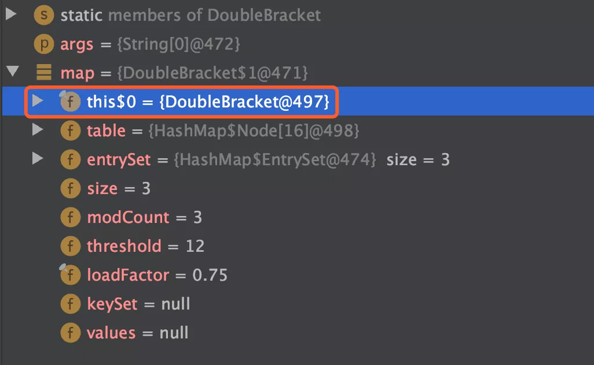

# 永远不要使用双花括号初始化实例，否则就会OOM！

生活中的尴尬无处不在，有时候你只是想简单的装一把，但某些“老同志”总是在不经意之间，给你无情的一脚，踹得你简直无法呼吸。

但谁让咱年轻呢？吃亏要趁早，前路会更好。

喝了这口温热的鸡汤之后，咱们来聊聊是怎么回事。

事情是这样的，在一个不大不小的项目中，小王写下了这段代码：

```java
Map<String, String> map = new HashMap() {{
    put("map1", "value1");
    put("map2", "value2");
    put("map3", "value3");
}};
map.forEach((k, v) -> {
    System.out.println("key:" + k + " value:" + v);
});
```

本来是用它来替代下面这段代码的：

```java
Map<String, String> map = new HashMap();
map.put("map1", "value1");
map.put("map2", "value2");
map.put("map3", "value3");
map.forEach((k, v) -> {
    System.out.println("key:" + k + " value:" + v);
});
```

两块代码的执行结果也是完全一样的：

> key:map3 value:value3
>
> key:map2 value:value2
>
> key:map1 value:value1

所以小王正在得意的把这段代码介绍给部门新来的妹子小甜甜看，却不巧被正在经过的老张也看到了。

老张本来只是想给昨天的枸杞再续上一杯 85° 的热水，但说来也巧，刚好撞到了一次能在小甜甜面前秀技术的一波机会，于是习惯性的整理了一下自己稀疏的秀发，便开启了 diss 模式。


“小王啊，你这个代码问题很大啊！”

“怎么能用双花括号初始化实例呢？”

此时的小王被问的一脸懵逼，内心有无数个草泥马奔腾而过，心想你这头老牛竟然也和我争这颗嫩草，但内心却有一种不祥的预感，感觉自己要输，瞬间羞涩的不知该说啥，只能红着小脸，轻轻的“嗯？”了一声。

老张：“使用双花括号初始化实例是会导致内存溢出的啦！侬不晓得嘛？”

小王沉默了片刻，只是凭借着以往的经验来看，这“老家伙”还是有点东西的，于是敷衍的“哦~”了一声，仿佛自己明白了怎么回事一样，，其实内心仍然迷茫的一匹，为了不让其他同事发现，只得这般作态。

于是片刻的敷衍，待老张离去之后，才悄悄的打开了 Google，默默的搜索了一下。

小王：哦，原来如此......

## 双花括号初始化分析

首先，我们来看使用双花括号初始化的本质是什么？

以我们这段代码为例：

```java
Map<String, String> map = new HashMap() {{
    put("map1", "value1");
    put("map2", "value2");
    put("map3", "value3");
}};
```

这段代码**其实是创建了匿名内部类，然后再进行初始化代码块**。

这一点我们可以使用命令 `javac` 将代码编译成字节码之后发现，我们发现之前的一个类被编译成两个字节码（.class）文件，如下图所示：



我们使用 Idea 打开 `DoubleBracket$1.class` 文件发现：

```java
import java.util.HashMap;

class DoubleBracket$1 extends HashMap {
    DoubleBracket$1(DoubleBracket var1) {
        this.this$0 = var1;
        this.put("map1", "value1");
        this.put("map2", "value2");
    }
}
```

此时我们可以确认，它就是一个匿名内部类。那么问题来了，匿名内部类为什么会导致内存溢出呢？

## 匿名内部类的“锅”

在 Java 语言中非静态内部类会持有外部类的引用，从而导致 GC 无法回收这部分代码的引用，以至于造成内存溢出。

### 思考 1：为什么要持有外部类？

这个就要从匿名内部类的设计说起了，在 Java 语言中，非静态匿名内部类的主要作用有两个。

**1**、当匿名内部类只在外部类（主类）中使用时，匿名内部类可以让外部不知道它的存在，从而减少了代码的维护工作。

**2**、当匿名内部类持有外部类时，它就可以直接使用外部类中的变量了，这样可以很方便的完成调用，如下代码所示：

```java
public class DoubleBracket {
    private static String userName = "磊哥";
    public static void main(String[] args) throws NoSuchFieldException, IllegalAccessException {
        Map<String, String> map = new HashMap() {{
            put("map1", "value1");
            put("map2", "value2");
            put("map3", "value3");
            put(userName, userName);
        }};
    }
}
```

从上述代码可以看出在 `HashMap` 的方法内部，可以直接使用外部类的变量 `userName`。

### 思考 2：它是怎么持有外部类的？

关于匿名内部类是如何持久外部对象的，我们可以通过查看匿名内部类的字节码得知，我们使用 `javap -c DoubleBracket\$1.class` 命令进行查看，其中 `$1` 为以匿名类的字节码，字节码的内容如下；

```java
javap -c DoubleBracket\$1.class
Compiled from "DoubleBracket.java"
class com.example.DoubleBracket$1 extends java.util.HashMap {
  final com.example.DoubleBracket this$0;

  com.example.DoubleBracket$1(com.example.DoubleBracket);
    Code:
       0: aload_0
       1: aload_1
       2: putfield      #1                  // Field this$0:Lcom/example/DoubleBracket;
       5: aload_0
       6: invokespecial #7                  // Method java/util/HashMap."<init>":()V
       9: aload_0
      10: ldc           #13                 // String map1
      12: ldc           #15                 // String value1
      14: invokevirtual #17                 // Method put:(Ljava/lang/Object;Ljava/lang/Object;)Ljava/lang/Object;
      17: pop
      18: aload_0
      19: ldc           #21                 // String map2
      21: ldc           #23                 // String value2
      23: invokevirtual #17                 // Method put:(Ljava/lang/Object;Ljava/lang/Object;)Ljava/lang/Object;
      26: pop
      27: return
}
```

其中，关键代码的在 `putfield` 这一行，此行表示有一个对 `DoubleBracket` 的引用被存入到 `this$0` 中，也就是说这个匿名内部类持有了外部类的引用。

如果您觉得以上字节码不够直观，没关系，我们用下面的实际的代码来证明一下：

```java
import java.lang.reflect.Field;
import java.util.HashMap;
import java.util.Map;

public class DoubleBracket {
    public static void main(String[] args) throws NoSuchFieldException, IllegalAccessException {
        Map map = new DoubleBracket().createMap();
        // 获取一个类的所有字段
        Field field = map.getClass().getDeclaredField("this$0");
        // 设置允许方法私有的 private 修饰的变量
        field.setAccessible(true);
        System.out.println(field.get(map).getClass());
    }
    public Map createMap() {
        // 双花括号初始化
        Map map = new HashMap() {{
            put("map1", "value1");
            put("map2", "value2");
            put("map3", "value3");
        }};
        return map;
    }
}
```

当我们开启调试模式时，可以看出 `map` 中持有了外部对象 `DoubleBracket`，如下图所示：



以上代码的执行结果为：

> class com.example.DoubleBracket

从以上程序输出结果可以看出：**匿名内部类持有了外部类的引用，因此我们才可以使用 `$0` 正常获取到外部类，并输出相关的类信息**。

## 什么情况会导致内存泄漏？

当我们把以下正常的代码：

```java
public void createMap() {
    Map map = new HashMap() {{
        put("map1", "value1");
        put("map2", "value2");
        put("map3", "value3");
    }};
    // 业务处理....
}
```

改为下面这个样子时，可能会造成内存泄漏：

```java
public Map createMap() {
    Map map = new HashMap() {{
        put("map1", "value1");
        put("map2", "value2");
        put("map3", "value3");
    }};
    return map;
}
```

为什么用了「可能」而不是「一定」会造成内存泄漏？

这是因为当此 `map` 被赋值为其他类属性时，可能会导致 GC 收集时不清理此对象，这时候才会导致内存泄漏。可以关注我「Java中文社群」后面会专门写一篇关于此问题的文章。

## 如何保证内存不泄露？

要想保证双花扣号不泄漏，办法也很简单，只需要将 `map` 对象声明为 `static` 静态类型的就可以了，代码如下：

```java
public static Map createMap() {
    Map map = new HashMap() {{
        put("map1", "value1");
        put("map2", "value2");
        put("map3", "value3");
    }};
    return map;
}
```

什么？你不相信！


没关系，我们用事实说话，使用以上代码，我们重新编译一份字节码，查看匿名类的内容如下：

```java
javap -c  DoubleBracket\$1.class
Compiled from "DoubleBracket.java"
class com.example.DoubleBracket$1 extends java.util.HashMap {
  com.example.DoubleBracket$1();
    Code:
       0: aload_0
       1: invokespecial #1                  // Method java/util/HashMap."<init>":()V
       4: aload_0
       5: ldc           #7                  // String map1
       7: ldc           #9                  // String value1
       9: invokevirtual #11                 // Method put:(Ljava/lang/Object;Ljava/lang/Object;)Ljava/lang/Object;
      12: pop
      13: aload_0
      14: ldc           #17                 // String map2
      16: ldc           #19                 // String value2
      18: invokevirtual #11                 // Method put:(Ljava/lang/Object;Ljava/lang/Object;)Ljava/lang/Object;
      21: pop
      22: aload_0
      23: ldc           #21                 // String map3
      25: ldc           #23                 // String value3
      27: invokevirtual #11                 // Method put:(Ljava/lang/Object;Ljava/lang/Object;)Ljava/lang/Object;
      30: pop
      31: return
}
```

从这次的代码我们可以看出，**已经没有 `putfield` 关键字这一行了，也就是说静态匿名类不会持有外部对象的引用了**。

### 为什么静态内部类不会持有外部类的引用？

原因其实很简单，因为匿名内部类是静态的之后，它所引用的对象或属性也必须是静态的了，因此就可以直接从 JVM 的 Method Area（方法区）获取到引用而无需持久外部对象了。

## 双花括号的替代方案

即使声明为静态的变量可以避免内存泄漏，但依旧不建议这样使用，为什么呢？

原因很简单，项目一般都是需要团队协作的，假如那位老兄在不知情的情况下把你的 `static` 给删掉呢？这就相当于设置了一个隐形的“坑”，其他不知道的人，一不小心就跳进去了，所以我们可以尝试一些其他的方案，比如 Java8 中的 Stream API 和 Java9 中的集合工厂等。

### 替代方案 1：Stream

使用 Java8 中的 Stream API 替代，示例如下。原代码：

```java
List<String> list = new ArrayList() {{
    add("Java");
    add("Redis");
}};
```

替代代码：

```java
List<String> list = Stream.of("Java", "Redis").collect(Collectors.toList());
```

### 替代方案 2：集合工厂

使用集合工厂的 `of` 方法替代，示例如下。原代码：

```java
Map map = new HashMap() {{
    put("map1", "value1");
    put("map2", "value2");
}};
```

替代代码：

```java
Map map = Map.of("map1", "Java", "map2", "Redis");
```

显然使用 Java9 中的方案非常适合我们，简单又酷炫，只可惜我们还在用 Java 6...6...6... 心碎了一地。

## 总结

本文我们讲了双花括号初始化因为会持有外部类的引用，从而可以会导致内存泄漏的问题，还从字节码以及反射的层面演示了这个问题。

要想保证双花括号初始化不会出现内存泄漏的办法也很简单，只需要被 `static` 修饰即可，但这样做还是存在潜在的风险，可能会被某人不小心删除掉，于是我们另寻它道，发现了可以使用 Java8 中的 Stream 或 Java9 中的集合工厂 `of` 方法替代“{{”。

#### 最后的话

原创不易，点个「**赞**」再走呗！

**参考 & 鸣谢**

https://www.ripjava.com/article/1291630596325408

https://cloud.tencent.com/developer/article/1179625

https://hacpai.com/article/1498563483898


https://www.cnblogs.com/vipstone/p/12937582.html