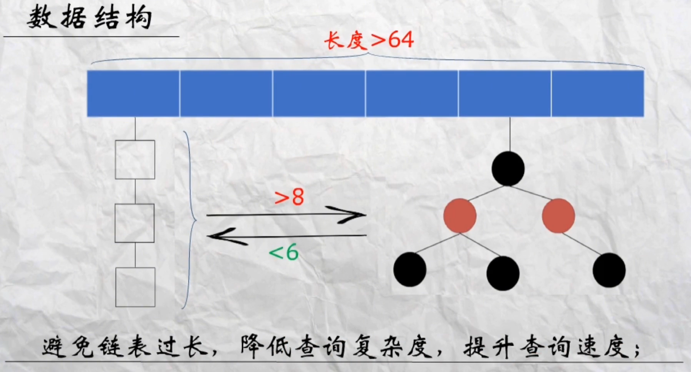
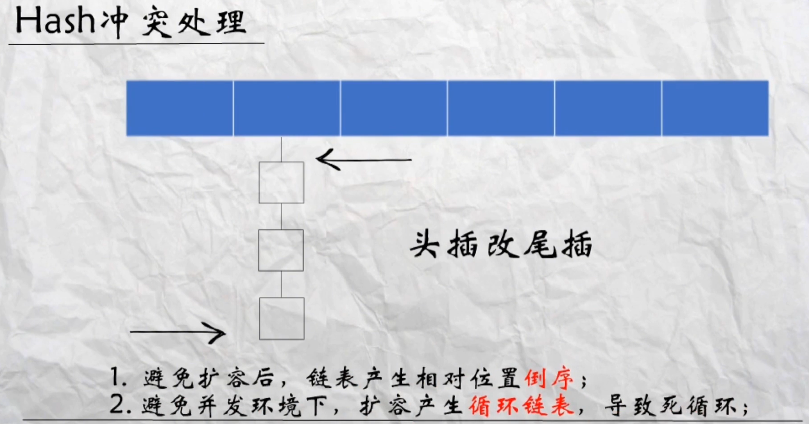

# 面试必问HashMap JDK1.8的优化

## 优化1-数据结构

由原本的数组加链表结构引入了红黑树，当链表长度大于8时，整个数组长度大于64时转化为红黑树，链表长度小于6时会转化会链表。

**好处**：避免链表过长，降低查询复杂度，提升查询速度;

## 优化2-Hash冲突处理

原本hash冲突是插入链表头部，现改成尾部。

好处：

1. 避免扩容后，链表产生相对位置**倒序**﹔
2. 避免并发环境下，扩容产生**循环链表**，导致死循环;

## 优化3-扩容寻址

扩容寻址算法优化，扩容后变成高位增加1，哈希值高位只有0或1，

所以可以得出结论：2倍扩容后，元素的位置要么是在原位置，要么是在原位置再加上原长度得到的位置;

HashMap扩容时直接判断
高位值:如果为0，则原位置保持不变，
如果为1，则原位置加上原数组长度

好处：

1. 省去了**重新计算**hash值的时间;
2. 新增参与运算位是0或1，具有**随机性**，让冲突元素分散到新桶;

https://www.ixigua.com/6851339016227258880