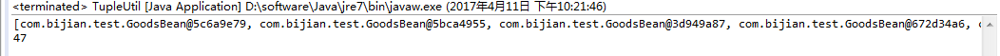
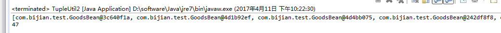

# java元组Tuple使用实例

## **一.为什么使用元组tuple？**

​    元组和列表list一样，都可能用于数据存储，包含多个数据；但是和列表不同的是：列表只能存储相同的数据类型，而元组不一样，它可以存储不同的数据类型，比如同时存储int、string、list等，并且可以根据需求无限扩展。
​    比如说在web应用中，经常会遇到一个问题就是数据分页问题，查询分页需要包含几点信息：当前页数、页大小；查询结果返回数据为：当前页的数据记录，但是如果需要在前台显示当前页、页大小、总页数等信息的时候，就必须有另外一个信息就是：数据记录总数，然后根据上面的信息进行计算得到总页数等信息。这个时候查询某一页信息的时候需要返回两个数据类型，一个是list（当前也的数据记录），一个是int（记录总数）。当然，完全可以在两个方法、两次数据库连接中得到这两个值。事实上在查询list的时候，已经通过sql查询得到总计录数，如果再开一个方法，再做一次数据库连接来查询总计录数，不免有点多此一举、浪费时间、浪费代码、浪费生命。言重了~在这种情况下，我们就可以利用二元组，在一次数据库连接中，得到总计录数、当前页记录，并存储到其中，简单明了！

## **二.源码实例**

### 1.二元组

```java
package com.bijian.test;

/**
 * 两个元素的元组，用于在一个方法里返回两种类型的值
 */
public class TwoTuple<A, B> {
    public final A first;
    public final B second;
     
    public TwoTuple(A a, B b) {
        this.first = a;
        this.second = b;
    }
}
```

### 2.扩展为三元组（按此可以任意扩展）

```
package com.bijian.test;

/**
 * 三个元素的元组，用于在一个方法里返回三种类型的值
 */
public class ThreeTuple<A, B, C> extends TwoTuple<A, B> {
    public final C third;
     
    public ThreeTuple(A a, B b, C c) {
        super(a, b);
        this.third = c;
    }
}
```

### 3.实体DTO

```
package com.bijian.test;

public class GoodsBean {

    private int goodsId;

    public int getGoodsId() {
        return goodsId;
    }

    public void setGoodsId(int goodsId) {
        this.goodsId = goodsId;
    }
}
```

### 4.元组操作工具类、测试类（可按需自定义）

```java
package com.bijian.test;

import java.util.ArrayList;
import java.util.List;
 
/**
 * 元组辅助类，用于多种类型值的返回，如在分页的时候，后台存储过程既返回了查询得到的
 * 当页的数据（List类型），又得到了数据表中总共的数据总数（Integer类型），然后将这
 * 两个参数封装到该类中返回到action中使用
 * 使用泛型方法实现，利用参数类型推断，编译器可以找出具体的类型
 */
public class TupleUtil {
     
    public static <A, B> TwoTuple<A, B> tuple(A a, B b) {
        return new TwoTuple<A, B>(a, b);
    }
     
    public static <A, B, C> ThreeTuple<A, B, C> tuple(A a, B b, C c) {
        return new ThreeTuple<A, B, C>(a, b, c);
    }
 
    // 测试
    public static void main(String[] args) {
        List<GoodsBean> goodsBeans = new ArrayList<GoodsBean>();
        for(int i = 1; i < 26; i++) {
            GoodsBean goodsBean = new GoodsBean();
            goodsBean.setGoodsId(i);
            goodsBeans.add(goodsBean);
        }
        Integer totalProperty = 47;
//      TupleUtil<List<GoodsBean>, Integer> tupleUtil = new TupleUtil<List<GoodsBean>, Integer>(goodsBeans, totalProperty);
        TwoTuple<List<GoodsBean>, Integer> twoTuple = TupleUtil.tuple(goodsBeans, totalProperty);
        List<GoodsBean> list = twoTuple.first;
        System.out.println(list);
        System.out.println(twoTuple.second);
    }
}
```

​    运行结果：



 

## **三.org.apache.commons.lang3.tuple**

​    用于处理一对键值的对象pair类似于Map.entry，commons lang3增加了可以处理3个值的Triple基类，此包下定义了Pair<L,R>抽象基类，及MutablePair,MutableTriple,ImmutablePair,ImmutableTriple子类。
​    一个线程非安全，另一个线程安全
接口：
1.Pair：封装一对键值对。
​    实现类：可变：MutablePair<L,R>，不可变：ImmutablePair
2.Triple：封装3个值的类
​    实现类：ImmutableTriple; MuttableTriple<L,M,R>

如上实例修改如下：

```java
package com.bijian.test;

import java.util.ArrayList;
import java.util.List;

import org.apache.commons.lang3.tuple.Pair;

public class TupleUtil2 {

    // 测试
    public static void main(String[] args) {
        List<GoodsBean> goodsBeans = new ArrayList<GoodsBean>();
        for(int i = 1; i < 26; i++) {
            GoodsBean goodsBean = new GoodsBean();
            goodsBean.setGoodsId(i);
            goodsBeans.add(goodsBean);
        }
        Integer totalProperty = 47;
        
        Pair<List<GoodsBean>, Integer> twoTuple = Pair.of(goodsBeans, totalProperty);
        List<GoodsBean> list = twoTuple.getLeft();
        System.out.println(list);
        System.out.println(twoTuple.getRight());
    }
}
```


​    运行结果：



 

**PS：org.apache.commons.lang3.tuple.Pair的compareTo方法**

​    org.apache.commons.lang3.tuple.Pair的compareTo方法的入参不能为空，实例如下。


```java
package com.bijian.test;

import org.apache.commons.lang3.tuple.Pair;

public class PairTest {
    
    private Pair<Long, Long> pair = Pair.of(100l, 60l);
    
    public static void main(String[] args) {
        PairTest pairTest = new PairTest();
        pairTest.test1();
        pairTest.test2();
    }
     
    public void test1() {
        System.out.println("pair" + pair);  //pair(100,60)
        Pair<Long, Long> newPair = Pair.of(3000l, 30l);
        System.out.println("newPair" + newPair);  //newPair(3000,30)
        System.out.println(newPair != pair);  //true
        System.out.println(pair.compareTo(newPair));  //-1
    }
    
    public void test2() {
        System.out.println("pair" + pair);  //pair(100,60)
        Pair<Long, Long> newPair = null;
        System.out.println("newPair" + newPair);  //newPairnull
        System.out.println(newPair != pair); //true
        System.out.println(pair.compareTo(newPair));  //Exception in thread "main" java.lang.NullPointerException
    }
}
```


https://www.cnblogs.com/flyingeagle/articles/6696780.html

 