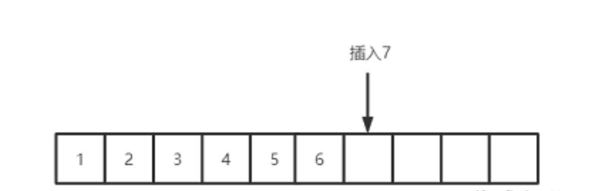
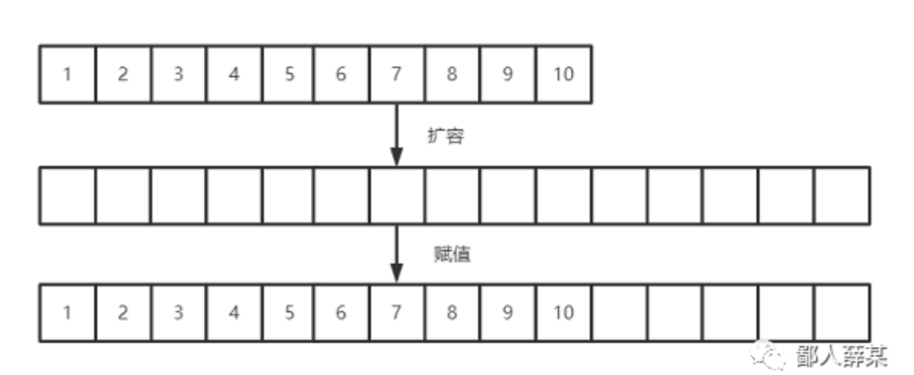
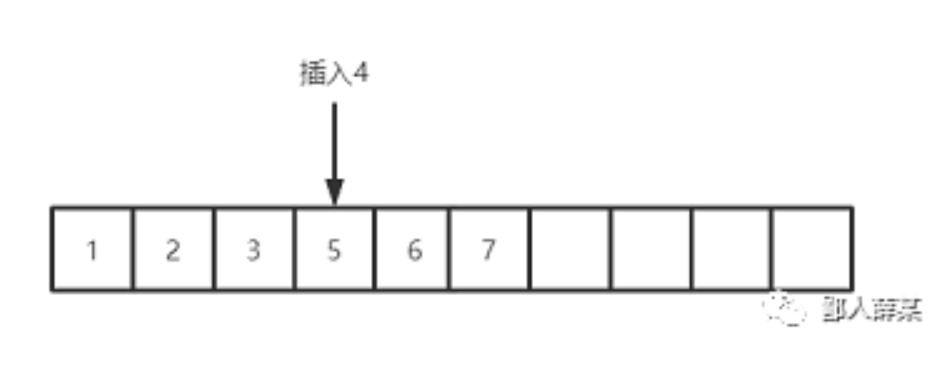
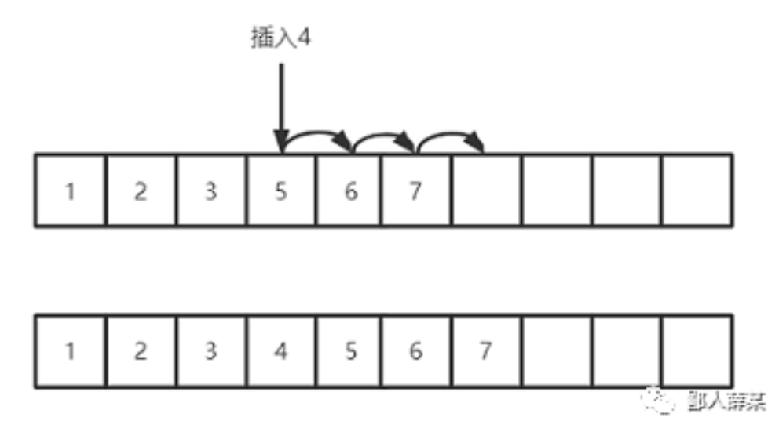
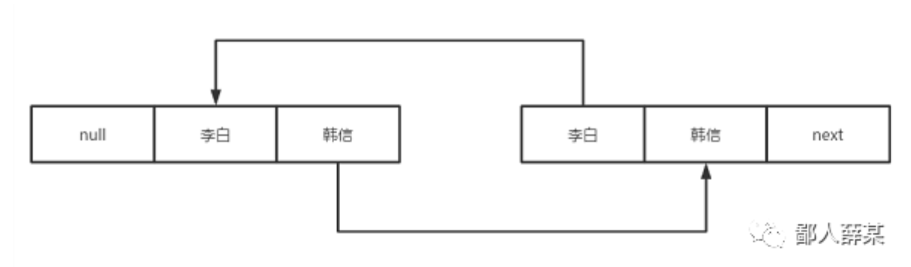
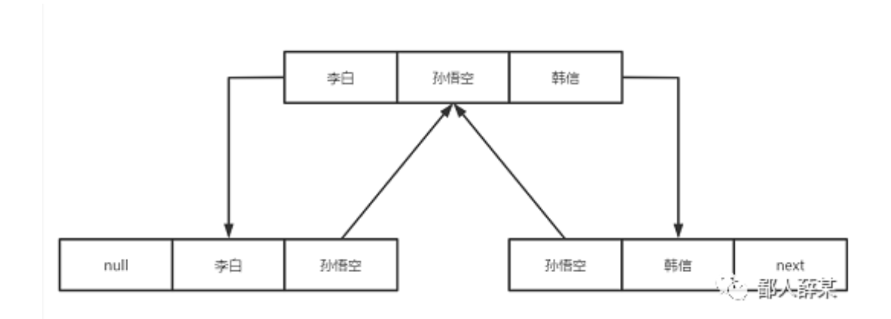

# 当面试官问我ArrayList和LinkedList哪个更占空间时，我这么答让他眼前一亮

## **前言**

今天介绍一下Java的两个集合类，ArrayList和LinkedList，这两个集合的知识点几乎可以说面试必问的。

对于这两个集合类，相信大家都不陌生，ArrayList可以说是日常开发中用的最多的工具类了，也是面试中几乎必问的，LinkedList可能用的少点，但大多数的面试也会有所涉及，尤其是关于这两者的比较可以说是家常便饭，所以，无论从使用上还是在面试的准备上，对于这两个类的知识点我们都要有足够的了解。

## **ArrayList**

ArrayList是List接口的一个实现类，底层是基于数组实现的存储结构，可以用于装载数据，数据都是存放到一个数组变量中

```
transient Object[] elementData;
```

transient是一个关键字，它的作用可以总结为一句话：将不需要序列化的属性前添加关键字transient，序列化对象的时候，这个属性就不会被序列化。你可能会觉得奇怪，ArrayList可以被序列化的啊，源码可是实现了java.io.Serializable接口啊，为什么数组变量还要用transient定义呢？

别急，关于这个问题，我们后面会讨论到，不卖个关子，你们怎么会看到最后，然后给我点在看呢？

当我们新建一个实例时，ArrayList会默认帮我们初始化数组的大小为10

```
/**
 * Default initial capacity.
 */
private static final int DEFAULT_CAPACITY = 10;
```

但请注意，这个只是数组的容量大小，并不是List真正的大小，List的大小应该由存储数据的数量决定，在源码中，获取真实的容量其实是用一个变量size来表示，

```
private int size;
```

在源码中，数据默认是从数组的第一个索引开始存储的，当我们添加数据时，ArrayList会把数据填充到上一个索引的后面去，所以，ArrayList的数据都是有序排列的。而且，由于ArrayList本身是基于数组存储，所以查询的时候只需要根据索引下标就可以找到对于的元素，查询性能非常的高，这也是我们非常青睐ArrayList的最重要的原因。



但是，数组的容量是确定的啊，如果要存储的数据大小超过了数组大小，那不就有数组越界的问题？

关于这点，我们不用担心，ArrayList帮我们做了动态扩容的处理，如果发现新增数据后，List的大小已经超过数组的容量的话，就会新增一个为原来1.5倍容量的新数组，然后把原数组的数据原封不动的复制到新数组中，再把新数组赋值给原来的数组对象就完成了。



扩容之后，数组的容量足够了，就可以正常新增数据了。

除此之外，ArrayList提供支持指定index新增的方法，就是可以把数据插入到设定的索引下标，比如说我想把元素4插入到3后面的位置，也就是现在5所在的地方，



插入数据的时候，ArrayList的操作是先把3后面的数组全部复制一遍，然后将这部分数据往后移动一位，其实就是逐个赋值给后移一位的索引位置，然后3后面就可以空出一个位置，把4放入就完成了插入数据的操作了



删除的时候也是一样，指定index，然后把后面的数据拷贝一份，并且向前移动，这样原来index位置的数据就删除了。

到这里我们也不难发现，这种基于数组的查询虽然高效，但增删数据的时候却很耗性能，因为每增删一个元素就要移动对应index后面的所有元素，数据量少点还无所谓，但如果存储上千上万的数据就很吃力了，所以，如果是频繁增删的情况，不建议用ArrayList。

既然ArrayList不建议用的话，这种情况下有没有其他的集合可用呢？

当然有啊，像我这样的暖男肯定是第一时间告诉你们的，这就是我们下面要说的LinkedList。

## LinkedList

LinkedList 是基于双向链表实现的，不需要指定初始容量，链表中任何一个存储单元都可以通过向前或者向后的指针获取到前面或者后面的存储单元。在 LinkedList 的源码中，其存储单元用一个Node类表示：

```java
private static class Node<E> {
    E item;
    Node<E> next;  
    Node<E> prev;

    Node(Node<E> prev, E element, Node<E> next) {
        this.item = element;
        this.next = next;
        this.prev = prev;
    }
}
```

Node中包含了三个成员，分别是存储数据的item，指向前一个存储单元的点 prev 和指向后一个存储单元的节点 next ，通过这两个节点就可以关联前后的节点，组装成为链表的结构，



因为有保存前后节点的地址，LinkedList增删数据的时候不需要像ArrayList那样移动整片的数据，只需要通过引用指定index位置前后的两个节点即可，比如我们要在李白和韩信之间插入孙悟空的节点，只需要像这样处理下节点之间的指向地址：



删除数据也是同样原理，只需要改变index位置前后两个节点的指向地址即可。

这样的链表结构使得LinkedList能非常高效的增删数据，在频繁增删的情景下能很好的使用，但不足之处也是有的。

虽然增删数据很快，但查询就不怎么样了，LinkedList是基于双向链表存储的，当查询对应index位置的数据时，会先计算链表总长度一半的值，判读index是在这个值的左边还是右边，然后决定从头结点还是从尾结点开始遍历，

```java
Node<E> node(int index) {
        // assert isElementIndex(index);

        if (index < (size >> 1)) {
            Node<E> x = first;
            for (int i = 0; i < index; i++)
                x = x.next;
            return x;
        } else {
            Node<E> x = last;
            for (int i = size - 1; i > index; i--)
                x = x.prev;
            return x;
        }
    }
```

虽然已经二分法来做优化，但依然会有遍历一半链表长度的情况，如果是数据量非常多的话，这样的查询无疑是非常慢的。

这也是LinkedList最无奈的地方，鱼和熊掌不可兼得，我们既想查的快，又想增删快，这样的好事怎么可能都让我们遇到呢？所以，一般建议LinkedList使用于增删多，查询少的情景。

除此之外，LinkedList对内存的占用也是比较大的，毕竟每个Node都维护着前后指向地址的节点，数据量大的话会占用不少内存空间。

## 两者哪个更占空间？

讲到这，你是不是对标题的那个问题成竹在胸了？

下次有面试官问你，ArrayList和LinkedList哪个更占空间时，你就可以信誓旦旦的说，LinkedList更占空间，我看了薛大佬的文章，肯定不会错。说完你就可以安心坐着，等待面试官露出满意的笑容，告诉你通过面试的消息，成功拿下offer指日可待。

如果你真的这么答的话，我也相信面试官一定会被你的回答所征服，他听完一定会点点头，嘴角开始上扬，然后笑容满面的告诉你，

感谢你今天过来面试，你可以回去等通知了。。。。

哈哈，开个玩笑，不凑多点字可不是我的风格。

言归正传，表面上看，LinkedList的Node存储结构似乎更占空间，但别忘了前面介绍ArrayList扩容的时候，它会默认把数组的容量扩大到原来的1.5倍的，如果你只添加一个元素的话，那么会有将近原来一半大小的数组空间被浪费了，如果原先数组很大的话，那么这部分空间的浪费也是不少的，

所以，如果数据量很大又在实时添加数据的情况下，ArrayList占用的空间不一定会比LinkedList空间小，这样的回答就显得谨慎些了，听上去也更加让人容易认同，但你以为这样回答就完美了吗？非也

还记得我前面说的那个transient变量吗？它的作用已经说了，不想序列化的对象就可以用它来修饰，用transient修饰elementData意味着我不希望elementData数组被序列化。为什么要这么做呢？

这是因为序列化ArrayList的时候，ArrayList里面的elementData，也就是数组未必是满的，比方说elementData有10的大小，但是我只用了其中的3个，那么是否有必要序列化整个elementData呢？显然没有这个必要，因此ArrayList中重写了writeObject方法：

```java
private void writeObject(java.io.ObjectOutputStream s)
    throws java.io.IOException{
    // Write out element count, and any hidden stuff
    int expectedModCount = modCount;
    s.defaultWriteObject();

    // Write out size as capacity for behavioural compatibility with clone()
    s.writeInt(size);

    // Write out all elements in the proper order.
    for (int i=0; i<size; i++) {
        s.writeObject(elementData[i]);
    }

    if (modCount != expectedModCount) {
        throw new ConcurrentModificationException();
    }
}
```

每次序列化的时候调用这个方法，先调用defaultWriteObject()方法序列化ArrayList中的非transient元素，elementData这个数组对象不去序列化它，而是遍历elementData，只序列化数组里面有数据的元素，这样一来，就可以加快序列化的速度，还能够减少空间的开销。

加上这个知识点后，我们对上面那个问题就可以有更加全面的回答了，如果你下次也遇到这个问题的话，你可以参考一下我的说法：

**一般情况下，LinkedList的占用空间更大，因为每个节点要维护指向前后地址的两个节点，但也不是绝对，如果刚好数据量超过ArrayList默认的临时值时，ArrayList占用的空间也是不小的，因为扩容的原因会浪费将近原来数组一半的容量，不过，因为ArrayList的数组变量是用transient关键字修饰的，如果集合本身需要做序列化操作的话，ArrayList这部分多余的空间不会被序列化。**

怎么样，这样的回答是不是更加的说服力，不仅更加全面，还可能会给面试官留下好印象，让他觉得你是个有自己思考的求职者，说不定当场就让你面试通过了呢。就冲这点，你们是不是应该给我来个在看之类的，哈哈。

https://mp.weixin.qq.com/s/95m3eKct2aH8UZwprMO5tg