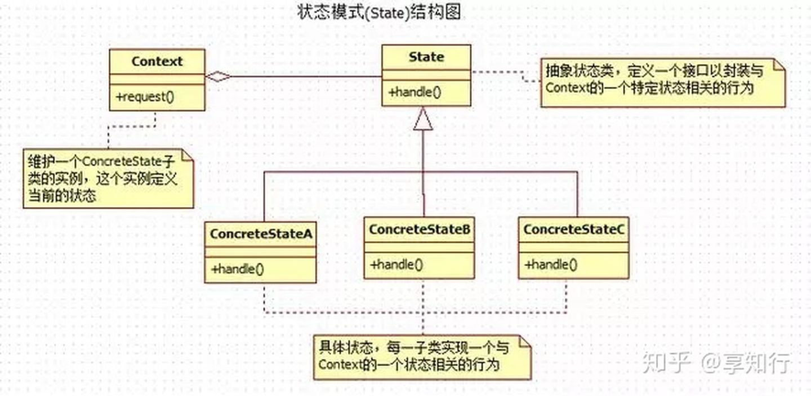
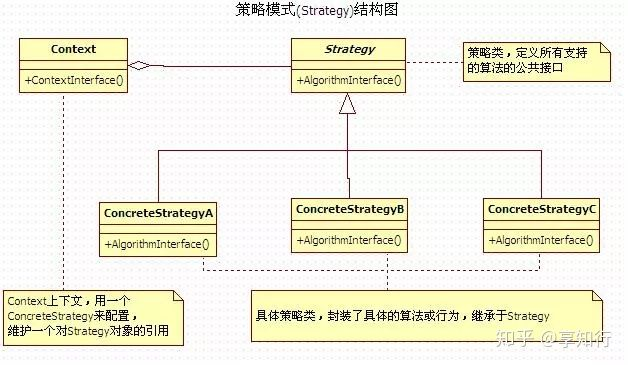
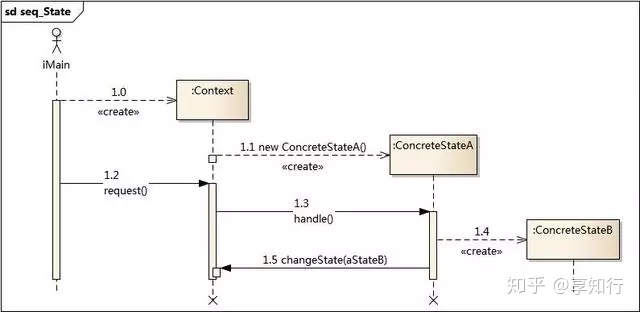
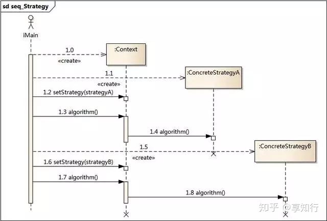
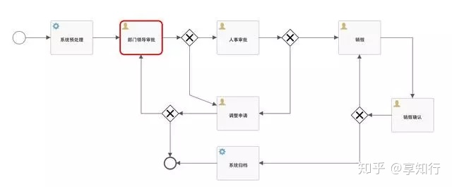

# 设计模式之状态模式-补充

## **状态模式**

状态模式（State Pattern）中，类的行为是基于它的状态改变的，状态之间的切换，在状态A执行完毕后自己控制状态指向状态B，状态模式是不停的切换状态执行,这种类型的设计模式属于行为型模式。

## **状态模式解决的问题**

解决内在状态的改变而引起行为改变的问题，它的出发点是事物的状态，封装状态而暴露行为，一个对象的状态改变，从外界来看就好像是行为改变。

## **态模式角色**

State: 抽象状态类，定义一个接口以封装与context的一个状态相关的行为

ConcreteState: 具体状态，每一子类实现一个与Context的一个状态相关的行为

Context: 状态上下文，维护一个ConcreteState子类的实例，这个实例定义当前的状态。

## **状态模式抽象类方法类型**

上下文抽象方法：request，上下文处理请求。

状态抽象方法：handle，状态行为方法，不同的状态，行为不同。



## **状态模式和策略模式的区别**






状态是系统自身的固有的，调用者不能控制系统的状态转移。比如，一个请假单有“部长审批”-“经理审批”-“审批通过”-“审批不通过”等状态，请假者没有办法将一个部长都还没审批完的请假单提交给经理，这个状态转换只能系统自己完成。



策略是外界给的，策略怎么变，是调用者考虑的事情，系统只是根据所给的策略做事情。

### **环境角色的职责不同**

两者都有一个叫做Context环境角色的类，但是两者的区别很大，策略模式的环境角色只是一个委托作用，负责算法的替换；而状态模式的环境角色不仅仅是委托行为，它还具有登记状态变化的功能，与具体的状态类协作，共同完成状态切换行为随之切换的任务。

### **解决问题的重点不同**

策略模式旨在解决内部算法如何改变的问题，也就是将内部算法的改变对外界的影响降低到最小，它保证的是算法可以自由地切换；而状态模式旨在解决内在状态的改变而引起行为改变的问题，它的出发点是事物的状态，封装状态而暴露行为，一个对象的状态改变，从外界来看就好像是行为改变。

### **解决问题的方法不同**

策略模式只是确保算法可以自由切换，但是什么时候用什么算法它决定不了；而状态模式对外暴露的是行为，状态的变化一般是由环境角色和具体状态共同完成的，也就是说状态模式封装了状态的变化而暴露了不同的行为或行为结果。

### **复杂度不同**

通常策略模式比较简单，这里的简单指的是结构简单，扩展比较容易，而且代码也容易阅读。状态模式则通常比较复杂，因为它要从两个角色看到一个对象状态和行为的改变，也就是说它封装的是变化，要知道变化是无穷尽的，因此相对来说状态模式通常都比较复杂，涉及面很多，虽然也很容易扩展，但是一般不会进行大规模的扩张和修正

## **代码实现**

销售员工报销，需要主管、经理、总监审批，审批通过之后财务打款。

```java
/**
 * 抽象状态类
 */
public abstract class State {
    protected Context context;
    public Context getContext() {
        return context;
    }
    public void setContext(Context context) {
        this.context = context;
    }
    public abstract void handle();
}
```


```java
/**
 * 状态上下文
 */
public class Context {
    private State state;
    public Context() {
    }
    public State getState() {
        return state;
    }
    public void setState(State state) {
        this.state = state;
        this.state.setContext(this);
    }
    public void request(){
        this.state.handle();
    }
}
```


```java
/**
 * 主管审批状态
 */
public class SupervisorState extends State{
    public void handle() {
        System.out.println("主管审批通过，下一个经理审批");
        context.setState(new ManagerState());
    }
}
```


```java
/**
 * 经理审批状态
 */
public class ManagerState extends State{
    public void handle() {
        System.out.println("经理审批通过，下一个总监审批");
        context.setState(new DirectorState());
    }
}
```


```java
/**
 * 总监审批状态
 */
public class DirectorState extends State{
    public void handle() {
        System.out.println("总监审批通过，我是最后一个审批者");
        //审核通过之后的逻辑
        System.out.println("财务打款500元");
    }
}
```


```java
/**
 * 状态模式测试类
 */
public class StateModeTest {
    public static void main(String[] args) {
        Context context = new Context();
        context.setState(new SupervisorState());
        context.request();
        context.request();
        context.request();
    }
}
```

**运行结果：**


以上代码只是为了简单的展示状态模式，如果审批工作流是一个复杂的过程，有专门的工作流框架，这里推荐activiti。BPMN：业务流程建模与标注，包括这些图元如何组合成一个业务流程图，让业务工作流更灵活，用户可以根据自己的业务场景，定义自己特有的流程图。



## **优缺点**

优点：封装了转换规则。枚举可能的状态，在枚举状态之前需要确定状态种类。允许状态转换逻辑与状态对象合成一体，而不是某一个巨大的条件语句块。

缺点：状态模式的使用必然会增加系统类和对象的个数。状态模式对"开闭原则"的支持并不太好，对于可以切换状态的状态模式，增加新的状态类需要修改那些负责状态转换的代码。

## **生活中的状态模式**

审批工作流，报销审批，销售发起审批，如果金额小于200，只需要主管审批，如果金额在200-500之间需要经理审批，金额大于500小于2000，需要总监审批，大于2000需要老板审批。每一个审批人审批都对应着状态的变化。

订单状态的变化，下单、待支付、支付、发货、待收货、收货、取消、待退款、已退款等等，每一个订单背后承载着很多不同的状态。每一个状态，都有不一样的业务逻辑。

## **我的启发**

状态模式，策略模式的孪生兄弟，两者之间极其相似，但是如果我们用心去观察体会，一定能找出它们之间的不同。


[java设计模式之状态模式 - 知乎 (zhihu.com)](https://zhuanlan.zhihu.com/p/64585296)