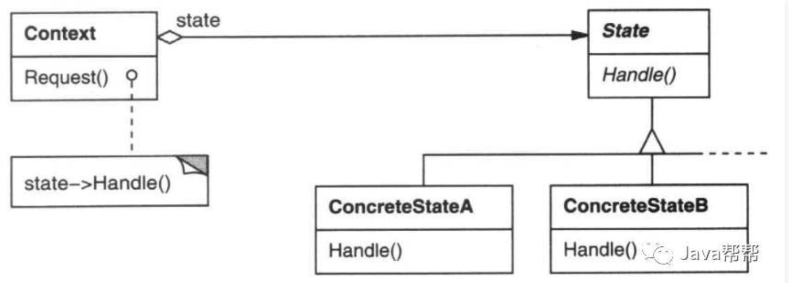
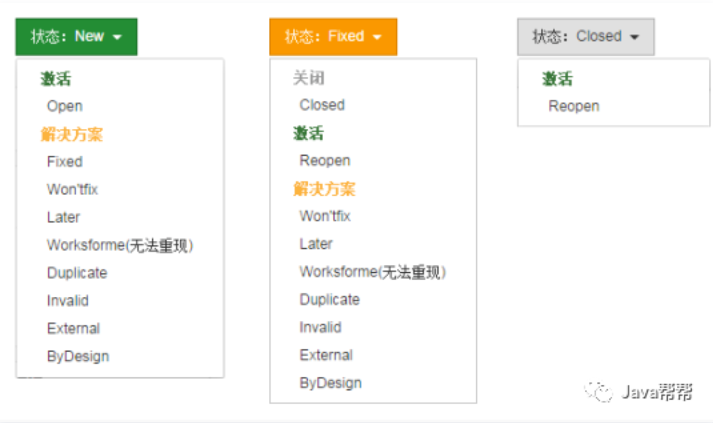
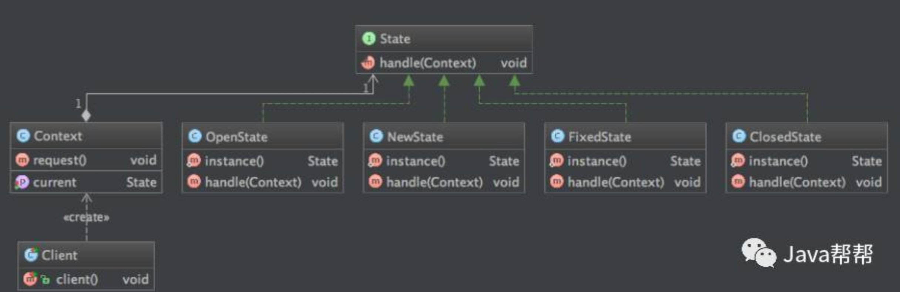

# Java设计模式-状态模式

2018-03-16

## 概述

状态模式: 允许一个对象在其内部状态改变时改变其行为, 其对象看起来像是改变了其类. 



(图片来源: 设计模式:可复用面向对象软件的基础) 

## 目的

其目的是: 解决系统中复杂对象的状态流转以及不同状态下的行为封装问题.

## 模式实现

### 案例背景

案例: 问题跟踪(Bug状态流转): 

有过Kelude、Jira使用经验的同学都知道一个Bug由测试同学提出, 一直到被开发同学解决会经过一系列状态的流转: 

新建(New) -> 打开(Open) -> 解决(Fixed) -> 关闭(Closed) … 



且每种状态都会对应复杂业务的处理逻辑(如通知相应开发/测试人员、邮件/[短信](https://cloud.tencent.com/product/sms?from=10680)提醒、报表记录等等), 下面我们就以这个场景来讨论状态模式的实现:

状态模式-Bug流转: 



### 代码

#### State

抽象状态: 定义一个接口封装与 Context的一个特定状态 相关的行为:

```js
/**
 * @author jifang
 * @since 16/8/28 下午6:06.
 */
public interface State {
    void handle(Context context);
}
```

#### ConcreteState

具体状态: 每一个子类实现一个与 Context的某一个特定状态相关的具体行为 :

```js
class NewState implements State {
    static final NewState instance = new NewState();
    // 单例 or 享元
    public static State instance() {
        return instance;
    }
    @Override
    public void handle(Context context) {
        if (context.getCurrent() == this) {
            // 本状态下的核心业务处理
            System.out.println("测试: 发现了Bug, 开发同学赶紧处理");
            // 状态流转
            context.setCurrent(OpenState.instance());
        }
    }
}
class OpenState implements State {
    static final OpenState instance = new OpenState();
    public static State instance() {
        return instance;
    }
    @Override
    public void handle(Context context) {
        if (context.getCurrent() == this) {
            System.out.println("开发: Bug已经看到, 正在处理");
            context.setCurrent(FixedState.instance());
        }
    }
}
class FixedState implements State {
    static final FixedState instance = new FixedState();
    public static State instance() {
        return instance;
    }
    @Override
    public void handle(Context context) {
        if (context.getCurrent() == this) {
            System.out.println("开发: Bug已经修复, 测试同学看一下");
            context.setCurrent(ClosedState.instance());
        }
    }
}
class ClosedState implements State {
    static final ClosedState instance = new ClosedState();
    public static State instance() {
        return instance;
    }
    @Override
    public void handle(Context context) {
        if (context.getCurrent() == this) {
            System.out.println("测试: Bug验证通过, 已关闭");
            context.setCurrent(null);
        }
    }
}
```

#### Context

定义客户感兴趣的接口

维护一个ConcreteState子类实例 -当前状态.

```js
public class Context {
    private State current;
    public Context(State current) {
        this.current = current;
    }
    public State getCurrent() {
        return current;
    }
    public void setCurrent(State current) {
        this.current = current;
    }
    public void request() {
        if (current != null) {
            current.handle(this);
        }
    }
}
```

#### Client

```js
public class Client {
    @Test
    public void client() {
        Context context = new Context(NewState.instance());
        context.request();
        context.request();
        context.request();
        context.request();
        context.request();
    }
}
```

#### 状态推动

前面介绍的状态流转需要由Client推动(Client调用Context的request()), 还有其他几种推动方式. 如State自动流转: 每个State处理结束, 自动进入下一状态的处理环节(在State内部调用Context的request()):

```js
class NewState implements State {
    @Override
    public void handle(Context context) {
        if (context.getCurrent() == this) {
            System.out.println("测试: 发现了Bug, 开发同学赶紧处理");
            context.setCurrent(new OpenState());
        }
        context.request();
    }
}
```

另外还有一种基于表驱动的状态机实现, 实现细节参考 设计模式:可复用面向对象软件的基础 P204.

## 小结

将与特定状态相关的行为局部化, 并将不同状态的行为分隔开: 

将特定的状态相关的行为都放入一个对象中: 由于所有与状态相关的代码都存在于某ConcreteState中, 所以通过定义新的子类可以很容易地增加新的状态和转换.

可以将状态转移逻辑分布到State之间, 将每一个状态转换和动作封装到一个类中, 就把着眼点从执行状态提高到整个对象的状态, 这将使代码结构化并使意图更加清晰,消除庞大的条件分支语句.

状态转换显式化: 

当一个对象仅以内部数据值来定义当前状态时, 其状态仅表现为一些变量的赋值, 这不够明确. 为不同的状态引入独立的对象使得转换变得更加明确(类原子化).

场景: 

当一个对象的行为取决于它的状态, 并且它必须在运行时刻根据状态改变它的行为;

一个操作中含有庞大的条件分支语句, 且这些分支依赖于该对象的状态, 这个状态通常用一个/多个枚举常量表示: 

OA系统请求状态流转

银行系统资金状态流转

线程对象状态切换

TCP连接状态流转 

State模式将每一个条件分支放入一个独立的类中. 这使得可以根据对象自身的情况将对象的状态作为一个对象, 这一对象可以不依赖于其他对象而独立变化.


[Java设计模式-状态模式 - 云+社区 - 腾讯云 (tencent.com)](https://cloud.tencent.com/developer/article/1064323)