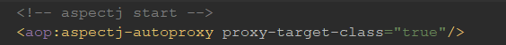

# springMVC中controller中方法使用private和public问题-cglib代理类Callback中private方法属性null


2019-09-25 16:24:51

今天遇到一个问题，使用springMVC时 一不小心提供了一个private的方法，之前访问都没问题，今天给项目加监控（Metric）,由于监控采用切面监控所有带有注解 @RequestMapping的方法，再访问私有方法时所有注入的bean全都是null导致空指针异常，那么为什么会造成这种现象出现呢？这就要说到spring的代理模式了，代理模式的基本原理这里就不细细阐述了，针对问题查阅了资料和源码，原来都是spring 使用cglib代理造成的，那么接下来就简单分析一下原因。

首先查看工程中AOP配置：



得知是采用的cglib的代理方式，然后查看源码中（AbstractAutoProxyCreator.class）

```java
protected Object createProxy(Class<?> beanClass, @Nullable String beanName, Object[] specificInterceptors, TargetSource targetSource) {
    // ....
	ProxyFactory proxyFactory = new ProxyFactory();
    //复制当前类的一些属性
	proxyFactory.copyFrom(this);
    // 如果在配置文件中配置的aop标签的属性proxy-target-class为false，
	if (!proxyFactory.isProxyTargetClass()) {
        // 是否需要代理当前类而不是代理接口，根据preserveTargetClass属性来判断Boolean.TRUE.equals(bd.getAttribute("preserveTargetClass")
		if (shouldProxyTargetClass(beanClass, beanName)) {
			proxyFactory.setProxyTargetClass(true);
		}
		else {
            // 如果代理的是接口，则添加代理接口
			evaluateProxyInterfaces(beanClass, proxyFactory);
		}
	}
    // 对增强器进行包装，有些增强是通过拦截器等方式来实现的，所以这里统一封装为 Advisor 进行处理
	Advisor[] advisors = buildAdvisors(beanName, specificInterceptors);
    // 加入增强器
	proxyFactory.addAdvisors(advisors);
    // 设置要代理的类
	proxyFactory.setTargetSource(targetSource);
    // 用户自定义代理
	customizeProxyFactory(proxyFactory);
    // 该属性用来控制代理工厂被配置以后，是否还允许修改通知，默认为false
	proxyFactory.setFrozen(this.freezeProxy);
	if (advisorsPreFiltered()) {
		proxyFactory.setPreFiltered(true);
	}
    // 创建代理
	return proxyFactory.getProxy(getProxyClassLoader());
}
 
// 添加接口代理
protected void evaluateProxyInterfaces(Class<?> beanClass, ProxyFactory proxyFactory) {
	Class<?>[] targetInterfaces = ClassUtils.getAllInterfacesForClass(beanClass, getProxyClassLoader());
	boolean hasReasonableProxyInterface = false;
	//....
	if (hasReasonableProxyInterface) {
		for (Class<?> ifc : targetInterfaces) {
			proxyFactory.addInterface(ifc);
		}
	}
	else {
		proxyFactory.setProxyTargetClass(true);
	}
}
```

proxyFactory.getProxy(getProxyClassLoader());

通过这行代码我们可以看到有两个实现类分别是：JdkDynamicAopProxy 和 CglibAopProxy ，通过前面的xml配置我们知道采用的是Cglib代理方式 所以我们又追溯到CglibAopProxy 源码中

```java
 
	@Override
	public Object getProxy(ClassLoader classLoader) {
		if (logger.isDebugEnabled()) {
			logger.debug("Creating CGLIB proxy: target source is " + this.advised.getTargetSource());
		}
 
		try {
			Class<?> rootClass = this.advised.getTargetClass();
			Assert.state(rootClass != null, "Target class must be available for creating a CGLIB proxy");
 
			Class<?> proxySuperClass = rootClass;
			if (ClassUtils.isCglibProxyClass(rootClass)) {
				proxySuperClass = rootClass.getSuperclass();
				Class<?>[] additionalInterfaces = rootClass.getInterfaces();
				for (Class<?> additionalInterface : additionalInterfaces) {
					this.advised.addInterface(additionalInterface);
				}
			}
 
			// Validate the class, writing log messages as necessary.
			validateClassIfNecessary(proxySuperClass, classLoader);
 
			// Configure CGLIB Enhancer...
			Enhancer enhancer = createEnhancer();
			if (classLoader != null) {
				enhancer.setClassLoader(classLoader);
				if (classLoader instanceof SmartClassLoader &&
						((SmartClassLoader) classLoader).isClassReloadable(proxySuperClass)) {
					enhancer.setUseCache(false);
				}
			}
                        //设置需要创建子类的类
			enhancer.setSuperclass(proxySuperClass);
			enhancer.setInterfaces(AopProxyUtils.completeProxiedInterfaces(this.advised));
			enhancer.setNamingPolicy(SpringNamingPolicy.INSTANCE);
			enhancer.setStrategy(new UndeclaredThrowableStrategy(UndeclaredThrowableException.class));
 
			Callback[] callbacks = getCallbacks(rootClass);
			Class<?>[] types = new Class<?>[callbacks.length];
			for (int x = 0; x < types.length; x++) {
				types[x] = callbacks[x].getClass();
			}
			// fixedInterceptorMap only populated at this point, after getCallbacks call above
			enhancer.setCallbackFilter(new ProxyCallbackFilter(
					this.advised.getConfigurationOnlyCopy(), this.fixedInterceptorMap, this.fixedInterceptorOffset));
			enhancer.setCallbackTypes(types);
 
			// Generate the proxy class and create a proxy instance.
			return createProxyClassAndInstance(enhancer, callbacks);
		}
		catch (CodeGenerationException ex) {
			throw new AopConfigException("Could not generate CGLIB subclass of class [" +
					this.advised.getTargetClass() + "]: " +
					"Common causes of this problem include using a final class or a non-visible class",
					ex);
		}
		catch (IllegalArgumentException ex) {
			throw new AopConfigException("Could not generate CGLIB subclass of class [" +
					this.advised.getTargetClass() + "]: " +
					"Common causes of this problem include using a final class or a non-visible class",
					ex);
		}
		catch (Exception ex) {
			// TargetSource.getTarget() failed
			throw new AopConfigException("Unexpected AOP exception", ex);
		}
	}
 
	protected Object createProxyClassAndInstance(Enhancer enhancer, Callback[] callbacks) {
		enhancer.setInterceptDuringConstruction(false);
		enhancer.setCallbacks(callbacks);
		return (this.constructorArgs != null ?
				enhancer.create(this.constructorArgTypes, this.constructorArgs) :
				enhancer.create());
	}
```

我们看到有一行代码 enhancer.setSuperclass(proxySuperClass); 这说明什么 cglib采用继承的方式通过生成子类的方式创建代理类；生成代理类前，设置了CallbackFilter，CallbackFilter允许我们在方法层设置回调（callback），根据我们对方法处理的需求设置不同的回调（对cglib代理原理理解有些欠缺暂时留空 后续补上）；callback才是真正执行我们目标对象方法的地方；
有一点，private和final修饰的方法，不会被代理。**也就是说private和final的方法不会进入callBack。如果进入不了callBack，那么就进入不了被代理的目标对象。那么只能在proxy对象上执行private或final修饰的方法。而proxy对象是由cglib实例化的，里面没有spring注入的对象。因些报空指针**。

模拟代码 ：

```java
public class AOPDemo {
 
    public static void main(String[] args) throws Exception {
        HelloWorld helloWorld = new HelloWorld();
 
        ProxyFactory proxyFactory = new ProxyFactory();
 
        HelloWorld hello = (HelloWorld) proxyFactory.createProxy(helloWorld);
 
        hello.say();
 
    }
}
/**
 * 示例类
 */
class HelloWorld{
 
    public HelloWorld() {
    }
 
    public void say() throws Exception{
        System.out.println("hello world");
    }
}
 
class ProxyFactory implements MethodInterceptor{
 
    /**
     * 被代理的对象
     */
    private Object targetObj;
 
    public Object createProxy(Object target){
        this.targetObj = target;
        Enhancer enhancer = new Enhancer();
        //设置代理目标
        enhancer.setSuperclass(this.targetObj.getClass());
        //设置回调过滤器，过滤器返回值要与设置的回调处理数组保持下标一致
        enhancer.setCallbackFilter(new CallbackFilter() {
            @Override
            public int accept(Method method) {
                return 0;
            }
        });
 
        //设置单一回调对象，在调用中拦截对目标方法的调用
        //enhancer.setCallback(this);
 
        //设置回调处理数组 要与CallbackFilter返回值保持一致
        enhancer.setCallbacks(new Callback[]{new ProxyFactory()});
        //设置类加载器
        enhancer.setClassLoader(this.targetObj.getClass().getClassLoader());
        return enhancer.create();
 
    }
 
    @Override
    public Object intercept(Object obj, Method method, Object[] args, MethodProxy methodProxy) throws Throwable {
        Object result = null;
        try {
            //前置处理通知
            System.out.println("before method invoke ...");
            result = methodProxy.invokeSuper(obj, args);
            //后置通知
            System.out.println("after method invoke ...");
        } catch (Exception e) {
            //异常通知
            System.out.println("deal exception ...");
        } finally {
            //方法返回前通知
            System.out.println("before return  ...");
        }
 
        return result;
    }
}
```

 

[(18条消息) 关于springMVC中controller中方法使用private和public问题_liruichuan的专栏-CSDN博客](https://blog.csdn.net/liruichuan/article/details/101367819)