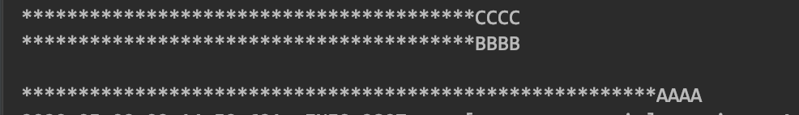

# 注解@AutoConfigureBefore 和 @AutoConfigureAfter的区别和作用,并举例说明

2020-05-09 09:42:51

最近在看ribbion负载均衡的源码问题,想看一下@LoadBalanced的使用,在看源码的时候,无意中发现@AutoConfigureBefore 和 @AutoConfigureAfter

想知道加载顺序如何?

> **猜想**

根据@AutoConfigureBefore 和 @AutoConfigureAfter两个的字面意思就我们猜测如下:

1、使用@AutoConfigureBefore

```
@AutoConfigureBefore(AAAA.class)
public class CCCC {
}
```

猜测1:CCCC 将会在 AAAA 之前加载?!

 

2、使用@AutoConfigureAfter

```java
@AutoConfigureAfter(BBB.class)
public class CCCC {
}
```

猜测2: CCCC 将会在 AAAA 之后加载?!

3、如果同时使用@AutoConfigureBefore 和 @AutoConfigureAfter这两个注解,是不是

```java
@AutoConfigureBefore(AAA.class)
@AutoConfigureAfter(BBB.class)
public class CCCC {
}
```

猜测3:执行顺序是不是就是CCCC 、AAA、BBB这个顺序了呢?!!!????

 

> **验证**

先看例子:

项目结构图


> ```html
> 验证猜测1    @AutoConfigureBefore 验证
> ```

```java
@Configuration
public class MyConfigureBefore {

    public MyConfigureBefore(){
        System.out.println("****************************************AAAA");
        System.out.println();
    }

}
```

配置类

```java
@Configuration
@Import({MyConfigureBefore.class})
@AutoConfigureBefore(MyConfigureBefore.class)
public class AppConfig1 {

    public  AppConfig1(){

        System.out.println();
        System.out.println("****************************************CCCC");
    }

}
```

执行结果:


结论:猜测1成立,**使用**@AutoConfigureBefore会优先加载当前的配置类,然后再去加载before中的配置类,

 

> ```html
> 验证猜测2  使用@AutoConfigureAfter验证
> ```

```java
@Configuration
public class MyConfigureAfter {


    public MyConfigureAfter(){
        System.out.println("********************************************************BBBB");
    }

}
```

配置AppConfig1代码

```java
@Configuration
@Import({MyConfigureAfter.class})
@AutoConfigureAfter(MyConfigureAfter.class)
public class AppConfig1 {


    public  AppConfig1(){
        System.out.println("****************************************CCCC");
    }


}
```

 

启动springboot进行测试

```
@SpringBootApplication
@ComponentScan("com.lquan.test1.conf")
public class Test1Main {


    public static void main(String[] args) {
        SpringApplication.run(Test1Main.class, args).close();

    }
```

> 执行结果:


> **结论:猜测2成立, 使用**@AutoConfigureAfter会优先加载当前的配置类,然后再去加载After中的配置类,

 

> 验证猜测3 @AutoConfigureBefore 和 @AutoConfigureAfter同时使用执行顺序如何?

配置类

```java
@Configuration
@Import({MyConfigureAfter.class,MyConfigureBefore.class})
@AutoConfigureBefore(MyConfigureBefore.class)
@AutoConfigureAfter(MyConfigureAfter.class)
public class AppConfig1 {


    public  AppConfig1(){
        System.out.println();
        System.out.println("****************************************CCCC");
    }

}
```

执行结果:


这个结论和猜测3有出入,虽然都在CCCC的后面加载,但是加载顺序不是先执行的@AutoConfigureBefore 的配置类,然后执行的@AutoConfigureAfter的配置类,

 

我们将AppConfig1配置类中@Import({MyConfigureAfter.class,MyConfigureBefore.class})的顺序更改看一下,

将顺序更改为@Import({MyConfigureBefore.class,MyConfigureAfter.class})

配置代码如下

```java
@Configuration
@Import({MyConfigureAfter.class,MyConfigureBefore.class})
@AutoConfigureBefore(MyConfigureBefore.class)
@AutoConfigureAfter(MyConfigureAfter.class)
public class AppConfig1 {

    public  AppConfig1(){

        System.out.println();
        System.out.println("****************************************CCCC");


    }

}
```

执行结果:



 

> 最终结论

猜测1正确 和 猜测2正确,***\*猜测3不正确\****,因为,@AutoConfigureBefore 和 @AutoConfigureAfter同时使用的话,他和对应的配置文件在在使用spring ioc的加载顺序有关系,

 

 

https://blog.csdn.net/dianxiaoer20111/article/details/106011220?utm_medium=distribute.pc_relevant.none-task-blog-BlogCommendFromMachineLearnPai2-1.nonecase&depth_1-utm_source=distribute.pc_relevant.none-task-blog-BlogCommendFromMachineLearnPai2-1.nonecase