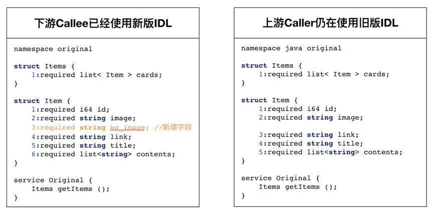
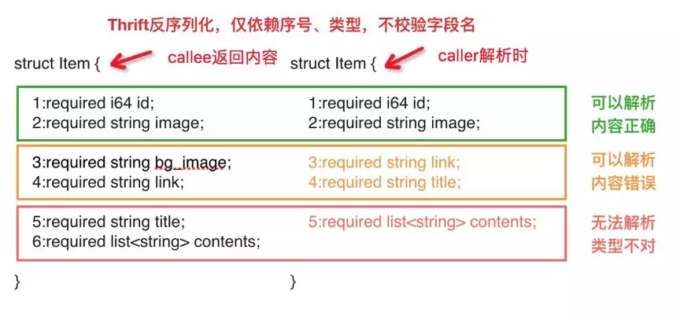
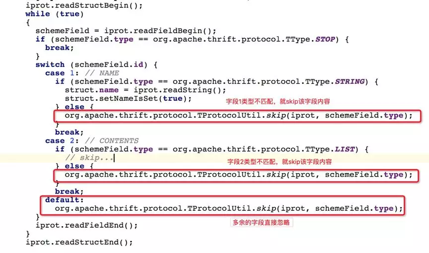
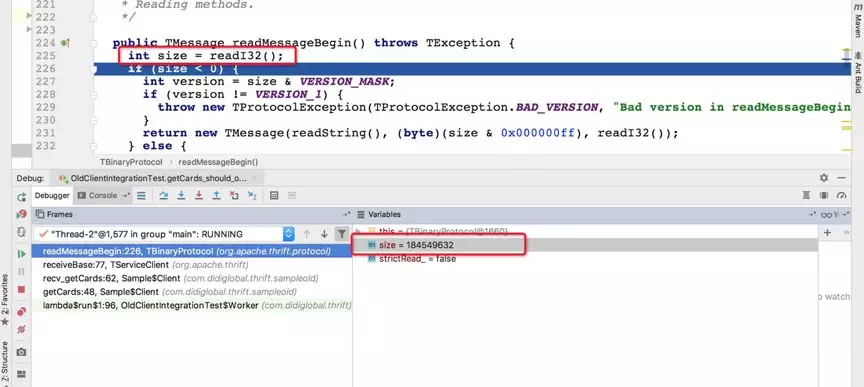
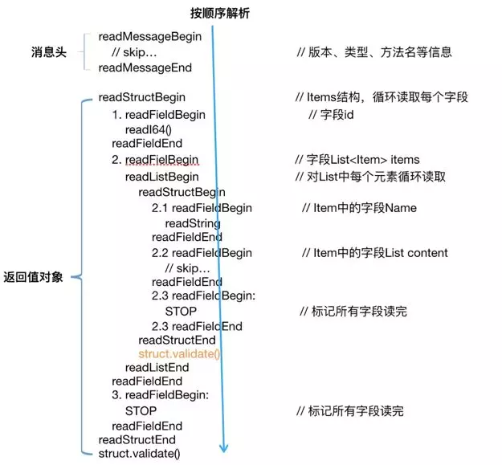
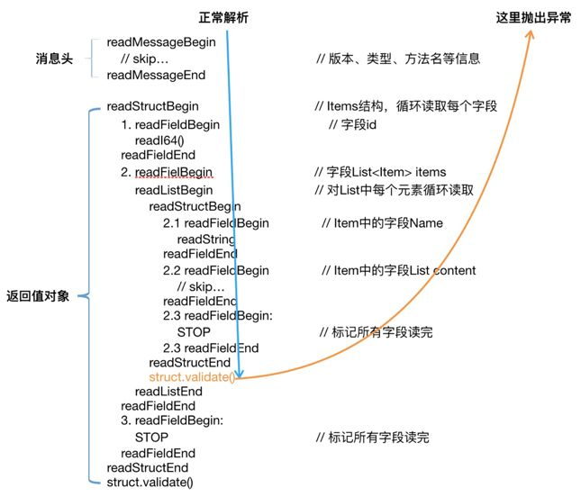
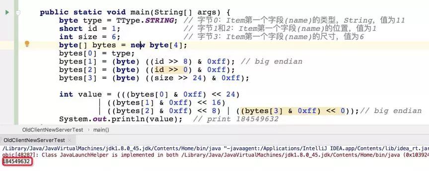

[TOC]


# Thrift IDL 的字段变更OOM 一起变更引发的惨案

** 2020 年 4 月 24 日

公司某业务出现严重的线上故障，复盘发现原因竟是某接口的 Thrift IDL 变更，未及时同步所有上游，导致上游某服务 OOM 引发 Crash。看似操作不规范是本次故障的根因，但进一步思考：该接口非主流程接口，即使 IDL 版本不统一，带来“最坏”的后果不应该是“仅仅报错”吗，为什么会产生 OOM 导致整个服务 Crash？

实际上这样的例子并不少见，很多公司内部 RPC 使用 Thrift 协议，IDL 变更及版本不一致在所难免，极端情况下，安全团队扫描 thrift 端口也会出现类似故障。为了避免更多团队采坑，有必要研究 Thrift 何种情况下会触发，以及为什么会触发 OOM。

## 一. 从 IDL 的字段变更说起

化繁为简，该故障的发生可以这样描述：某 Thrift 服务的返回值是一个数组，数组中每个元素本来包含 5 个字段，某次调整后，在中间位置新增 1 个字段，其余保持不变。服务上线后，某上游调用方未收到变更通知，仍使用旧版本的 SDK。参照下图所示：



看到这里，有经验的同学已经瑟瑟发抖。在 Thrift 协议跨语言、高性能的背后，做了很多取舍，比如接收方在反序列化时，仅做了方法名等少量的校验，通过序号、字段类型认为该返回值属于哪个字段，而并未校验字段名，因此一旦上下游 IDL 版本不一致，极易产生字段错位的情况。以上述 IDL 为例，id、image 字段正确解析，而 bg_image 被错误解析为 link、link 被错误解析为 title：


字段增加时，考虑到字段位置及新旧版本不匹配的各种场景，我们枚举可能的后果：

1. 新增字段放到中间位置
   A. 新 Server、旧 Client：容易字段错位，引发业务错误，不推荐
   B. 旧 Server、新 Client：容易字段错位，引发业务错误，不推荐
2. 新增字段放到最后，并且是 required
   A. 新 Server、旧 Client：旧 Client 感知不到新增字段，会忽略
   B. 旧 Server、新 Client：新 Client 获取不到新增字段，会报错
3. 新增字段放到最后，并且是 optional
   A. 新 Server、旧 Client：旧 Client 感知不到新增字段，会忽略
   B. 旧 Server、新 Client：新 Client 获取不到新增 Optional 字段，会忽略

再进一步，如果是删除字段呢？从删除字段的位置、是否 required，大家可自行思考，当然结果类似，轻则被忽略，重则字段错位，当然更严重的会导致服务 OOM。
小结：Thrift IDL 不要变更已有字段的序列号，上下游版本不一致极易发生错位现象。如需新增字段，应放到最后并设置为 optional。

## 二. OOM 问题复现

回到 IDL 变更上来，为什么会引发上游服务的 OOM 呢？我们用一段很短的 IDL 就可以重现。

复制代码

```
namespace java  com.didiglobal.thrift.sample
struct Items{
      1:required i64 id;
      2:required list<Item> items;
}
struct Item {
     1:required string name;
     2:required string image; // 新增字段
     3:required list<string> contents;
}
 
service Sample {
     Items getItems(1:i64 id);
}
```

如果你也想尝试，可以下载项目代码，在本地搭建环境。

1. Github 下载项目代码：[ https://github.com/aqingsao/thrift-oom](https://github.com/aqingsao/thrift-oom)
2. 使用你喜欢的 IDE 导入工程，该项目基于 thrift 0.11.0 版本，依赖 JDK1.8+ 以及 Maven
3. 运行包 com.didiglobal.thrift.sample1.sampleold 中 OldClientNewServerTest.java 类的这个测试用例：oldclient_should_oom_at_concurrency_10
   该测试用例会启动一个简单的 Thrift 服务，客户端使用 10 个并发，很快触发 OOM（如果遇到问题，可联系作者）。

使用不同的 Thrift 版本，0.9.3 到最新的 0.13.0-snapshot 均可以重现。使用 jmap 命令，可以看到应用创建了大量的字节数组。

小结：只需要 10 个并发就可以重现 OOM，该问题广泛存在于 Thrift 版本 0.9.3 到最新的 0.13.0-snapshot。

## 三. 为什么会 OOM？

本次故障的根因是新增 String 字段，并且客户端进程创建了大量的字节数组，首先怀疑字段错位后 Thrift 未正确处理，但查看了下源码，thrift 对字段类型不匹配、多余字段均作了 skip 处理：


查看 skip 方法的实现，一度怀疑在类型为 String 时调用了错误的方法，但考虑 String 使用字节流传输，下图中直接调用 readBinary() 方法也无不妥，测试后发现也不是该问题：


思考了几个其他方向，并做了多次尝试，均发现思路不对，而且始终无法解释的是，单个请求数据量只有上百字节，为什么只需要 10 个并发、几十个请求就会 OOM？这些请求的数据量累加起来也不过几十 K，一度陷入僵局。

下班的路上反复思考，是不是和 Thrift 抛出的异常有关，恰遇某个路口超长时间的红灯，每每感叹该路口浪费多少青春年华，此时却从容拿出电脑，对 Thrift 抛出的异常做了临时处理，运行测试，果然不再 OOM 了！

思路一下子清晰起来：虽然 Thrift 做了多余字段的 skip 处理，但由于抛出的异常，这些 skip 操作并未执行到，甚至，List 中第一个元素校验抛出异常后，后面所有字段都未继续消费！

按该思路重新阅读相关代码，果然找到了可疑点：Thrift 接受服务端响应时，会首先解析 TMessage 对象，前 4 个字节（I32）代表了某个字符串的长度，后面 readStringBody() 方法会分配该长度的字节数组（byte[] buf = new byte[size]），该字符串实际上是 thrift 的方法名，而 debug 发现，长度值是 184549632，大约 176M，这合理解释了为什么 10 个并发就会触发 OOM。



**小结：Thrift 接收到请求后首先读取 TMessage 结构，IDL 版本不一致的极端情况下，会分配 176M 的内存空间，导致 10 个并发就占用上 G 内存，触发 OOM。**

## 四. 为什么会分配 176 兆的内存空间？

解决这个问题，有助于了解哪些场景下会触发 OOM，从而更好地避免。

参考 Thrift TServiceClient 的 receiveBase() 方法，详细介绍了返回值的解析过程，参考下图可以更好地理解，基本上是一个从前到后类似堆栈的反序列化：


前面已经介绍过，如果返回值中多了参数、或者参数类型不对，Thrift 可以通过 skip() 操作对该字段进行忽略。但 thrift 对 struct 结构体有个额外的操作，就是解析完成后的调用 validate() 方法，如果结构不合法，会抛出异常：



正常情况下，这里抛出异常，请求失败，应该关闭该连接，或者想重用连接的话，要先把底层 Socket 的输入流做清零处理。但 Thrift 未对输入流做任何处理，直接重用了该 CLient 实例及其底层的 Socket 连接，导致下一次解析响应数据时，读取的是上一次请求失败未处理完的数据。由于连接及底层 Socket 被重用，下一次发出请求，很快收到响应，Thrift 惯例开始读取消息头：readMessageBegin→readI32()，由于存在未清空的脏数据，根据上图的堆栈分析，readI32() 时读取的这 4 个字节，分别是：

byte type = TType.STRING; // 字节 0：Item 第一个字段 (name) 的类型，String，值为 11
short id = 1; // 字节 1 和 2：Item 第一个字段 (name) 的位置，值为 1
int size = 6; // 字节 3：Item 第一个字段 (name) 的 size 的首字节，值为 6
byte（1 个字节）+short（2 个字节）+int（第 1 个字节），按 big endian 编码，其值恰好等于 184549632：

**小结：184549632 的出现有其必然性，不恰当的 IDL 变更，Thrift 客户端抛出异常后未做输入流清理，下一个请求会把之前的残留数据，错误解析成字符串大小，很快导致 OOM。**

## 五. 没遇到 OOM，我是不是很幸运？

当然依 IDL 不同、异常抛出的位置不同，读取消息头时 readI32() 读取的数字不一定恰好是 184549632。项目中提供了一个叫做 sample2 的 IDL，旧 Client 访问新 server 时，该值的大小是 8388864，大约等于 8M，因此 10 个并发甚至 100 个并发也不一定会触发 OOM。
所以当有不恰当的 IDL 变更，你没遇到 OOM，只是幸运而已。

但进一步分析，这种情况虽不会触发 OOM，但客户端一直等待服务端返回 8388864 个字节的数据，久等而不得，于是该连接被阻塞了，一直到超时。

**小结：不恰当的 IDL 变更，不会全部导致 OOM，也有可能导致大量连接被阻塞，直到超时错误。**

## 六. 如何修复 OOM?

参考 Thrift themissing guide 文档，IDL 变更要有规范，并在团队内反复宣导。

讽刺的是，“通过规范、最佳实践来避免 Crash 类问题”，本身就不是一种最佳实践，至少使用 Http 协议不用遇到这种问题。

这可以认为是 Thrift 自身的一个缺陷，作为当前广泛使用的 RPC 协议，需要优雅地处理用户必须遇到的 IDL 变更的问题。

思路一：读取任何 struct 类型的字段时，catch 住异常，保障 thrift 把输入流的所有数据读完
Thrift 在反序列化阶段，遇到任何 struct 类型的字段，读取结束后都会调用 validate() 方法，因此在 struct 类型字段的读取时，可以添加 try-catch 校验异常，保证 thrift 读完所有的数据。

该思路经测试验证可以，但需要修改的地方较多，不具备可操作性。
思路二：无论是否抛出异常，从协议层面保证清空输入流的残留数据
该思路具备较好的收敛性，只需要修改 Thrift 源码的 2 个文件：TServiceClient 修改如下图

1，TSocket 类的修改如下图 2：


经压测验证，在 Macbook Air 上，使用 100 个并发进行验证，持续 15 分钟，累计发送~160 万次请求，单次请求响应数据量~0.5K，除了正常报错，客户端、服务端内存无任何异常。

小结：Thrift IDL 变更不可避免，上下游版本不一致也不可避免，协议其实可以做到优雅地去处理，而不是 OOM 了事。

## 七. 有没有临时方案？

思路一：使用严格读模式？
Thrift 众多的配置项中，有严格读（strictRead）、严格写 (strictWrite) 两个选项，由于严格读默认值为 False，改为 true 是否可以呢？如果 OK 的话，只需要修改配置而无需修改源码，这将会是最轻量级的方案。查看 Thrift 源码，如果命中严格读会提前报错，避免下方 readStringBody() 方法分配太大的内存空间：

严格读（strictRead）的修改方式如下：
// 很多情况下大家如此使用 TProtocol 创建连接，此时 strictWrite 值为 true，而、strictRead 值为 false；
TProtocol protocol = new TBinaryProtocol(transport);
// 严格读：直接创建 TBinaryProtocol，传入参数
TProtocol protocol = new TBinaryProtocol(transport, true, true);
// 严格读：使用 Protocol 工厂模式，传入参数
TBinaryProtocol.Factory protFactory = new TBinaryProtocol.Factory(true, true);
经测试验证，使用严格读之后，客户端还会报错，但 OOM 问题消失了！“貌似”这也是我们想要的结果，压测效果如何呢？
在 MacbookAir 上，使用 100 个并发进行验证，5 分钟之后，发送大约 56 万请求，客户端出现大量的 SocketException(Broken pipe)，甚至客户端开始宕死。
究其原因，strictRead 虽然避免了创建大量字节数组，但抛异常时 thrift 也未对输入流做任何清理，会产生误读取残余数据，甚至引起连接阻塞。
所以使用严格读，并不能解决这一问题，同样 thrift 提供了另外一个配置项“读取字符串或字节的最大长度（stringLengthLimit_）”，也不能解决该问题。

思路二：使用短连接？
每个请求创建一个短连接，用完就关闭？这样虽可以避免请求之间的数据污染，但毫无疑问也会带来较大的性能损失，通常不建议。

思路三：使用 TFramedTransport？
TFramedTransport 对整帧数据使用了缓存，一次性把底层 Socket 中 Inputstream 中的数据完全读到了 readBuffer，理论上不会出现 OOM 了。
验证了一把，很可惜还是会 OOM，原因是抛异常之后，TFramedTransport 中的 readBuffer 中的数据未做清理，下次请求会错误读取 readBuffer 中的残余数据。
如果你想验证，可以运行 OldClientNewServerTest 中的测试用例：oldclient_should_oom_if_use_TFramedTransport_at_concurrency_10

小结：使用严格读、限制字符串长度等配置方式，使用 TFramedTransport 都不能完美解决问题，要么 OOM，要么连接被阻塞。而短连接对性能影响较大，在 Thrift 中也很少使用。

## 八. 总结

Thrift IDL 不恰当地变更，当上下游 IDL 版本不一致时，极易引发字段错位、连接阻塞、甚至 OOM。Java、Go 等语言实现中均存在该问题，并广泛存在于 Thrift 0.9 到最新的 0.13.0-snapshot 等各个版本。

该问题触发的根本原因是：客户端接收数据后，对 struct 类型做 validate() 时抛出异常，并未对底层的 socket 输入流做清零处理，后续请求误把残留数据读作字节长度，极易引发 OOM，或者导致 Socket 连接阻塞超时。

Thrift IDL 变更不可避免，上下游版本不一致也不可避免，从协议层面提供优雅支持是完全可能的。已向 Thrift 提交 Issue，以及部分语言实现的 Pull Request，但争吵几轮之后，Thrift 维护人员拒绝合并，认为“遵守最佳实践就够了”，他们敷衍的态度太让人 piss off 了。

**本文转载自技术锁话公众号。**

**原文链接：**[ https://mp.weixin.qq.com/s/aqHoM7-hKQOFHRzWipfa8g](https://mp.weixin.qq.com/s/aqHoM7-hKQOFHRzWipfa8g)

 

https://www.infoq.cn/article/Y5uW5GRYG1ujXPBQRSe0