# 在chrome-console中进行xpath-css-js定位

2019-09-21 12:42:20 

## 一、Xpath

console中调用xpath的基本格式：`$x("xpath表达式")`

### 1.1 绝对定位与相对定位

- 绝对定位：`$x("/xpath表达式")`
- 相对定位：`$x("//xpath表达式")`

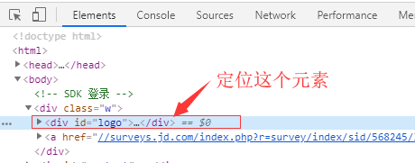

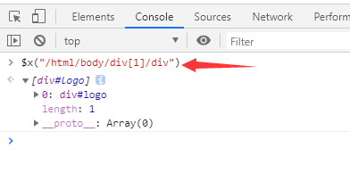

### 1.2 通配符与不包含筛选

属性@
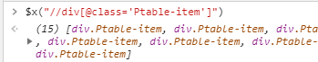
通配符*
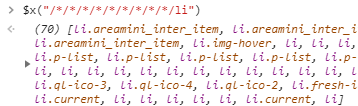
不包含not()
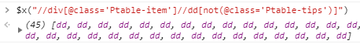
包含contains()
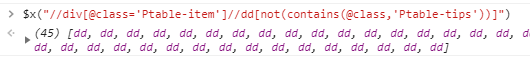

### 1.3 Xpath函数运算的简单实用

注意：xpath函数有很多，这里只是列举了一些简单的函数，若查看其他函数，请看xpath官方文档；

定位时去除空格
例：

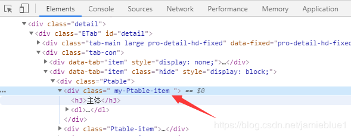
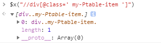
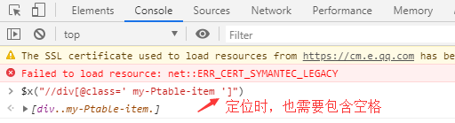
去除空格

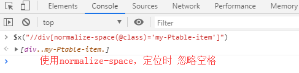
统计元素个数
例：统计行数为2行的元素个数

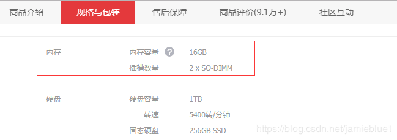
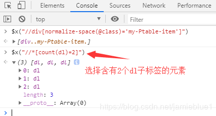
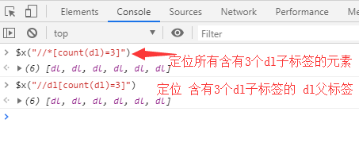

筛选name以dl开头：starts-with(name(), ‘dl’)
筛选字符串长度等于2的：string-lenth(name())=2

### 1.4 各种亲戚标签的定位

父标签parent::
比如定位div父标签parent::div
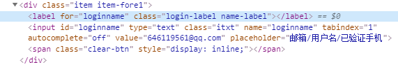
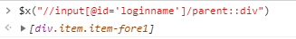

子标签child

哥哥标签preceding-sibling::
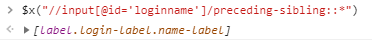
弟弟标签following-sibling::
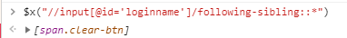
后代标签descendant::

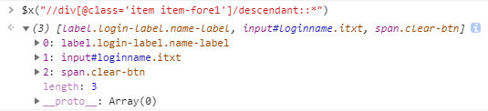
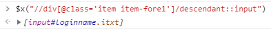
祖先标签ancestor::
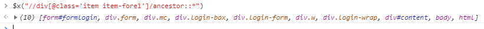

## 二、css选择器

### 2.1 基本格式

console中调用css的基本格式：`$("css表达式")`或者`$$("css表达式")`
谷歌插件：SelectorGadget

### 2.2 常用符号

.点，代表每个标签class的属性为xx
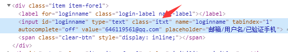
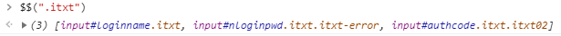

\#，代表整个标签中有个元素的id为xx
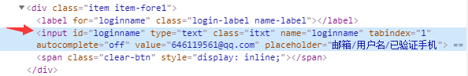
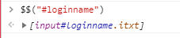

,逗号，代表谁和谁
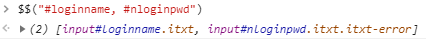
空格，代表所有的后代标签
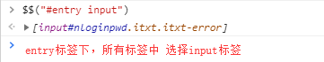
`>`大于号，代表所有的儿子标签，不包括孙子标签

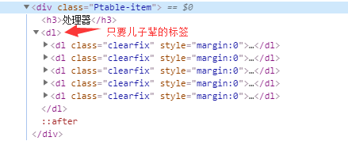
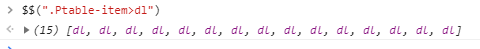

### 2.3 CSS选择器的属性筛选

属性筛选


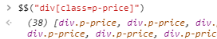
区别：xpath中带@，css中不带@

属性中带空格怎么筛选？
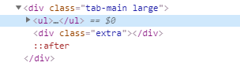

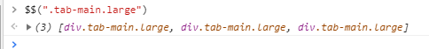

区别：xpath中class带空格直接写空格，css中用.点代替

包含某些字符的属性怎么筛选？

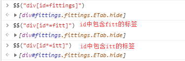

以某些字符开头的属性怎么筛选？


## 三、js定位

console里面执行javascript代码，操作dom对象。

每个载入浏览器的 HTML 文档都会成为 Document 对象。Document 对象使我们可以从脚本中对 HTML 页面中的所有元素进行访问。
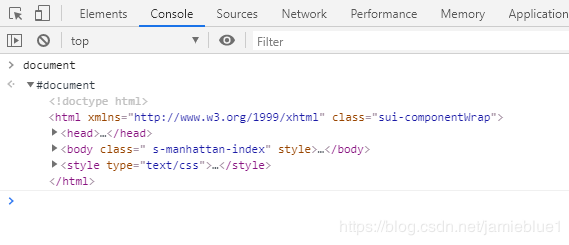

1. 通过id获取
   document.getElementById(“id”)
2. 通过name获取
   document.getElementsByName(“Name”) 返回的是list
3. 通过标签名选取元素
   document.getElementsByTagName(“tag”)
4. 通过CLASS类选取元素
   document.getElementsByClassName(“class”)
   兼容性：IE8及其以下版本的浏览器未实现getElementsByClassName方法
5. 通过CSS选择器选取元素
   document.querySelectorAll(“css selector")
   兼容性：IE8及其以下版本的浏览器只支持CSS2标准的选择器语法
   

【举例代码】

```python
js = 'document.getElementById("helloId").click();'

driver.execute_script(js)
```


https://blog.csdn.net/jamieblue1/article/details/101075193