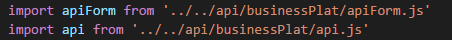
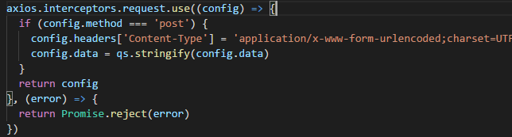
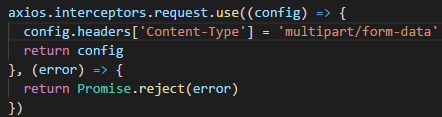

# axios调用多个api，每个api需要的拦截器不同

## 问题

.vue中引用两个api.js文件：


这两个api.js中分别有两个不同拦截器：


和

可是在.vue中调用上述某一引用的api.js中的接口时，发现两个api.js中的拦截器都拦截了，而且拦截顺序和import api的顺序有关...导致config.header无法正确设置，不懂为什么......

## 答

每个文件里面都给axios设置了拦截器，产生了全局叠加的效果，最好是用axios.create来创建一个实例来拦截

```js
let instance = axios.create();

// request拦截器
instance.interceptors.request.use(function (config) {
    let user = storageService.getUser();
    if (util.checkNonNullObj(user)) {
        // porch授权 统一配置
        let authorization = user.userId + '_' + user.authToken
        // 给所有请求添加自定义header
        config.headers['authorization'] = authorization
    }
    return config;
}, function (error) {
    return Promise.reject(error);
});
// response 拦截器
instance.interceptors.response.use((response) => {
    //错误校验
    if (response.data.code && response.data.code !== '200') {
        if (response.data.code === 'NOT_LOGIN') {
            Vue.prototype.$message.error(i18nUtil.t("message.invalidSession"));
            logoutAndLogin()
        } else if (response.data.message === undefined || /*response.data.message === '' ||*/ response.data.message === 'check ticket failed') {
            Vue.prototype.$message.error(i18nUtil.t('message.reLogin'));
            logoutAndLogin()
        } else {
            return response
        }
    }
    // 数据返回
    if (response.data && response.status === 200) {
        return response;
    } else {
        Vue.prototype.$message.error(i18nUtil.t('message.reLogin'));
        logoutAndLogin()
        return;
    }
},
    error => {
        Vue.prototype.$message.error(error.message);
    })
```

