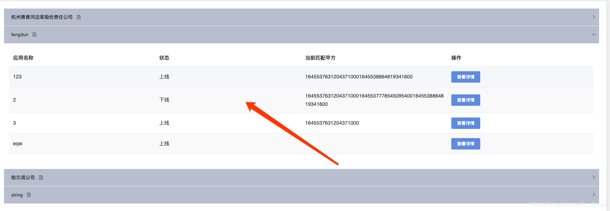

# element-ui el-collapse 折叠面板内部数据动态加载导致无法展开

2019-09-27 18:29:04 

如下图所示 面板内部数据为动态加载数据；为较少不必要的请求我们设置用户点击对应列表时请求对应列表下数据；如下代码所示： 



```html
 <el-collapse  v-model="activeNames" @change="handleChange"  v-loading='companylistLoading'>
          <el-collapse-item v-for ="(item,index) in companyList  " :key='index' :name="item.id">
              </template>
            <div style='padding:15px'>
               <el-table
                v-loading='companyAppLoading'
                :data="tableData"
                stripe
                style="width: 100%">
                <el-table-column
                  prop="name"
                  label="应用名称"
                  >
                </el-table-column>
        </el-collapse-item >
</el-collapse >
```

出现这种问题原因是点击时 数据异步加载导致 el-collapse-item的高度找不到，所以我们只要在数据更新完毕后执行就可以展开就可以；查找官网并没有给我回调函数；但是我发现el-collapse 绑定的属性activeNames 为一个数组，活跃面板的name 值会存储在这个属性中，所以我们只要在activeNames添加对应的name 值就会自动打开；

```js
 data () {
    return {
      activeNames: [],
    }
  }, 
 
methods:{
    handleChange (data) {  //点击面板触发的函数 官网提供
      this.getdemandAppList()
    },
 async getdemandAppList () {
      let id = this.activeNames.pop()
      this.companyAppLoading = true
      if (id) {
        let res = await getdemandAppList(id)
        this.tableData = res.data.list
        this.$nextTick(() => {  // 结构渲染完毕后执行
          this.activeNames.push(id)  //添加对应的name值
        })
      }
      this.companyAppLoading = false
 },
}
```

 

https://blog.csdn.net/L_shouzi/article/details/101551180