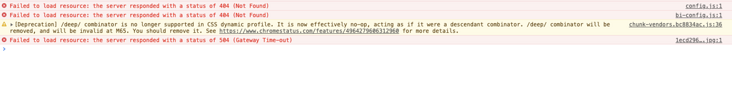
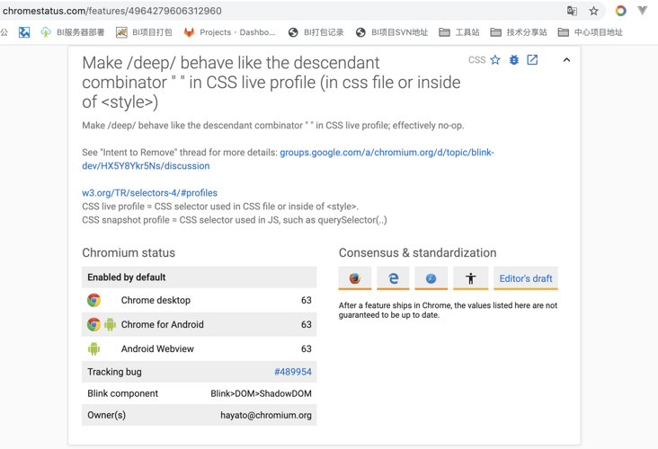

# vue css >>> /deep/穿透，深度查询样式在chrome89 edge最新版本中无效问题

利用vue开发项目过程中，控制台一直有警告⚠️ 提醒如下图，但是一直没有解决，因为大概上网查了一下据说只有在**vue-cli3以上版本不可以**，考虑到项目使用的是**vue2.5.17**,所以就懒得弄了，直到最近chrome与edge浏览器更新版本后，问题出现了（看来新的框架技术和浏览器都抛弃了这个东西），才想起来解决这个问题；

[Deprecation] /deep/ combinator is no longer supported in CSS dynamic profile. It is now effectively no-op, acting as if it were a descendant combinator. /deep/ combinator will be removed, and will be invalid at M65. You should remove it. See [https://www.chromestatus.com/...](https://www.chromestatus.com/features/4964279606312960) for more details.

打开给出的链接，过滤查询发现，有关于/deep/废除后的处理方法：


地址：[https://www.chromestatus.com/...](https://www.chromestatus.com/features#/deep/)

大概理解应该是/deep/基本上无效了，直接替换成“”空格，或者`>>>`代替处理；

于是，在项目中全局替换/deep/为空格，但是部分页面会有错乱问题，于是将替换为空格后，仍然无效的样式部分，添加`>>>`,居然可以了，但是对于Sass Less之类的预处理器是无法正确解析 `>>>`的，所以要保证样式是css文件；

还有一点要强调，`>>>`在html单页面下貌似无效，在vue项目中有效；

项目问题基本解决后，做一下汇总的情况下，上网查看关于样式穿透，发现除了`>>>`、/deep/外，还有一个**::v-deep**，写法如下：

```html
<style lang="scss" scoped>
/*用法1*/
.a{
::v-deep .b { }
}
/*用法2*/
.a ::v-deep .b {}
</style>
```

以上，是项目上值得记录的问题解决方法；


https://segmentfault.com/a/1190000039380516