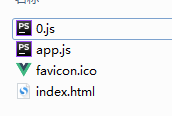

# vue-cli filenameHashing --model 环境变量自定义导致静态文件hash失效

## 问题

根目录下添加了vue.config.js文件
内容如下

```
module.exports = {
  publicPath: '/',
  outputDir: 'dist',
  assetsDir: 'static',
  indexPath: 'index.html',
  filenameHashing: true,
  productionSourceMap: false,
  devServer: {
    port: '3030',
  },
  transpileDependencies: ['webpack-dev-server/client'],
    chainWebpack: (config) => {
    config.entry.app = ['babel-polyfill', './src/main.js'];
    },
};
```

按照文档所述，assetsDir和filenameHashing这样配置，打包时应该会把js生成到static目录下并且文件名应该有hash，但实际没有生效


请教下这是什么问题？

刚刚又看了下，好像是因为我打包命令里加了--mode参数，这样是就直接给覆盖掉了吗？有没有办法两边都生效？


## 答

```
vue-cli-service build --mode

// 上面的命令等价于下面的
vue-cli-service build --mode=development
```

在 `development` 模式下构建，不会帮你生成 hash 的，这样做的目的是加快 开发过程中的效率，毕竟分析每个文件的hash是需要时间的

既然你是打包，那么可以用

```
vue-cli-service build --mode=production
```

另外：`filenameHashing `默认值就是true，你无需设置

如果你希望开发环境也能生成 `hash`

可能（因为我没试过）；你需要在 `chainWebpack `里面把 vue-loader 重新配置下

题外话：
为什么你要build 一个 开发模式的包？ 什么优化都没帮你做。这个包不建议用到生产


[vue-cli3的配置问题 - 的回答 - SegmentFault 思否](https://segmentfault.com/q/1010000020709297/a-1020000020713573)