# JVM 常见线上问题 → CPU 100%、内存泄露 问题排查

## 前言

　　后文会从 Windows、Linux 两个系统来做示例展示，有人会有疑问了：为什么要说 Windows 版的 ？ 目前市面上还是有很多 Windows 服务器的，应用于传统行业、政府结构、医疗行业 等等；两个系统下的情况都演示下，有备无患

　　后文中用到了两个工具：[Processor Explorer](https://docs.microsoft.com/en-us/sysinternals/downloads/process-explorer)、[MAT](https://www.eclipse.org/mat/downloads.php)，它们是什么，有什么用，怎么用，本文不做介绍，不知道的小伙伴最好先去做下功课

## cpu 100%

　　下面的示例中， cpu 的占有率没到 100%，只是比较高，但是排查方式是一样的，希望大家不要钻牛角尖

### 　　Windows

　　　　1、找到 cpu 占有率最高的 java 进程号

　　　　　　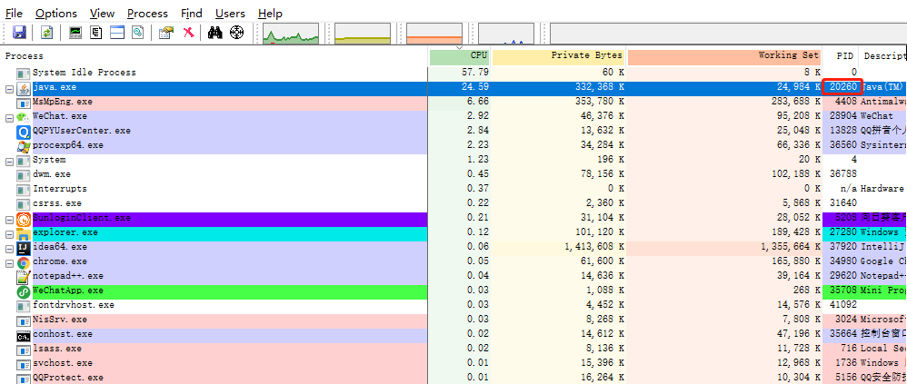

　　　　　　PID： 20260 

　　　　2、根据进程号找到 cpu 占有率最高的线程号

　　　　　　双击刚刚找到的 java 进程

　　　　　　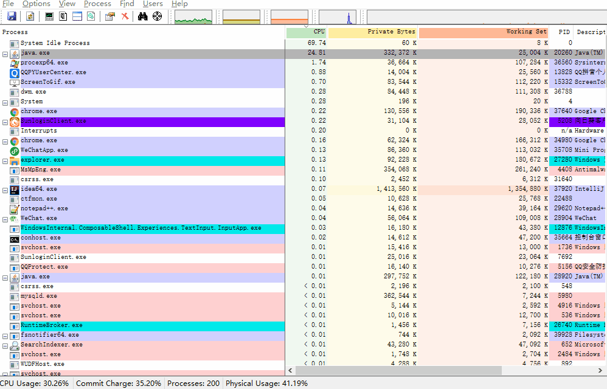

　　　　　　线程号： 15900 ，转成十六进制： 3e1c 

　　　　3、利用 jstack 生成虚拟机中所有线程的快照

　　　　　　命令： jstack -l {pid} > {path} 

　　　　　　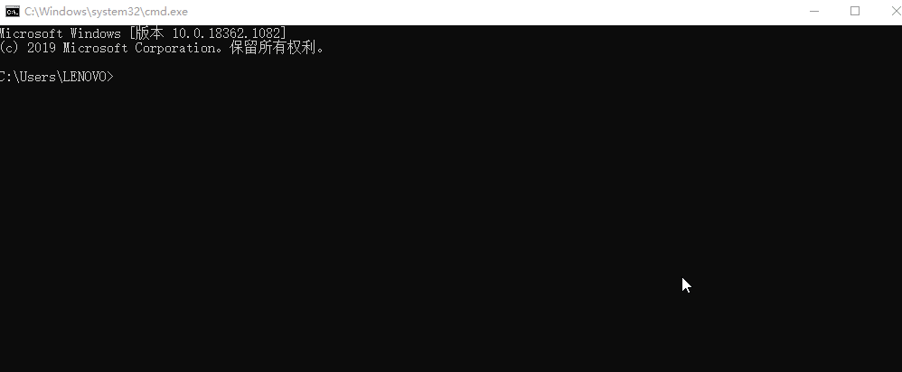

　　　　　　文件路径： D:\20260.stack 

　　　　4、线程快照分析

　　　　　　我们先浏览下快照内容

　　　　　　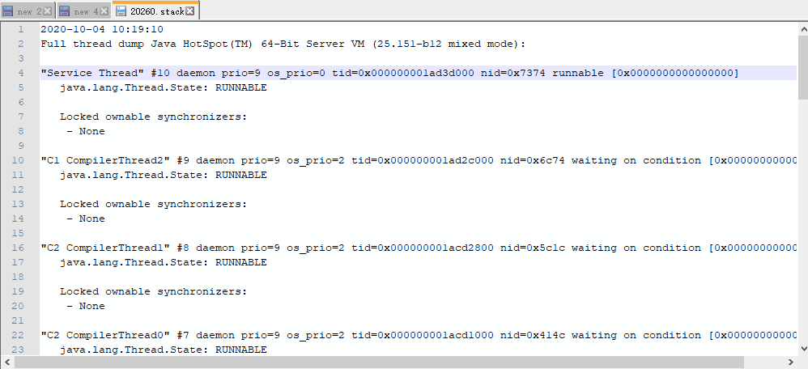

　　　　　　内容还算比较简洁，线程快照格式都是统一的，我们以一个线程快照简单说明下

　　　　　　 "main" #1 prio=5 os_prio=0 tid=0x0000000002792800 nid=0x3e1c runnable [0x00000000025cf000] 

　　　　　　

　　　　　　我们前面找到占 cpu 最高的线程号： 15900 ，十六进制： 3e1c ，用 3e1c 去快照文件里面搜一下

　　　　　　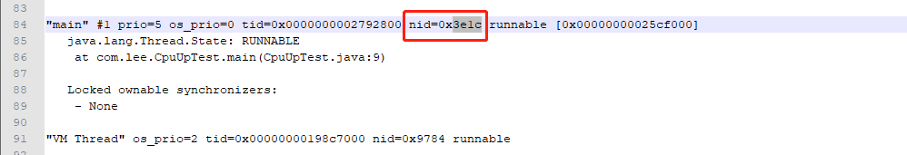

　　　　　　自此，找到问题

　　　　　　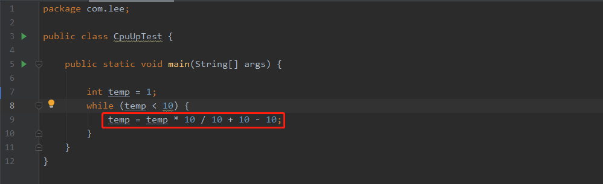

### 　　Linux

　　　　排查方式与 Windows 版一样，只是命令有些区别

　　　　1、找到 cpu 占有率最高的 java 进程号

　　　　　　使用命令： top -c 显示运行中的进程列表信息， shift + p 使列表按 cpu 使用率排序显示

　　　　　　

　　　　　　 PID = 2227 的进程，cpu 使用率最高

　　　　2、根据进程号找到 cpu 占有率最高的线程号

　　　　　　使用命令： top -Hp {pid} ，同样 shift + p 可按 cpu 使用率对线程列表进行排序

　　　　　　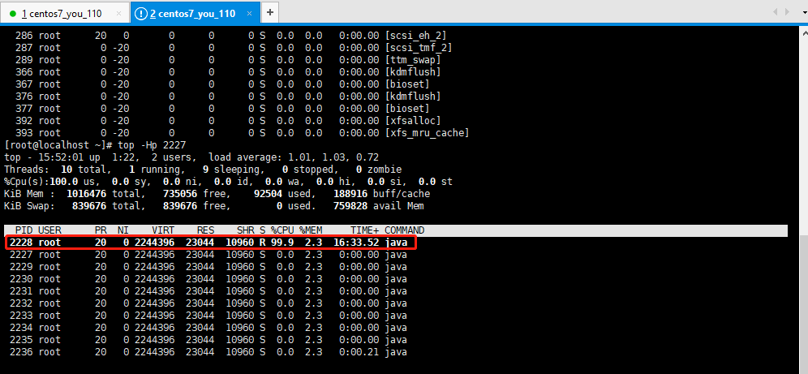

　　　　　　 PID = 2228 的线程消耗 cpu 最高，十进制的 2228 转成十六进制 8b4 

　　　　3、利用 jstack 生成虚拟机中所有线程的快照

　　　　　　

　　　　4、线程快照分析

　　　　　　分析方式与 Windows 版一致，我们可以把 2227.stack 下载到本地进行分析，也可直接在 Linux 上分析

　　　　　　在 Linux 上分析，命令： cat 2227.stack |grep '8b4' -C 5 

　　　　　　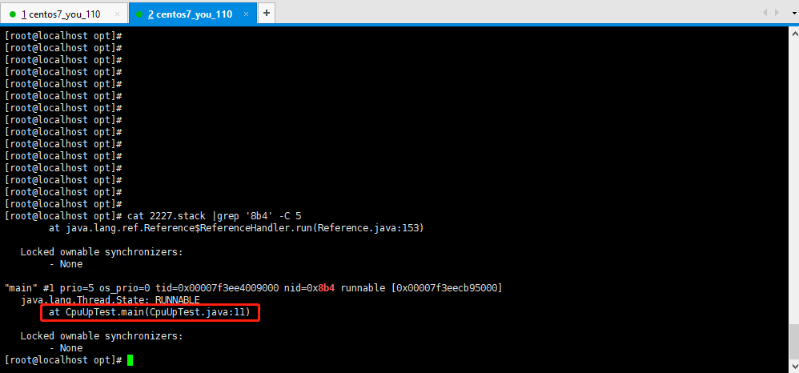

　　　　　　至此定位到问题

　　　　　　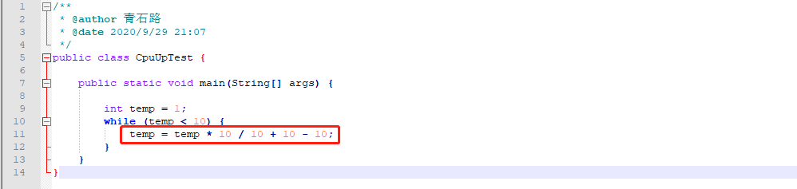

　　　　不管是在 Windows 下，还是在 Linux 下，排查套路都是一样的

　　　　

## 内存泄露

　　同样的，Windows、Linux 各展示一个示例

### 　　Windows

　　　　1、找到内存占有率最高的进程号 PID

　　　　　　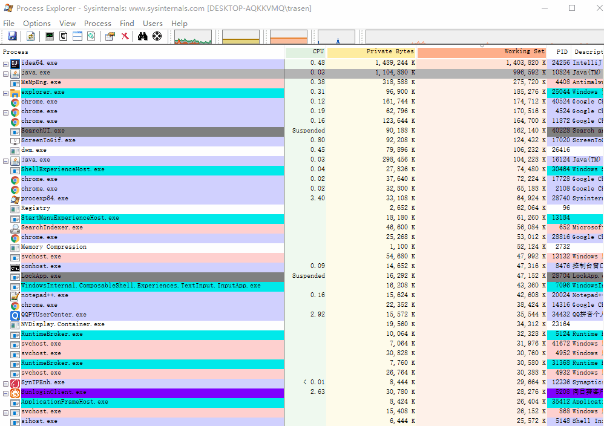

　　　　　　第一眼看上去， idea 内存占有率最高，因为我是以 idea 启动的 java 进程；idea 进程我们无需关注，我们找到内存占有率最高的 java 的 PID： 10824 

　　　　2、利用 jmap 生成堆转储快照

　　　　　　命令： jmap -dump:format=b,file={path} {pid} 

　　　　　　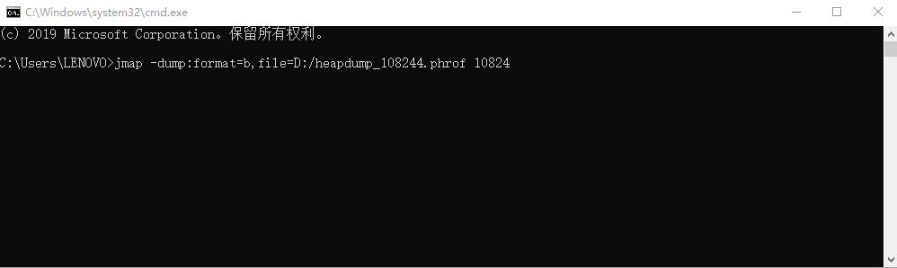

　　　　　　dump 文件路径： D:\heapdump_108244.hprof 

　　　　3、利用 MAT 分析 dump 文件

　　　　　　MAT：Memory Analyzer Tool，是针对 java 的内存分析工具；下载地址：

　　　　　　

　　　　　　选择对应的版本，下载后直接解压；默认情况下，mat 最大内存是 1024m ，而我们的 dump 文件往往大于 1024m，所以我们需要调整，在 mat 的 home 目录下找到 MemoryAnalyzer.ini ，将 -Xmx1024m 修改成大于 dump 大小的空间， 我把它改成了 -Xmx4096m 

　　　　　　接着我们就可以将 dump 文件导入 mat 中，开始 dump 文件的解析

　　　　　　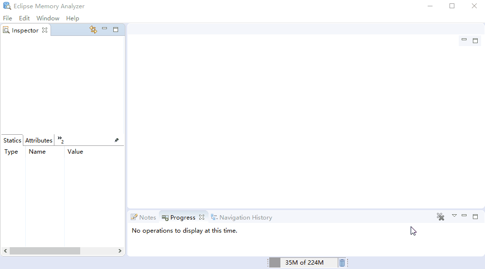

　　　　　　解析是个比较漫长的过程，我们需要耐心等待

　　　　　　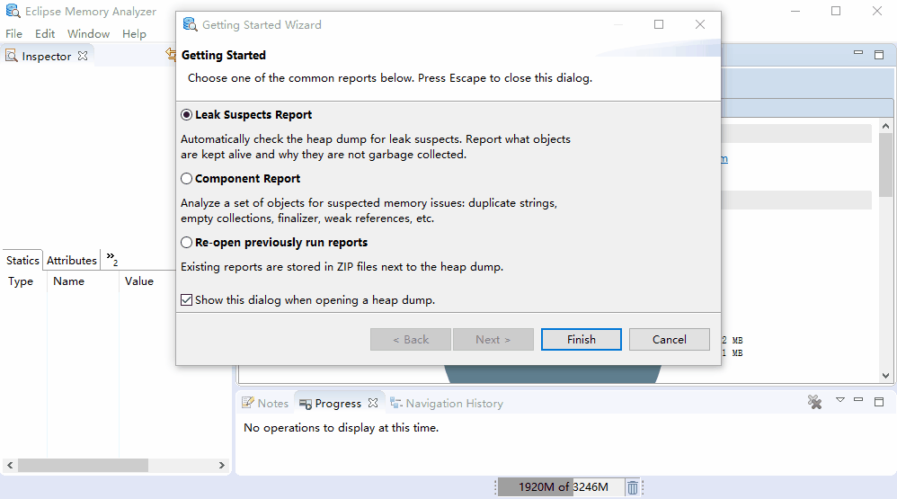

　　　　　　解析完成后，我们可以看到如下概况界面

　　　　　　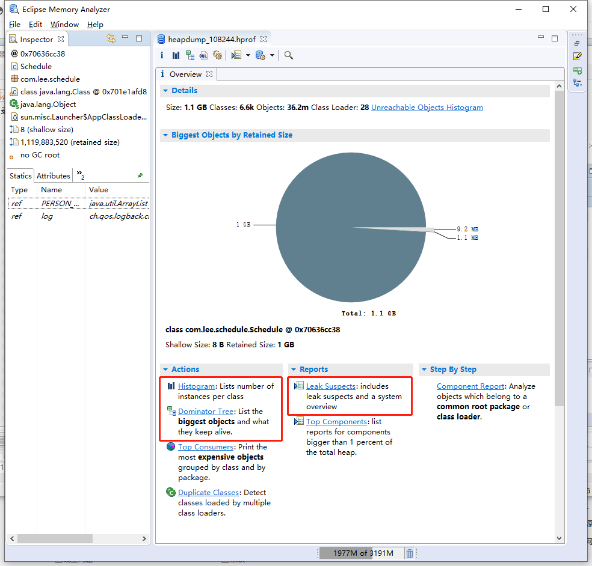

　　　　　　各个窗口的各个细节就不做详细介绍了，有兴趣的可自行去查阅资料；我们来看看几个图：饼状图、直方图、支配树、可疑的内存泄露报告

　　　　　　饼状图

　　　　　　　　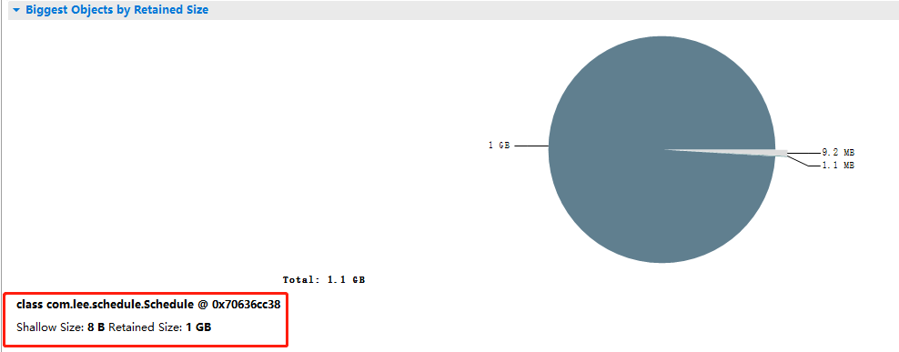

　　　　　　　　可以看出， com.lee.schedule.Schedule 对象持有 1G 内存，肯定有问题

　　　　　　直方图

　　　　　　　　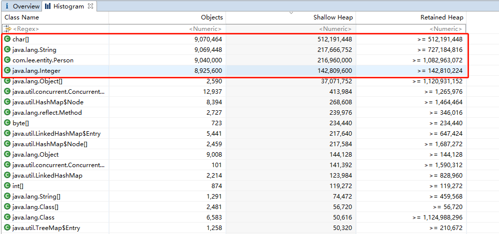

　　　　　　　　我们看下 Person 定义


```
@Setter
@Getter
@NoArgsConstructor
@AllArgsConstructor
public class Person {

    private String name;
    private Integer age;

}
```

　　　　　　　　可想而知，上图标记的几项都与 Person 有关

　　　　　　支配树

　　　　　　　　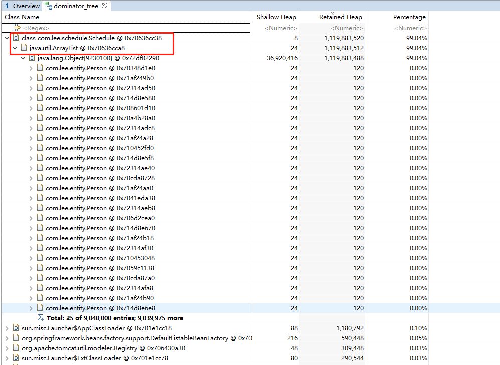

　　　　　　　　这就非常直观了，Schedule 中的 ArrayList 占了 99.04% 的大小

　　　　　　可疑的内存泄露报告

　　　　　　　　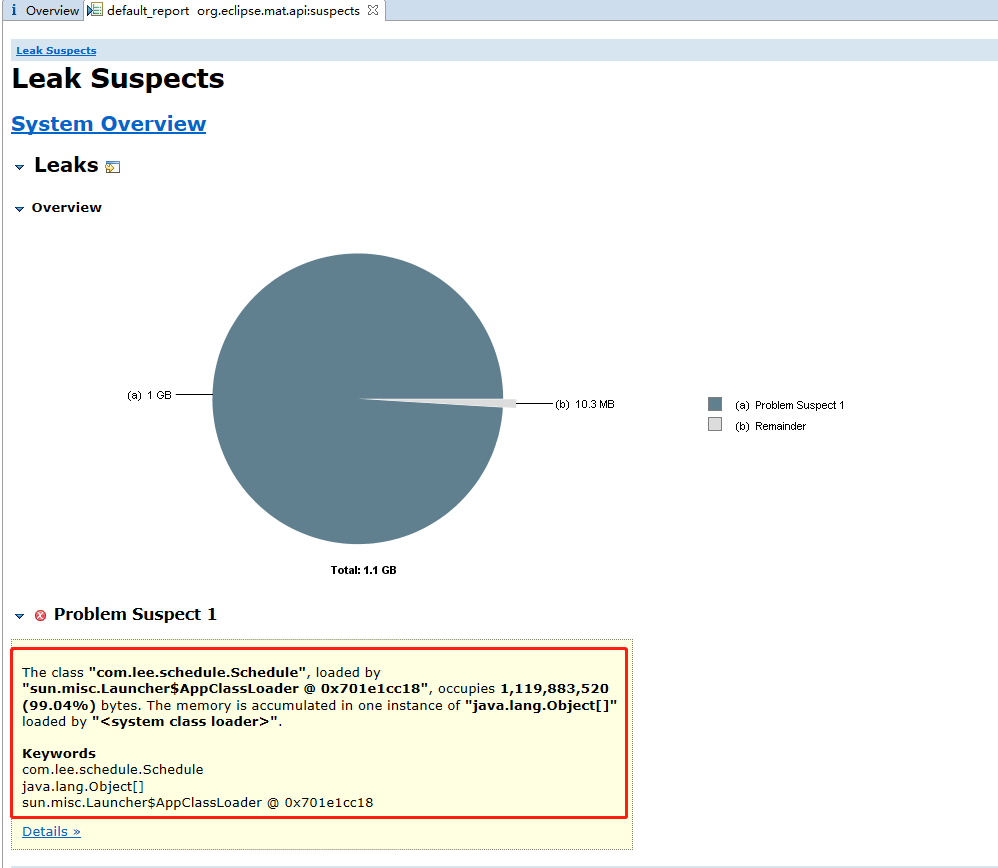

　　　　　　通过这些数据，相信大家也能找到问题所在了

　　　　　　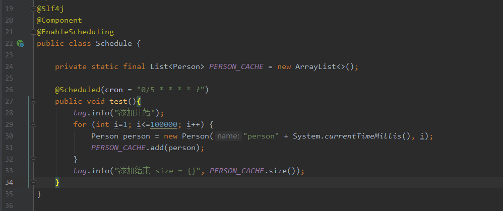

### 　　Linux

　　　　排查方式与 Windows 一样，只是有稍许的命令区别

　　　　1、找到内存占有率最高的进程号

　　　　　　使用命令： top -c 显示运行中的进程列表信息， shift + m 按内存使用率进行排序

　　　　　　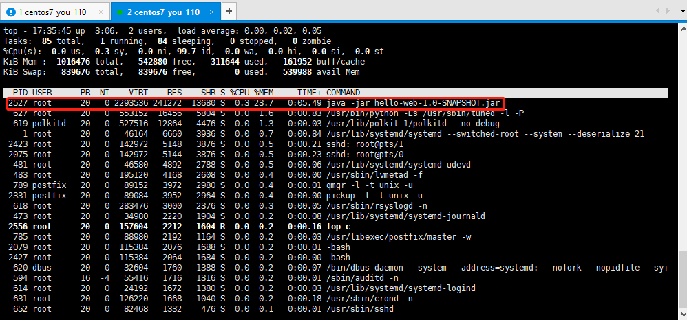

　　　　　　进程号： 2527 

　　　　2、利用 jmap 生成堆转储快照

　　　　　　命令： jmap -dump:format=b,file={path} {pid} 

　　　　　　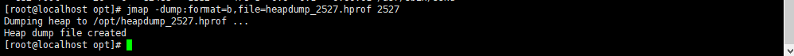

　　　　　　堆转储快照文件路径： /opt/heapdump_2527.hprof 

　　　　3、利用 MAT 分析堆转储快照

　　　　　　将 heapdump_2448.phrof 下载到本地，利用 MAT 进行分析；分析过程与 Windows 版完全一致

　　　　　　

　　　　　　自此，定位到问题

　　　　Windows 下与 Linux 下，排查流程是一样的

　　　　

## 总结

### 　　JVM 常用命令

　　　　jps：列出正在运行的虚拟机进程

　　　　jstat：监视虚拟机各种运行状态信息，可以显示虚拟机进程中的类装载、内存、垃圾收集、JIT编译等运行数据

　　　　jinfo：实时查看和调整虚拟机各项参数

　　　　jmap：生成堆转储快照，也可以查询 finalize 执行队列、Java 堆和永久代的详细信息

　　　　jstack：生成虚拟机当前时刻的线程快照

　　　　jhat：虚拟机堆转储快照分析工具

　　　　　　与 jmap 搭配使用，分析 jmap 生成的堆转储快照，与 MAT 的作用类似

### 　　排查步骤

　　　　1、先找到对应的进程： PID 

　　　　2、生成线程快照 stack （或堆转储快照： hprof ）

　　　　3、分析快照（或堆转储快照），定位问题

### 　　内存泄露、内存溢出和 CPU 100% 关系

　　　　 

### 　　常用 JVM 性能检测工具

　　　　Eclipse Memory Analyer、JProfile、JProbe Profiler、JVisualVM、JConsole、Plumbr

## 参考

　　[一次完整的JVM堆外内存泄漏故障排查记录](https://www.cnblogs.com/rude3knife/p/13570423.html)

　　[【原创】谈谈线上CPU100%排查套路](https://www.cnblogs.com/rjzheng/p/10315250.html)

　　[紧急修复一次线上商城系统高并发优化实战](https://mp.weixin.qq.com/s/LGBBxYRBO91wCtuufdp_cQ)

　　[面试官：如果你们的系统 CPU 突然飙升且 GC 频繁，如何排查？](https://mp.weixin.qq.com/s/g8KJhOtiBHWb6wNFrCcLVg)

　　[记一次公司JVM堆溢出抽丝剥茧定位的过程](https://www.cnblogs.com/bryan31/p/13343926.html)

　　[MAT：一次线上内存泄漏排查](https://www.lagou.com/lgeduarticle/142372.html)

　　[JVM探秘：MAT分析内存溢出](https://www.cnblogs.com/cellei/p/12240241.html)


https://www.cnblogs.com/youzhibing/p/13599874.html#autoid-4-0-0