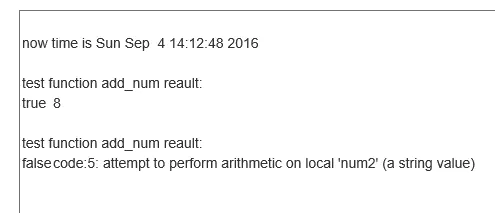

# Lua base pcall()

# 前言

作为苦逼的程序猿大周末的时候也必须不能忘记学习，今天我们来看一个调用其他函数的函数，这个函数其实就是给其他函数提供一个保护环境，保护程序可以不被意外终止，可以顺利的执行下去，我们一起来看一下这个函数的用法吧。

# 内容

------

## pcall()

- 原型：pcall(f, arg1, ···)
- 解释：在一个保护模式下调用参数`f`指定的函数。这意味着在函数`f`中发生的错误都不会被抛出，相反，函数`pcall`会捕获发生的错误然后返回一个错误状态，函数的第一个返回值是一个表示错误状态的布尔变量，当被调用函数被成功调用并且没有错误时，函数返回`true`作为第一个返回值，并且依次返回被调用函数的所有返回值，当发生错误时，函数会返回一个`false`并且紧跟着错误信息。

------

## usage

- 首先我们新建一个文件将文件命名为pcalltest.lua然后编写代码如下：

```bash
-- 打印一下苦逼的程序猿时间
print("\nnow time is "..os.date())

local function add_num(num1, num2)
    return num1 + num2;
end

-- 打印函数正常调用
print("\ntest function add_num reault:")
print(pcall(add_num, 3, 5))


-- 打印可能出现问题的函数
print("\ntest function add_num reault:")
print(pcall(add_num, 3, "what"))
```

- 运行结果（今天在家加班，运行环境有点问题，找了一个在线运行的凑活着看吧）



# 总结

- 从结果可以看出函数第一个返回值就是一个表示函数执行状态的布尔值。
- 由函数两次运行可以看出，不管被调用函数是否发生错误，函数都不会中断。
- 这个函数可以为被执行函数提供一个保护模式，保证程序不会意外终止。
- 还有这个时间打印的其实是格林威治时间，实际上现在已经`2016-09-04 22:37:56`。


作者：AlbertS
链接：https://www.jianshu.com/p/f49b90891daa
来源：简书
著作权归作者所有。商业转载请联系作者获得授权，非商业转载请注明出处。

 