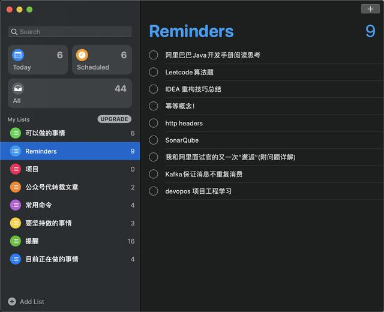
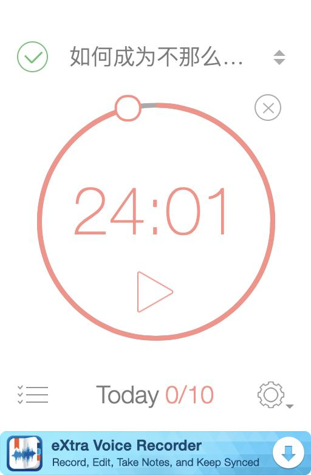
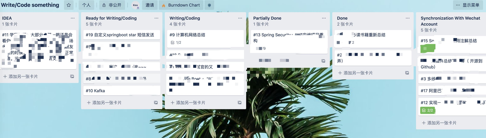
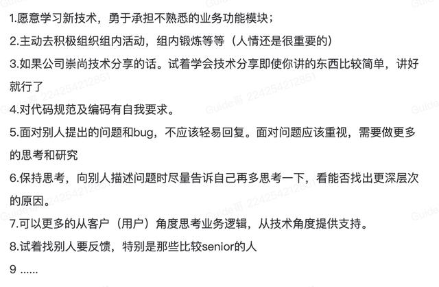

# 入职半年多，Guide哥总结了这些帮助你领先90%程序员的好习惯！

Guide哥 2020-05-06 09:57:09

大家好，我是 Guide 哥，这篇文章还是不分享技术文章了，我想简单聊聊一些程序员的好习惯。

其实自己写这篇文章还是很忐忑的，毕竟自己算不上一个优秀的程序员，但也不是那么差。大学学习编程 4 年，工作半年多，这些年的不算平淡的经历，算是让我有了些对程序员这个职业的认识。

### 1.不要沉迷框架,多修炼内功

不要沉迷框架，多花点时间去修炼内功——底层技术。从用别人的框架，到自己造轮子，会是一步很大的成长。

**为什么？**

1. **技术更新换代快** ：我们前几年可能还在用 Spring 基于传统的 XML 开发，现在几乎大家都会用 Spring Boot 这个开发利器来提升开发速度，再比如几年前我们使用消息队列可能还在用 ActiveMQ，到今天几乎都没有人用它了，现在比较常用的就是 Rocket MQ、Kafka 。技术更新换代这么快的今天，你是无法把每一个框架/工具都学习一边的，底层技术就是你快速上手他们的瑞士军刀。
2. **懂得底层技术的人更有竞争力** ： 现在的程序员这么多，你如何能和别人拉开差距？单纯就靠使用框架的能力么？这些随便从培训班抽一个人可能都会做的工作无法成为你的核心竞争力。

拿 Java 举例子，有哪些比较底层的技术呢？

1. 算法和数据结构(适用于任何编程语言的底层技术)；
2. 框架的源码；
3. Java 程序运行的基础—JVM;
4. ......

### 2.提高英语阅读能力

大部分最新的资料/技术都是国外那边的，基本上大部分都是英文的。据说 90% 以上的程序员都不习惯直接看英文文档，都会选择看别人的翻译/总结或者书籍。但是，书籍或者别人的翻译/总结都会比较慢，而且难免会有个人主观因素影响翻译效果。**如果你想领先 90 % 以上的程序员的话，那就从现在开始习惯阅读英文文档吧！**

### 3.职场从来不缺普通的程序员

很多人都说程序员这个行业吃青春饭，我觉得对于一部分程序员来讲确实是这个理，前提是你日复一日做着重复的工作而没有随着技术的更新而更新自己的技术。随着时间的流逝，如果我们不去提高自己的核心竞争力比如技术深度、广度以及对业务思考的能力等等，你肯定会被那些体力更胜于你并且比你更勤奋工作的人所淘汰。

**职场从来不缺普通的程序员，缺的是技术有深度且对业务和产品敏感的人。**

之前大学有一个 06 届的学长，自己本身是物理专业的，后面对计算机专业感兴趣。听我们老师说他每天都学到很晚才回去，甚至还通宵了很多次。后面毕业，他去了一家创业公司。工作沉淀几年后，他又去了阿里巴巴。在阿里巴巴工作沉淀了几年后，他又回到武汉创业，自己又是作为技术主力，又是每天忙着给公司在海外市场找机会，现在他的公司已经发展成为 50 多人的规模了，他自己也凭借自己的努力在武汉买了好几套房。

这又对应了我们前面提到了两点

1. **不要沉迷框架,多修炼内功。**
2. **工作之外多多学习。**

### 4.工作之外有点自己感兴趣的东西

工作之外要有自己的生活，这样的日子才不会太单调，比如我工作之外喜欢打打游戏放松一下，周末的时候喜欢自己烹饪做好吃的东西给自己。有人可能觉得这个比较浪费时间，不过，在我而言这也是对自己的一种放松，或许在某种程度还能帮助我们提升效率。

### 5.学会规划自己的时间

我觉得每个人都是需要 TODO List 或者类似的东西，因为事情多了之后真的容易忘记，况且现在这个信息爆炸的社会。可能你前脚答应女朋友半个小时后陪她玩游戏，后脚写文章就忘记了（emmm~~~好像说的就是自己）。

我平常用的比较多的是 Mac 自带的 reminders。

另外，做事情的时候最好给自己设置一个 time box，这样的话会让自己更加专注一点。这个实际上叫做番茄工作法，一个番茄时间包含了 25 分钟的工作学习和 5 分钟的休息。

我用的这个工具的名字是 Be focused，不清楚 Window 上有没有。

还有一款叫做番茄土豆的工具也很好用，支持多端（ios、安卓、win、mac）。

### 6.学会安排自己任务

每天的任务是不是很多？不知道如何安排？很多时候自己都会手忙脚乱？很多时候忙活了一天也不知道自己做了什么?

Guide 哥强烈安利 Trello 作为个人/项目/团队的管理工具，据我所知国内外很多项目都是说那个这个来做项目管理，不知道用项目管理这个词合不合适。就拿我平时工具来说，我们的项目组一般都会把所有要做的任务卡放在上面，然后自己去领。

我平时使用 Trello 记录一些自己想写的文章或者代码，以及一些读者的投稿情况和个人突然冒出来的 idea。

我会按照优先级来排列每一个任务和 IDEA。

### 7.学会使用工具提升工作效率

就比如我上面推荐的几款效率工具，就我个人而言真的是方便了我太多，在工具效率上给我带来了很大的帮助。

再拿我们平时编程来说，选好编程工具也真的太重要了，比如在我看来 Java 最好的 IDE 当属 IDEA 了，随随便便提升 30%以上的开发效率不是吹的。

另外，我平时也会经常给大家推荐一些不错的工具比如：**浏览 Github 必备的 5 款神器级别的 Chrome 插件**，**IDEA 插件** ，这些工具/插件它不香么？

### 8.学会休息，注意健康

别打时间战，少熬夜，休息好了，工作效率才高。熬夜的危害就不用多说了，秃头加内分泌失调，你懂得！

拿我个人来说，我平时如果 12 点前睡的话，白天就是 7 点起来，如果 12 点后睡的话，一般都是 8 点左右起来。没睡好的话，一天真的效率会降低很多。

看电脑 45 分钟之后，起来走 5 分钟，看看远方放松一下。不要觉得这 5 分钟浪费时间，相反，这 5 分钟可能为你带来更大的效率提升。

电脑架子不贵，但是很有用，保护好自己脊椎的同时，办公体验也会提升很多。

这是我在武汉租的房子的办公环境，比较简陋，买了一个 50 不到的电脑架子。

我其实还可以写很多很多条的，真的，可能和我平时会有意无意的记录一些比较好的习惯有关系的。每当我从别人身上发现一些我觉得的优点，以及别人对我提的比较有意义的反馈的时候，我都会记录下来。

再分享几个好习惯吧！

如果你们觉得有用的话，后面还会继续写一些这类文章。

不说了，女朋友催我去玩王者荣耀了，第四关 AI 人机真难过啊，打了两天了都，必须得团队配合才行啊。

本文已经收录进我的 75K Star 的 Java 开源项目 JavaGuide：**https://github.com/Snailclimb/JavaGuide**

https://www.toutiao.com/a6823544378896679428/?tt_from=android_share&utm_campaign=client_share&timestamp=1588812070&app=news_article&utm_medium=toutiao_android&use_new_style=0&req_id=2020050708410901001405713022BAA038&group_id=6823544378896679428