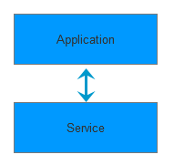
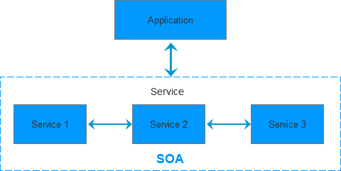
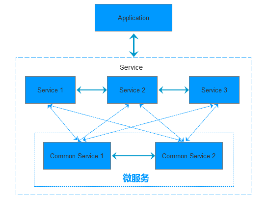
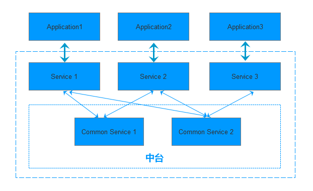
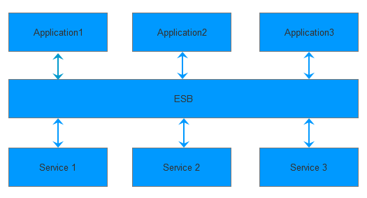

# 一文读懂SOA、微服务、中台和ESB

## **一般的应用服务**

一般的应用服务无论是C/S还是B/S架构，都会有一个提供用户操作的前台和一个提供服务的后台，可以简单的理解为：前台主要完成用户操作的响应和预处理，后台主要实现应用的业务服务。

## **SOA**

SOA(面向服务的架构，Service Oriented Architecture)说的是在一般的应用服务架构中，后台服务(Service端)由一系列提供不同业务支撑的、独立部署的子服务实现。这些子服务不仅暴露自身的服务接口给其它子服务使用，同时也消费其它子服务提供的服务。

## **微服务**

微服务是SOA的一种延伸，它实现了对后台的服务治理。它更多提倡的是业务组件化和服务化，通过对单个应用后台服务中可以被抽象出来的、独立运行的业务逻辑进行模块化，以实现高效的开发运维和适应应用功能的伸缩。

## **中台**

中台是业务层的概念，属于产品架构而不是技术架构。它指的是将多个应用后台在业务上提供相同服务的功能剥离出来，形成一个集中化的服务平台。中台根据其提供服务的不同可分为业务中台和数据中台。

## **ESB**

ESB(Enterprise Service Bus)是企业服务总线，用来连接各服务节点。它实现了对不同协议的不同服务进行集成，通过消息转化、解释以及路由让不同的服务互联互通。ESB为接入的不同服务提供了统一的服务框架和规范，同时也可以对接入的服务进行统计和监控。

版权声明：本文为博主原创文章，遵循[ CC 4.0 BY-SA ](https://creativecommons.org/licenses/by-sa/4.0/)版权协议，转载请附上原文出处链接和本声明。

本文链接：https://blog.csdn.net/weixin_31978735/article/details/112786221