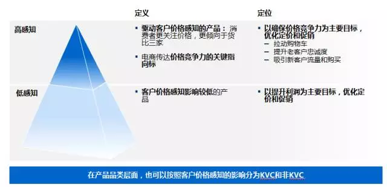
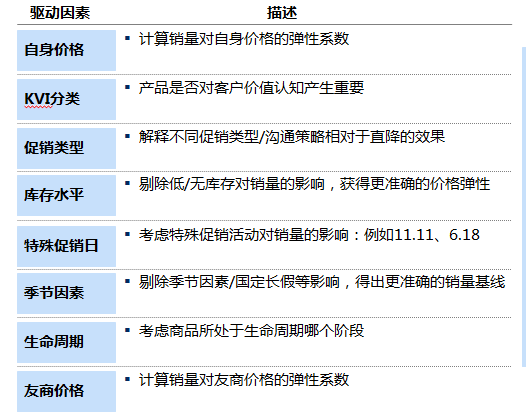
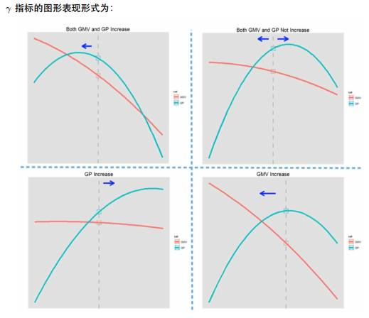
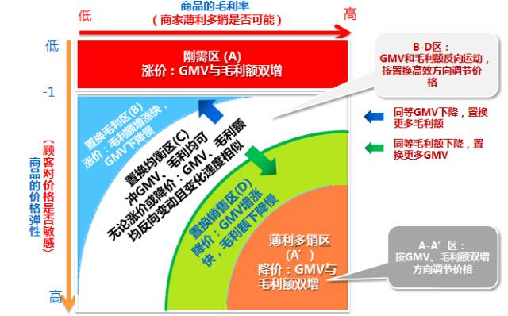
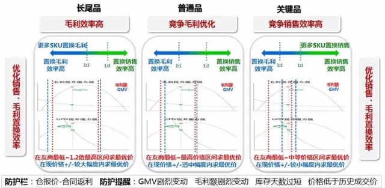
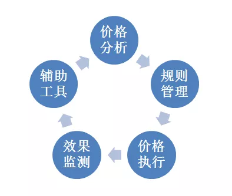
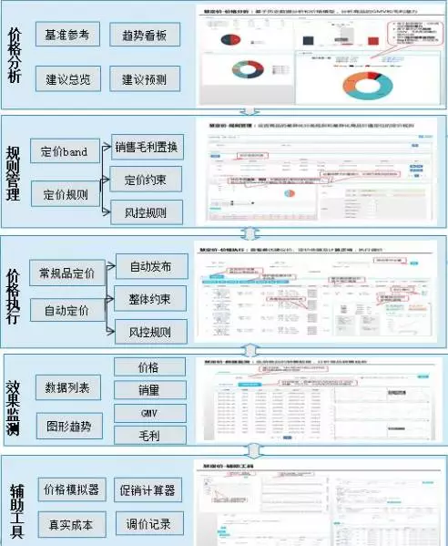
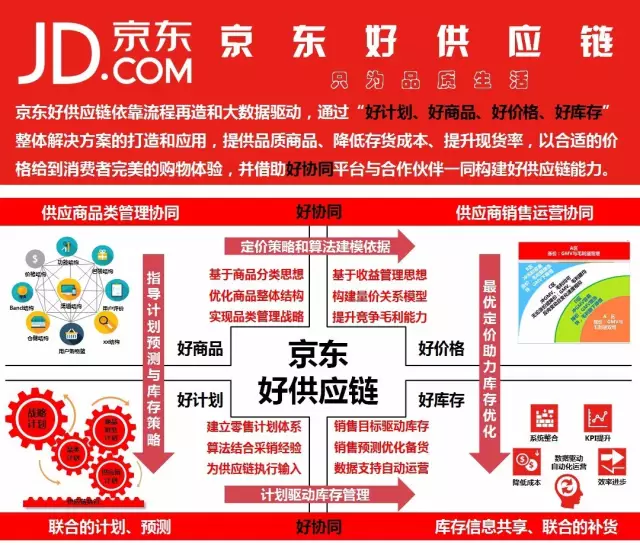

# 效率致胜-智慧定价系统驱动京东长尾商品价格管理

[京东零售平台](javascript:void(0);) *2016-08-19*

  “运筹帷幄之中，决胜于千里之外”，面对零售电子商务市场风云变换的市场竞争，能否做好收益管理（尤其是价格管理）一直是高悬于各零售企业头顶的达摩克利斯之剑。京东连续多年高速增长背后，横向是日趋丰富的商品类别，纵向是日趋增长的商品数量，而海量零售商品的价格管理是优是劣，决定了公司收益管理乃至未来发展的战略地位是否领先。

​    采销经理们除了时时刻刻关注竞争友商的商品价格外，还要注意其他各类多因素（如是否有促销活动、季节趋势、商品价格敏感度、库存、流量、调价幅度等等）、同时还需兼顾重要的利润指标（如毛利额、毛利率）和销售指标（GMV、销量），决策过程通常十分复杂、且相当耗时。而最关键的是，单纯依靠人工手动的进行价格计算、价格预测、变得越来越困难。尤其是长尾低单值商品，在部分三级品类的人均SKU数量动辄超过2000个，占据了采销人员宝贵的工作时间和精力，耗费的是时间成本和人员效率。

​    京东商城研发部零售平台相关项目同事，经过访谈调研，在深入了解采销定价现状的基础上，有效运用企业内外部资源，通过与麦肯锡咨询公司和斯坦福大学优秀的外脑团队建立合作关系，齐心协力，从2015年年初启动京东动态定价体系项目，厉兵秣马，深耕细作，借助机器学习及深度算法，不断更新迭代，通过了多轮正式在线和非正式离线测试，于今年7月正式推出了有京东特色的“价格效率模型”，以及此基础上的最新版“慧定价”动态智慧定价系统，核心思考的问题就是—— “如何降低采销定价的时间成本、如何提高定价的科学效率？”

## 1**重新定义商品分类**

​    商品分类是制定价格的理论基础，从用户感知的角度来看，销售量和流量决定了商品感知程度的高低，如果一个商品拥有很多的关注（流量），同时有很多人购买（流量），此时它在用户心中的感知程度就很高，也说明该商品对顾客影响的效率高。“慧定价”系统结合商品的历史销售数据和流量数据，通过算法排序，将商品按照得分高低分成“关键品”、“普通品”、“长尾品”三类。

**基于用户价格感知的商品分类**

## 2**科学计算价格弹性**

   对近两年的历史销售数据进行深度挖掘，构建多变量的混合效应模型，从中优化匹配出商品销售数量与价格的需求函数关系，通过算法的数据拟合，得到最接近该商品的真实价格弹性，简单说来，就是价格的变动百分率所引起的销量变动百分率的程度，价格弹性越高，表明商品价格敏感度越高，销量变化越大，反之则越低。

**多变量价格需求函数的驱动因素**

## 3**独创GMV和毛利衡量系数**

   在有了价格弹性后，系统结合商品当前的毛利率，对采销实际业务操作中面临的两个重要指标——毛利潜力和GMV潜力进行权衡计算，并在此基础上创新性的设计了gamma系数，该指标能够对商品从创收能力（GMV）以及盈利能力（GP）两个维度进行考量，让每个SKU都有属于自己的 “价格特点”。更进一步地，对“关键品”、“普通品”、“长尾品”三种分类下的SKU进行个性化的最优价格策略建议，确保“物尽其用”，充分体现价格效率。

结合上述方法，最终产生四个销售目标潜力区间，分别是：

1、有GMV与GP毛利同时提升潜力（涨价双增型、降价双增型）;

2、有GMV提升潜力；

3、有GP提升潜力；

4、定价合理，暂无明显可提升空间。

**衡量毛利和GMV效率的Gamma系数**

**“价格效率”模型**

 

## 4**搭建价格效率模型**

   系统在设计目标函数中，采取了优化算法，通过协调GMV与GP的效率，使其达到综合最优。最终搭建了动态定价引擎，引擎基于商品分类，为每个商品分配合适的潜力区间，确保每个SKU都能通过价格充分发挥出最大的潜力。

   不仅如此，系统通过价格风控机制充分考虑价格可能会产生的风险，通过最低毛利要求、友商价格区间、自身价格调整幅度、市场价等多重价格约束条件，确保建议价格不出现异常值。同时，系统还可以在指定条件下（如GMV\毛利\销量的最低要求）作为风险预警机制，一旦系统价格建议可能触发到上述阙线值，则自动提醒相关采销管理者及时监控，消除隐患。

 

**“价格效率模型”的工作原理**

## 5**深度耕植业务需求**

​    研发团队深知市场环境是处在动态变化中的，每时每刻都存在着出乎意料的异动因素，为了保证系统的合理性，除了依靠科学的算法模型，还需要深度耕植于采销的实际业务需求中，有效结合阶段性的销售目标，保证价格建议兼顾准确性和灵活性。

​    系统在2016年7月选择了在消费品事业部和服饰家居事业部（骑行装备、玻璃杯、一次性用品、调味品）四个品类进行实际线上AB测试，在非促销的1000个参与测试SKU中，测试组对比非测试组取得了整体GMV提升3.6%，毛利额提升19.0%的成绩。这也表明：通过“慧定价”系统自动定价，能够有效平衡GMV以及促进长尾商品毛利的提升。据调研和系统使用数据估算，“慧定价”系统在首推的消费品事业部和服饰家居事业部长尾商品中可覆盖90%的非促销长尾商品，节约7万人时/年，GMV提升1%-2%，毛利额提升5%-8%。

## 6**固化明晰业务流程**

  “慧定价”系统在产品功能模块的设计中，也充分考虑到了日常采销业务管理流程，作为管理的一个载体，它也保持了更高的开放度和灵活性。通过对权限的分层把控，可以有效结合管理意志和执行效率。同时，系统严格遵循PDCA（Plan-Do-Check-Action）四步法，通过价格分析、决策执行、效果监控、进程追踪，形成了严格的工作闭环，有助于采销人员及管理者固化明细业务流程。

**“慧定价”P-D-C-A闭环系统**

**“慧定价系统”操作功能模块一览**

**
**

​    未来还将在产品的生命周期、新品定价、区域定价、滞销清理定价、促销联动优化等方向进行更深一步的研究。

"慧定价“系统网址：dp.cis.jd.com

   京东动态智慧定价系统的应用与不断完善，是京东技术创新驱动业务发展的体现。在京东技术研发与业务运营部门的通力协作下，京东的SKU价格管理将步入全新阶段，不仅能全面提升GMV、毛利等核心指标，更能解放人效，释放采销人员更多的时间和精力，让京东的运营效率得到进一步提升！

------

  更多“京东好供应链”干货陆续上映，敬请关注！

https://mp.weixin.qq.com/s?__biz=MjM5NDQwMTc1OQ==&mid=2654510868&idx=1&sn=23971991247d3bee1a42937b476424c8&scene=1&srcid=0831K4HX1x3DumHAiyzPSXfl&st=6AFD67C2294E50357002DD7121B6724470F691190773BC54FA36D868D28D78D1B5A53109760B60B88F01CA0206747CF59A1178BFB5B27BCDD3175EDBAF246E7B8A2BAC24AB978C1DF44192DC30FED7A794AE4AE8AA49399FB5DB1968890ED5E9B87EDB3E12E2E4B598A8AFB4AFC0F538631FFCD059305D14B8CF5BD954C9669924F3EB24212A65B3A08685DE24EC4D110A2C5AB9CCE3D36B101C1E3BD1A62FB6F4BE939638FBC948D476B14C987F7112A3D3F4881BD481B1C90FC43D80280C47&vid=1688853849386736&cst=ED29DB049DF00BC3DBEBFB76C4D7F4D6DCC31F85265FBA93AA6E766195768593586AEF7C68E44CC9ED93EAF31A61E9E6&deviceid=fbaa3fca-6b98-4924-a179-b58eabbbaa2e&version=3.1.2.6203&platform=mac#wechat_redirect