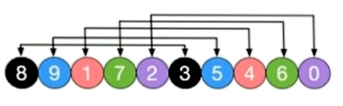
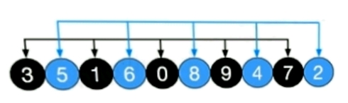
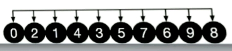

# 希尔排序（ShellSort）交换法与移位法的区别

2020-10-23 15:22:26

# 希尔排序

1. 希尔排序的介绍
   希尔排序是希尔于19859年提出的一种排序算法，希尔排序也是一种插入排序，它是简单插入排序经过改进之后的一个更高效的版本，也称为**缩小增量**排序。
2. 希尔排序的基本思想
   希尔排序是把记录按下标的一定增量分组，对每组使用直接插入排序；随着增量的逐渐减少，每组包含的关键词越来越多，当增量减至1时，整个文件恰被分成一组，算法便终止。

### 举例说明

定义一个乱序一维数组

```java
int[] arr = {8,9,1,7,2,3,5,4,6,0}
```

初始增量为gap = length / 2 = 5，意味着整个数组被分为5组，[8,3] [9,5] [1,4] [7,6] [2,0]

对着5组分别进行直接插入排序，结果如下，可以看到，像3，5，6这些小元素都被调到前面了，然后缩小增量gap = 5 / 2 = 2，数组被分为2组 [3,1,0,9,7] [5,6,8,4,2]

对以上2组再分别进行直接插入排序，结果如下，可以看到，此时整个数组的有序程度更进一步，再缩小增量gap = 2 / 2 = 1，此时，整个数组为1组[0,2,1,4,3,5,7,6,9,8]

**交换法**进行希尔排序，程序如下

```java
public static void shellSort(int[] arr) {
		int temp = 0; // 定义中间变量，用于存放数据。
		int count = 0; // 记录排序次数，
		for(int gap = arr.length/2;gap > 0; gap /= 2) {
			for(int i=gap;i<arr.length;i++) {
				// 遍历各组中所有的元素，步长是gap
				for(int j= i-gap;j>=0;j -= gap) {
					// 如果当前的元素大于加上步长后的那个元素，说明交换
					if(arr[j] > arr[j+gap]) {
						temp = arr[j];
						arr[j] = arr[j+gap];
						arr[j+gap] = temp;
					}
				}
			}
			count++;
			System.out.println("希尔排序第"+count+"轮="+Arrays.toString(arr));
		}
```

交换法中，每次排序都存在交换两个逆序数据的行为。如[5,6,8,4]其中元素4要交换到前面需要先和元素8交换，再和元素6交换，最后和元素5交换，更换到最前面。
假设有大量数据，而最后一个数据为最小数据，因此要交换至最前面，那么就需要和每一个数据交换，会产生大量运算。而移位法不需要。

**移位法代码如下**

```java
public static void shellSort2(int[] arr) {
		// 增量gap，并逐步的缩小增量
		for(int gap = arr.length/2 ; gap > 0 ; gap /= 2) {
			// 第gap个元素开始，逐个对其所在的组进行直接插入排序
			for(int i = gap; i<arr.length;i++) {
				int j = i;
				int temp = arr[j];
				if(arr[j] < arr[j - gap]) {
					while(j-gap >= 0 && temp < arr[j-gap]) {
						// 开始移动
						arr[j] = arr[j-gap];
						j -= gap;
					}
					// 当退出while循环后，就给temp找到了插入的位置
					arr[j] = temp;
				}
			}
		}
	}
```

移位法将最小的那个数据只进行了一次插入，在找到本轮循环其所在位置插入即可，大大提高了排序的效率。


https://blog.csdn.net/weixin_51757922/article/details/109242519