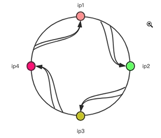
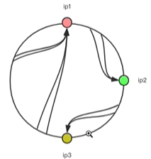
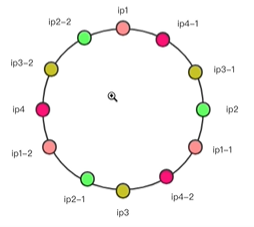
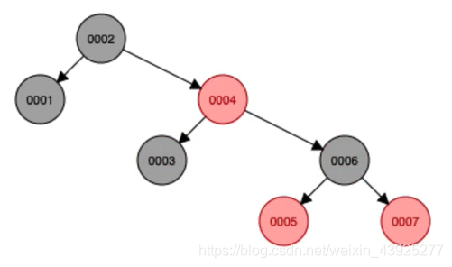
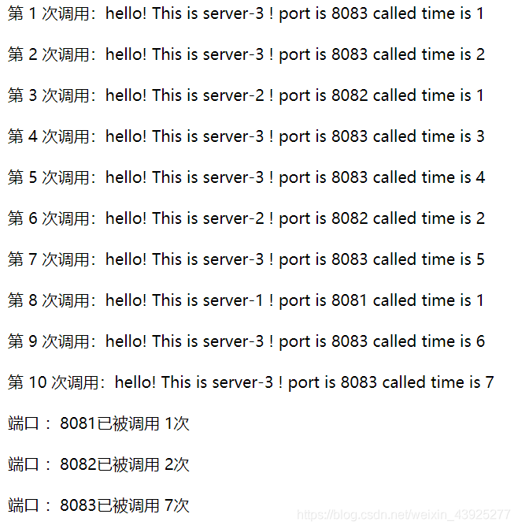
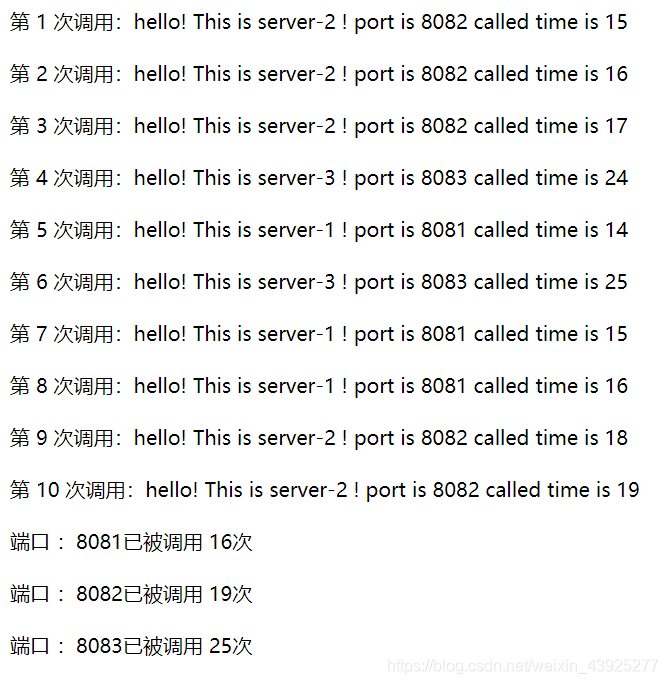
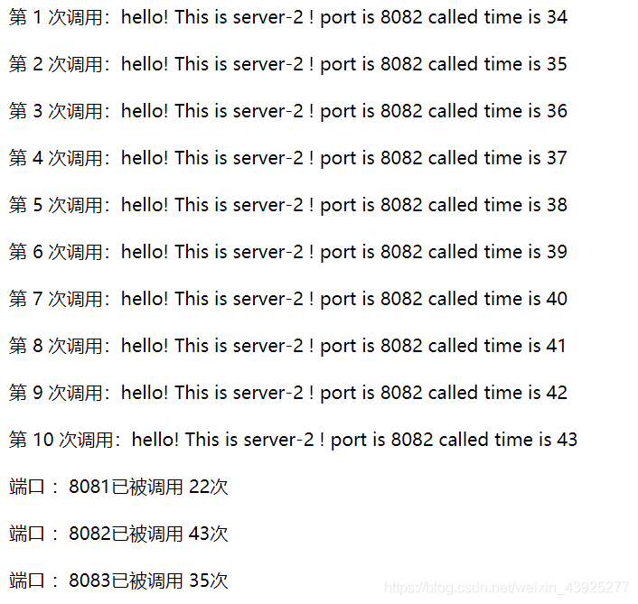
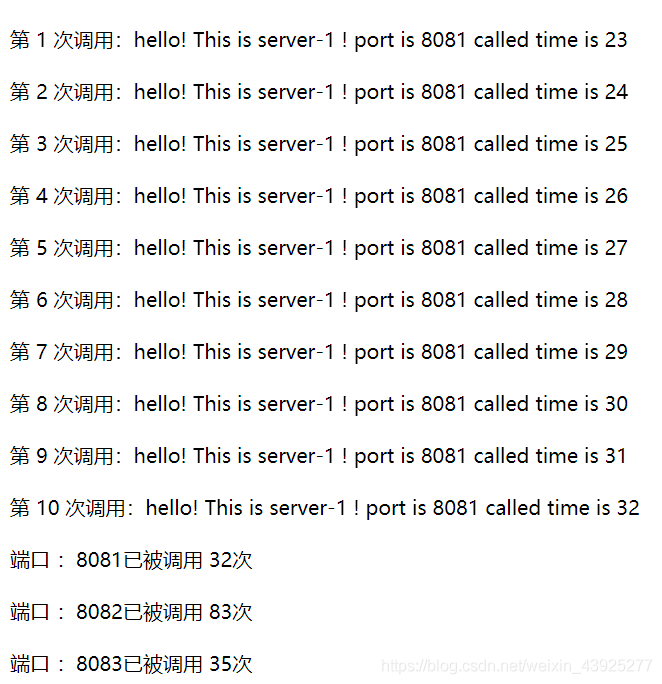

# 负载均衡算法实现（权重随机、平滑轮询、一致性哈希）

[Jerry1ee](https://blog.csdn.net/weixin_43925277) 2020-08-18 19:42:51


## 写在前面

通过客户端实现负载均衡算法（包括随机，轮询，一致性哈希），要求在客户端使用参数指定负载均衡策略和调用次数，调用不同的服务端。

- 三台服务器，一台客户端
- 由于只在一台机器上进行实现，三台服务器的不同由端口号来区分
- 客户端，服务端均采用spring-boot暴露Restful接口

## 三种负载均衡策略

### 服务器列表

```java
import java.util.*;

public class ServerPath {

    //不带权重的服务路径列表
    public static final List<String> LIST = Arrays.asList(
            "8081",
            "8082",
            "8083"
    );

    //带有权重的 服务路径 列表
    public static final Map<String,Integer> WEIGHT_LIST = new LinkedHashMap<>();
    static {
        WEIGHT_LIST.put("8081",20);
        WEIGHT_LIST.put("8082",30);
        WEIGHT_LIST.put("8083",50);
    }
}
```

### 随机算法

随机算法顾名思义，从一些服务器列表中随机挑选出一个服务器来进行负载操作，强调随机性。
但只是简单随机会有一些问题，如果我们有3台服务器，运算效率差距很大，第一台运算效率100分，第二台50分，第三台1分，那么我们简单随机的话，显然无法发挥第一台高性能服务器的优势，所以**带权重的随机算法**更加优秀。

- 8081端口，权重20
- 8082端口，权重30
- 8083端口，权重50
- 按权重构造一个长度为20+30+50的一维坐标轴，总和为100，则在0~100之间取一个随机数，根据随机数所在的区间来选择具体的服务器。
- |0——8081——20|21———8082———50|51—————8083—————100|
- 若随机数为 35， 则 20<35<50，选择8082端口服务器。

##### 代码实现

```java
import com.balanceLoad.client.ServerPath;

import java.util.Random;

public class RandomBalance {
    public static String getServerPath(){
        Random random = new Random();
        int total = 0;
        //从服务器端口列表中取权重累加到total
        for(Integer weight : ServerPath.WEIGHT_LIST.values()){
            total +=weight;
        }

        int x = random.nextInt(total);
        return GetPath.getPath(x);

    }

    public static void main(String[] args) {
        for(int i =0;i<10;i++){
            System.out.println(getServerPath());
        }
    }

}
```

##### GetPath类

```java
public class GetPath {
    public static String getPath(int pos){
        for(String port : ServerPath.WEIGHT_LIST.keySet()){
            int weight = ServerPath.WEIGHT_LIST.get(port);
            if(pos<weight){
                return port;
            }
            pos -= weight;
        }
        return "";
    }
}

```

### 轮询算法（平滑加权轮询）

朴素的轮询方法，如果大权重的服务器排在前面，会造成对某台机器请求过多，而排在后面的服务器在请求数较少的时候，可能都没有机会参与负载。

例如权重100的服务器A排在首位，后面跟着权重20的服务B和权重5的服务器C，如果每次服务器集群运行期间请求数都小于100，那么BC服务器基本上都没法参与负载。

例如

- 8081端口，权重20
- 8082端口，权重30
- 8083端口，权重50
- 调用10次服务，朴素的轮询调用序列为：

```shell
8081
8081
8082
8082
8082
8083
8083
8083
8083
8083
```

使用平滑轮询，可以优化为如下序列：

```shell
8083
8082
8081
8083
8082
8083
8083
8081
8082
8083
```

8081，8082，8083端口总被调次数不变，但均匀分布

#### 实现思路

引入动态权重的概念`currentWeight`，每次请求更新动态权重并以动态权重为基准来选择负载服务器。

假设ABC三台服务器，权重分别为5，1，1，权重之和为 `totalWeight = 7`，朴素的轮询序列为`AAAAABC`

| 请求次数 | 当前权重 | 当前最大权重 | 选取的服务器 | 选取后更新的权重 max(currentWeight)-totalWeight |
| -------- | -------- | ------------ | ------------ | ----------------------------------------------- |
| 1        | 5,1,1    | 5            | A            | -2,1,1                                          |
| 2        | 3,2,2    | 3            | A            | -4,2,2                                          |
| 3        | 1,3,3    | 3            | B            | 1,-4,3                                          |
| 4        | 6,-3,4   | 6            | A            | -1,-3,4                                         |
| 5        | 4,-2,5   | 5            | C            | 4,-2,-2                                         |
| 6        | 9,-1,-1  | 9            | A            | 2,-1,-1                                         |
| 7        | 7,0,0    | 7            | A            | 0,0,0                                           |
| 8        | 5,1,1    | 5            | A            | -2,1,1                                          |

…

##### 说明

- 每次从当前权重中选出最大权重代表的服务器作为返回结果
- 选择完具体服务器后，把当前最大权重减去权重总和，再把所有权重都跟初始权重(5,1,1)相加
- 5,1,1，选出5代表的A服务器，然后减去7成为 -2,1,1，再加上5,1,1，成为3,2,2，下次的当前权重即为3,2,2

将原来的序列`AAAAABC`变成了`AABACAA`

##### 代码实现

为了方便拿权重，封装一个类

```java
public class WeightPath {
    public String port;
    public Integer weight;
    public Integer curWeight;

    public WeightPath(String port, Integer weight, Integer curWeight){
        this.port = port;
        this.weight = weight;
        this.curWeight = curWeight;
    }
}
```

平滑加权轮询

```java
import java.util.HashMap;
import java.util.Map;

public class Polling {
	//每个端口对应一个权重
    private static Map<String,WeightPath> weightPathMap = new HashMap();
    public static String getServerPath(){
        //拿到总权重
        int total = 0;
        for(Integer weight : ServerPath.WEIGHT_LIST.values()){
            total +=weight;
        }

        //动态权重Map为空，那么初始化端口权重map
        if(weightPathMap.isEmpty()){
            ServerPath.WEIGHT_LIST.forEach((port,weight)-> weightPathMap.put(port,new WeightPath(port, weight,0)));
        }
        for(WeightPath weightPath : weightPathMap.values()){
            weightPath.curWeight += weightPath.weight;
        }

        //将最大的权重赋值
        WeightPath maxCurWeight = null;
        for(WeightPath weightPath : weightPathMap.values()){
        //找最大的权重值
            if(maxCurWeight == null || weightPath.curWeight>maxCurWeight.curWeight){
                maxCurWeight = weightPath;
            }
        }
		//减去总权重
        maxCurWeight.curWeight -=total;
		//拿到端口
        return maxCurWeight.port;
    }

    public static void main(String[] args) {
        for(int i = 0;i<10;i++){
            System.out.println(getServerPath());
        }
    }
}
```

##### 运行结果

```shell
8083
8082
8081
8083
8082
8083
8083
8081
8082
8083
```

### 一致性哈希算法

一致性哈希算法的一个特点：保证节点变化时，原来分配到的某个节点，现在仍然应该分配到那个节点，将数据迁移量降到最低。

发送请求时，可以携带一些信息，根据这些特定信息哈希出同样的值，那么每次携带同样信息时，都会选择相同的服务器来负载。即哈希值对应服务端口/IP。

在未生成哈希码时，要提前提供一种一一对应关系，这是重点。

##### 哈希环



- 理论上哈希环上可以有无穷多的节点
- 每个节点都是一个哈希码（hashcode）
- 每当得到的哈希码落到两个节点之间的区域，那么就让后面的节点来承担负载



问题：如果某个节点挂掉，会导致整个哈希环不再均匀，如上图，ip4挂掉后，ip1充当负载节点的概率明显变高

##### 引入虚拟节点


ip1为真实节点，ip1-1，ip1-2为虚拟节点，其他节点同理。这样即使挂掉，对其他节点影响也较小。

##### 实现思路

采用TreeMap结构来模拟哈希环这种结构
一个具有7个节点的TreeMap结构如下图：

TreeMap不仅是树状结构，节点还有明显的顺序性，里面具有的几个关键API：

- `firstKey()`:返回当前树结构最小的节点，即1，最终调用的方法如下

```java
    /**
     * Returns the first Entry in the TreeMap (according to the TreeMap's
     * key-sort function).  Returns null if the TreeMap is empty.
     */
    final Entry<K,V> getFirstEntry() {
        Entry<K,V> p = root;
        if (p != null)
            while (p.left != null)
                p = p.left;
        return p;
    }
```

- `tailMap(String value)`:返回节点值大于value的子树结构，即`tailMap("4")`，返回 4,5,6,7组成的子树

```java
//返回大于fromKey 的子树结构
 public SortedMap<K,V> tailMap(K fromKey) {
        return tailMap(fromKey, true);
    }
```

使用这两个接口就可以达到哈希环的操作

##### 具体实现

```java
//一致性Hash
//解决客户端与服务器一一对应的要求
//使用TreeMap 红黑树
public class Hash {

    private static TreeMap<Integer, String> virtualNodes = new TreeMap();
    //设置了800个虚拟节点
    private static final int V_NODES = 800;

    static {
        //初始化哈希环
        //真实节点 添加对应的虚拟节点
        for(String port : ServerPath.LIST){
            for(int i =0;i<V_NODES;i++){
                int hash = FNVHash(port+"_"+i);
                virtualNodes.put(hash, port);
            }
        }
    }
    public static String getServerPath(String hashInfo){
        //这里取请求信息
        int hash = FNVHash(hashInfo);

        //大于该Hash值的红黑树子树
        SortedMap<Integer,String> subMap = virtualNodes.tailMap(hash);
        if(subMap == null){
            return virtualNodes.get(virtualNodes.firstKey());
        }
        //获取该树的第一个元素，即最小元素
        Integer nodeKey = subMap.firstKey();

        //返回虚拟节点的名称
        return virtualNodes.get(nodeKey);
    }


    // 32位的 Fowler-Noll-Vo 哈希算法
    // https://en.wikipedia.org/wiki/Fowler–Noll–Vo_hash_function
    private static int FNVHash(String key) {
        final int p = 16777619;
        Long hash = 2166136261L;
        for (int idx = 0, num = key.length(); idx < num; ++idx) {
            hash = (hash ^ key.charAt(idx)) * p;
        }
        hash += hash << 13;
        hash ^= hash >> 7;
        hash += hash << 3;
        hash ^= hash >> 17;
        hash += hash << 5;

        if (hash < 0) {
            hash = Math.abs(hash);
        }
        return hash.intValue();
    }

    public static void main(String[] args) {
        for(int i =0;i<10;i++){
            System.out.println(getServerPath("xxx"));
        }
    }
}

```

## 模拟负载均衡策略

客户端spring boot代码：

```java
@RestController
public class CallController {

    @Autowired
    CallService callService;
    @RequestMapping(value ="call/{balanceType}/{times}/{clientInfo}" ,method = RequestMethod.GET)
    public @ResponseBody String callServer(
            @PathVariable String balanceType,
            @PathVariable int times,
            @PathVariable String clientInfo){
        return callService.callServer(balanceType, times, clientInfo);
    }
}
12345678910111213
```

负载均衡策略的选择和调用次数的选择

```java
@Service
public class CallService {

    static final String URL = "http://localhost:";
    static final String INDEX = "/times";

    public String callServer(String balanceType, int times, String clientInfo){
        StringBuilder sb  = new StringBuilder();
        String port;
        for(int i =0;i<times;i++){
            switch (balanceType){
                case "random":
                    port = RandomBalance.getServerPath();
                    break;
                case "polling":
                    port = Polling.getServerPath();
                    break;
                case "hash":
                    port = Hash.getServerPath(String.valueOf(clientInfo));
                    break;
                default:
                    port = RandomBalance.getServerPath();
            }
            sb.append("<br>第 "+(i+1)+" 次调用："+callMethod(port, "/home")+"</br>");
        }
        for(String itemPort : ServerPath.LIST){
            sb.append("<br> 端口 ："+itemPort+ "已被调用 "+callMethod(itemPort, "/times")+"次 </br>");
        }
        return sb.toString();
    }


    public String callMethod(String port, String index){
        HttpClient httpClient = HttpClientBuilder.create().build();
        HttpGet request = new HttpGet(URL +port+ index);
        request.setHeader("Content-Type", "application/json");
        request.setHeader("Accept", "application/json");
        HttpResponse response;
        try {
            response = httpClient.execute(request);
            try {
                return EntityUtils.toString(response.getEntity(),"UTF-8");
            } catch (IOException e) {
                e.printStackTrace();
                return "访问服务器返回结果转换失败！"+ e.getMessage();
            }
        } catch (IOException e) {
            e.printStackTrace();
            return "请求失败！"+ e.getMessage();

        } finally {
            try {
                ((CloseableHttpClient) httpClient).close();
            } catch (IOException e) {
                e.printStackTrace();
                return "请求关闭失败！"+ e.getMessage();
            }
        }
    }
}
123456789101112131415161718192021222324252627282930313233343536373839404142434445464748495051525354555657585960
```

服务端代码：

```java
@RestController

public class controller1 {

    int callTimes = 0;
    @RequestMapping(value = "/home", method = RequestMethod.GET )
    public String hello(){
        callTimes++;
        return "hello! This is server-1 ! port is 8081 "+"called time is "+ callTimes;
    }

    @RequestMapping(value = "/times", method = RequestMethod.GET)
    public int times(){
        return callTimes;
    }
}
12345678910111213141516
```

**上面的所有涉及调用的整型参数应该都使用`AtomicInteger`原子类**

## 最终效果

- 随机：`http://localhost:8080/call/random/10/dsada`
  
- 轮询：`http://localhost:8080/call/loop/10/dsada`
  
- 一致性哈希：`http://localhost:8080/call/hash/10/dsada`
  
- 一致性哈希：`http://localhost:8080/call/hash/10/fa3rfa`
  


原文链接：https://blog.csdn.net/weixin_43925277/article/details/107989585

 